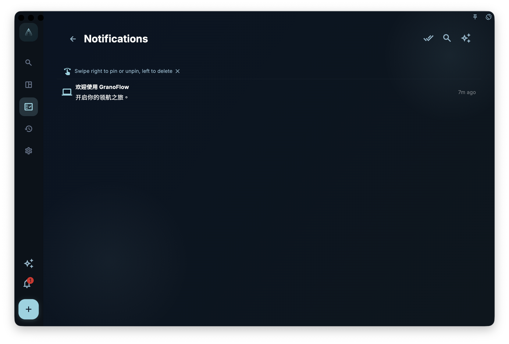

If you want to check alerts sent by GranoFlow inside the app, open the notifications page; you can review unread notifications, open the related area, or mark notifications as read.

## What you can do here

You can use the notifications page to:

- Review unread messages. Unread notifications have an unread indicator, so you can spot what you have not opened yet.
- Tap a notification to jump to the related feature area.
- Use “Mark all as read” to change unread notifications in the current list to read.

## Important: notifications are not status confirmation

“Mark all as read” only means those notifications are no longer treated as unread messages. It does not fix the issue mentioned in a notification, and it does not mean the related status has returned to normal.

If you are checking sync, subscription entitlements, account status, or task reminders, go back to the relevant feature page to view the current state. The notifications page can tell you that something happened, but it cannot replace the status shown on the feature page itself.

## Relationship with system notifications

The notifications page shows **in-app messages**, which means the notification list you see after opening GranoFlow.

System-level banners are controlled from Settings > Messages and reminders. Task reminder banners are on by default, and their sound can be turned off separately. Notification center messages stay inside the app by default; they do not show system banners or play sounds unless you turn that on. Sound for notification center messages only takes effect after banners are on.

System banners can also be affected by system notification permissions, platform background limits, network conditions, and Do Not Disturb. If task reminders do not appear on time, also check this device's system notification permissions.
