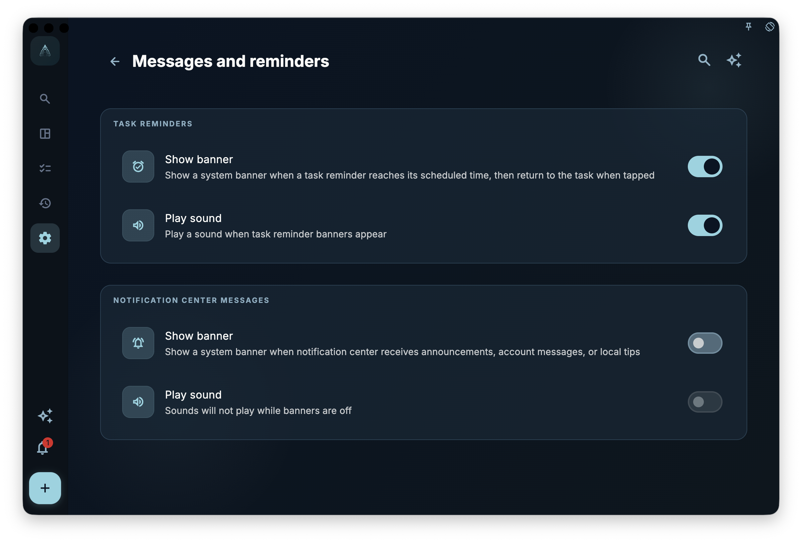

To view in-app reminders from GranoFlow, open the Notifications page. Here you can see unread notifications, jump to the relevant location, or mark notifications as read.

<!-- manual-screenshot:id=interface-notifications-main -->

## What You Can Do on the Notifications Page

On the Notifications page, you can perform these actions:

- View unread messages. Unread notifications have an unread badge so you can handle content you haven't seen yet.
- Tap a notification to jump to its corresponding feature location.
- Swipe right on a notification to pin it. Pinned notifications get a gold star and always appear before ordinary notifications. Swipe right again on a pinned notification to unpin it.
- Swipe left on a notification to delete it. A confirmation prompt will appear; the notification is deleted directly, not moved to the trash. You can also check "Don't ask again" in the confirmation box.
- Use "Mark All as Read" to change the unread status of the current notification list to read.

## Note: Notifications Are Not Status Confirmations

"Mark All as Read" only means you no longer consider these notifications as unread messages. It does not automatically resolve the issues mentioned in the notifications, nor does it mean the related status has returned to normal.

If you're troubleshooting sync, subscription entitlements, account status, or task reminders, go back to the corresponding feature page to check the current status. The Notifications page can tell you "something happened," but it cannot replace the status confirmation on the actual feature page.

## Relationship with System Notifications

The Notifications page displays **in-app messages**, meaning the notification list you see when you open GranoFlow inside the app.

System-level notification banners are controlled by "Settings > Messages & Reminders." Task reminder banners are enabled by default; sound can be turned off independently. Notification center messages are left only inside the app by default — they don't trigger system banners or play sounds. After you enable notification center message banners, you'll see these in-app messages at the system level; sound only works when the banner is enabled.

<!-- manual-screenshot:id=message-reminder-settings -->

This settings page is divided into two groups:

- **Task Reminders**: Controls whether task due reminders pop system banners and whether sound plays.
- **Notification Center Messages**: Controls whether in-app notifications also pop system banners and whether sound plays.

The sound toggle depends on the corresponding banner. For example, if you disable task reminder banners, the task reminder sound also becomes unavailable; if you disable notification center message banners, the notification center message sound won't play independently.

Whether system banners appear is also affected by system notification permissions, platform background restrictions, network status, and Do Not Disturb mode. If a task reminder doesn't pop on time, also check the system notification permissions on that device.
