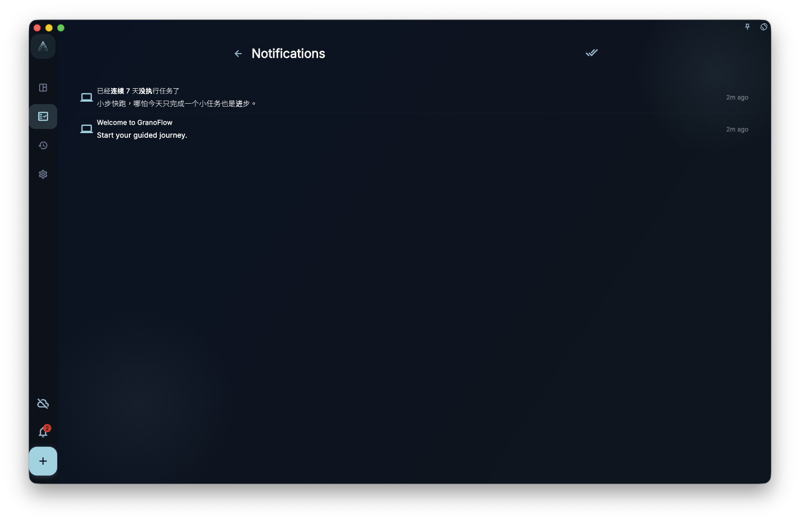

The notification page shows messages and status notices inside GranoFlow. Use it to review unread messages, open a related destination from a notification, or check whether anything recent needs attention.

Do not rely on notifications alone to decide whether sync, subscription, system reminders, or background status definitely succeeded. The notification list is a message entry point, not the only proof of every state.

## Where To Enter

Open notifications from the top area, sidebar, or related system tray entry. The page refreshes the notification list and marks which messages are still unread.

<!-- manual-screenshot:id=interface-notifications-main -->

When there are unread notifications, you can open them one by one or mark all as read. This only changes the read state; it does not mean the issue mentioned by the notification has been resolved.

## What Happens When You Open One

When you tap a notification, GranoFlow first marks unread items as read. If the notification includes an in-app destination, the app tries to open it. If it includes an external link, it may open the system browser.

If a notification has no action destination, it is still useful as a message record.

## Relationship To System Alerts

The notification page shows in-app messages. Whether a system notification appears also depends on system permissions, platform background limits, network state, and desktop tray behavior.

If you are checking task reminders, sync state, subscription access, or account issues, return to the relevant feature page. Notifications can point you there, but they do not replace the result shown on that page.
