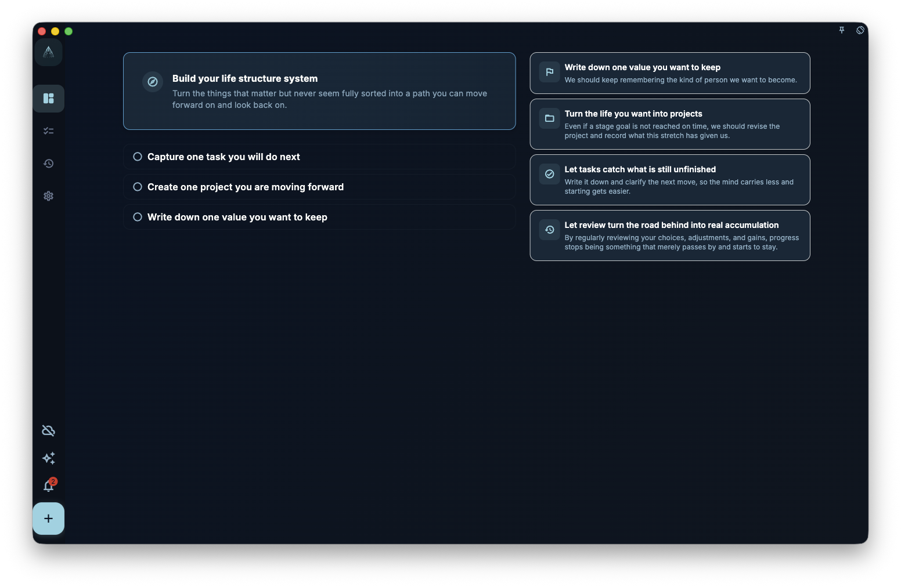

If you just opened GranoFlow and the Progress page shows first-use guidance instead of statistics, that is normal: you have not added any tasks, projects, or values yet, so GranoFlow does not have enough content to build your personal dashboard.

This is not a bug, and the page has not failed to load. The guidance is helping you take the first step: write down one thing that is clear to you right now.

<!-- manual-screenshot:id=interface-progress-onboarding-cold-start -->

## What you see

On a wide screen or desktop, the Progress page usually has two columns:

- **Left**: three starter actions
  1. Write down one task you need to do next
  2. Create a project you are currently working on
  3. Write down one value you want to keep
- **Right**: a few lines explaining how GranoFlow is meant to be used

If the screenshot does not load, you can still understand the page from the text above: this is not a results page. It is a starting page asking whether you want to begin with a task, a project, or a value.

## Where to start

The three starter actions do not have a fixed order. Choose the one that is easiest to write right now:

- If you have a next task in mind, write the task first.
- If you are already working on something larger, create the project first.
- If you want to clarify your long-term direction, write one value first.

:::tip[You do not need to fill everything in at once]
Writing down one thing is enough to begin. You do not need to fill in all tasks, projects, and values on day one; your structure can grow as you keep using GranoFlow.
:::

## When the guidance disappears

Once you have added a task, created a project, or written a value, the Progress page switches to the normal personal dashboard view. After that, this first-use guidance is no longer shown.
