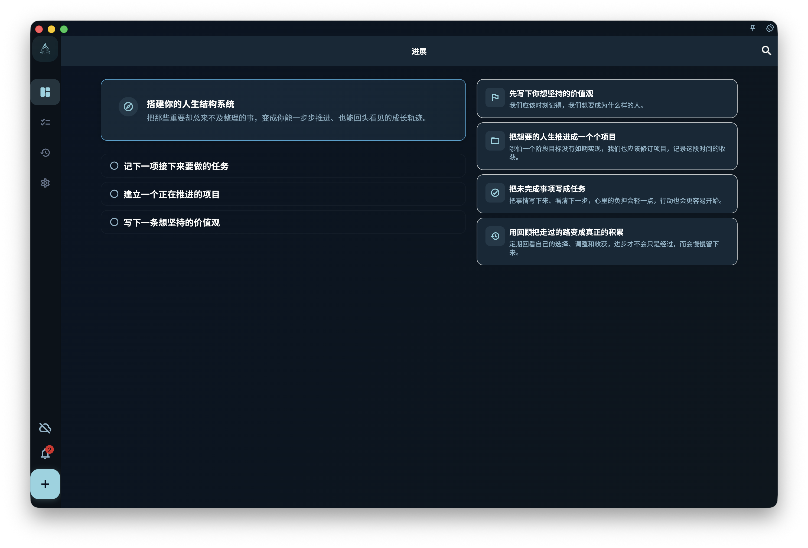

When you first open GranoFlow, or when local data has not yet formed tasks, projects, and values, the Progress page shows first-use guidance.

This state is not an error, and it does not mean the statistics page failed to load. It means GranoFlow does not yet have enough content to build your personal progress dashboard, so it gives you the shortest path to write important things down and let them gradually become a structure you can review.

<!-- manual-screenshot:id=interface-progress-onboarding-cold-start -->

## What you see

On a wide desktop or landscape window, the left side shows the headline "Build your life structure system" and three starting actions:

1. Write down one task you need to do next.
2. Create a project that is already moving.
3. Write down one value you want to keep.

The right side shows four method messages that explain how GranoFlow expects you to begin:

- First write down the values you want to keep.
- Turn the life you want into projects.
- Turn unfinished things into tasks.
- Use review to turn the road behind you into real accumulation.

On narrower windows or portrait devices, the same content is arranged in one column, but the meaning stays the same.

## When it disappears

After you complete the starting actions, or after the app detects tasks, projects, a registered account, import history, or valid sync history, GranoFlow bypasses this first-use guidance.

The next time you open Progress, you will see the data-backed state: what needs attention now, how to continue today, recent projects, values, weekly and monthly progress, and review entry points.

## How it differs from the regular Progress page

First-use guidance only helps you get started. It does not show the work queue, today's progress, or short feedback yet, because those cards need real task and project data to be meaningful.

If you have already imported a backup or synced data but still see this state, local data may not have finished restoring, importing, or refreshing. Wait for that to complete, then check the Progress page again.

## Related pages

- [Progress](/manual/en/interface/home-progress/)
- [Tasks overview](/manual/en/tasks/overview/)
- [Projects and milestones overview](/manual/en/projects/overview/)
- [Review overview](/manual/en/review/overview/)
