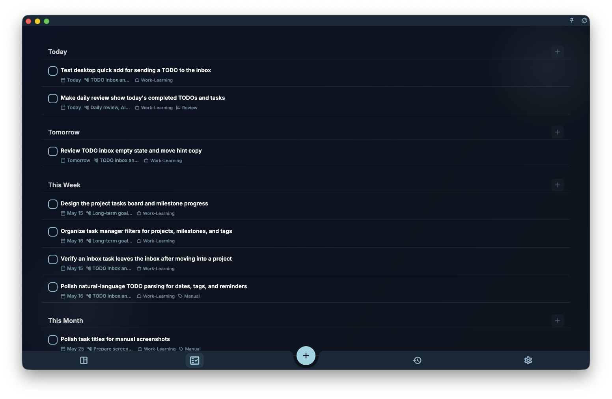

Quick add is for saving one thing right away: click the `+` in the bottom bar or side area, enter a task title, then submit. A title is enough; if you do not set a date, the task goes to the inbox so you can organize it later. A project or milestone only sets ownership; it does not by itself move an undated task out of the inbox.

## Write a Title

You can treat the input as a note and write one plain line. For example:

```text
Prepare the weekly report
Reply to Alex
Check release screenshots
```

After writing the title, click the submit button. GranoFlow saves the line as the task title.

## Add Fields in the Title

On desktop, the input hint shows `#tag @project ~reminder`. These symbols are shortcuts, not required fields.

<!-- manual-screenshot:id=interface-quick-add-main -->


- Type `#` to search tags.
- Type `@` to search projects or milestones.
- Type `~` to enter a reminder time.

For example:

```text
Check subscription page copy @Website redesign #release ~tomorrow 8am
```

A shortcut is written to the task fields only after you choose a suggestion, or confirm it with `Enter` / `Tab`. If you do not confirm it, text such as `#release` or `@Website redesign` stays in the title as normal text.

## Dates and Reminders

You can also type a date phrase directly in the title. For example:

```text
Check release screenshots by Friday
```

The date phrase may be highlighted or shown as a pending date hint. It becomes the task date only after you click the date hint, or type a space after the date phrase to confirm it. Unconfirmed date text stays in the title.

Use `~` for reminders. For example:

```text
Organize screenshots tomorrow ~8am
Reply to Alex ~8am
```

A reminder is the notification time, not the task date itself. If the task does not have a date yet, GranoFlow chooses a suitable task date from the reminder time. You can also set the date manually with the date button below the input.

## Use the Buttons Below

If you do not want to remember shortcuts, use the buttons below the input:

- Date
- Reminder
- Add to project
- Tag
- Image

These buttons and the `#`, `@`, and `~` shortcuts write to the same task fields. Selected fields appear as small tokens; click a token to change it, or remove it to clear the field.  
The image button supports up to 5 images at a time and shows `Image N/5` after selection. After submit, images upload with the task. If some uploads fail because of network or permission issues, the task is still saved and you will see a message that the task was created but not all images were uploaded.

## Suggestions and Corrections

As you type, GranoFlow may show similar task suggestions. Clicking a suggestion applies that task's title, plus its most recently saved tags, project, or milestone, and creates a new task immediately.

If GranoFlow finds an obvious typo, the first submit may show corrected text instead of saving right away. Review the corrected title, then submit again to save it.

## Mobile and Desktop

On mobile, the input hint is shorter and usually only asks you to enter a new task. On desktop, it shows `#tag @project ~reminder` for faster keyboard entry.

On any device, shortcuts are only a faster path. You can ignore them and use the buttons below the input to set the date, reminder, project, milestone, and tags.
