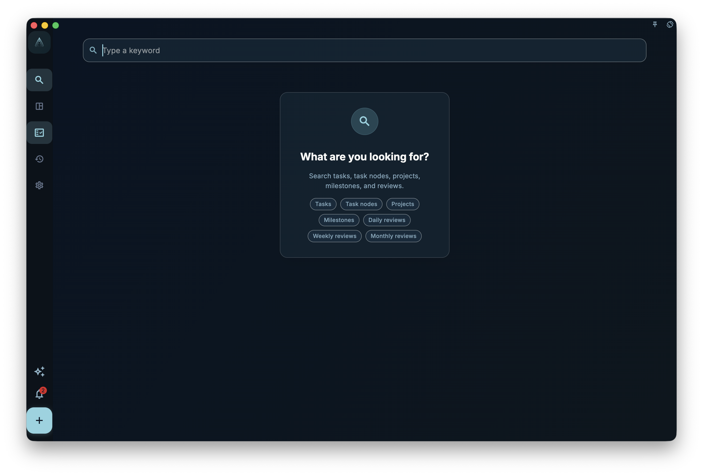

If you remember one or two words from a task, task node, project, milestone, card, daily review, weekly review, or monthly review but forget where it is, use Search to find and open it. Search is for "finding existing content," not for performing a full audit or organizing tasks or projects on your behalf.

## How to Access

Enter the Search page from the search entry on the home page or main interface. Once open, type a relatively specific keyword into the input box — for example, a task title, task node title, project description, milestone summary, card front/back content, or a few consecutive words from a review record — then look at the result list below.

You can also add structured conditions to your search term:

- Enter `#tag` to see only tasks with that tag. The tag can be a system tag display name or an existing custom tag name, for example `#important`, `#urgent`, `#Work-Learning`, `#home`.
- Enter `@project` to see only tasks that belong to that project. The project name can be the full name or a partial name that uniquely identifies the project.
- Regular keywords can be used together with structured conditions, e.g., `plan #important @product-optimization`.

<!-- manual-screenshot:id=interface-search-main -->

If you only enter regular keywords and they are too short, the page will prompt you to continue typing. Structured conditions like `#tag` or `@project` can be searched on their own without needing to meet a three-character minimum.

If there are no results, it only means no match was found within the current searchable scope. It could also be that the tag name or project name does not correspond to an existing object. It does not mean that GranoFlow has checked every attachment, deleted content, or historical data not included in the search scope.

## How to Use Results

Search results are displayed in columns by type, showing only columns that have results. The column order is Tasks, Projects, Milestones, Cards, Daily Reviews, Weekly Reviews, Monthly Reviews. When a task node matches, there will not be a separate "Node" column; instead, the parent task is displayed as one task result, with the matching nodes listed under it. This way you can see both the reason for the match and which task it belongs to.

Task results show the title, update time, and matching text. When multiple nodes, task descriptions, or task reviews match at the same time, up to two lines of matching excerpts are shown under the same task result. When the task title itself directly matches, only the title and basic info are shown, without expanding descriptions, reviews, or node content.

After clicking a task result, GranoFlow takes you to the task's current location. It may be in the Inbox, Task List, Completed, Archived, or Trash. Opening a project or milestone result takes you to the corresponding project context; opening a card result takes you to the card details; opening a review result takes you to the Achievements & Reviews page, which tries to navigate to the corresponding date or week.

If the result belongs to a project, after opening, you still need to go back to the task or project page to determine which phase it belongs to, which milestone it is related to, and whether the date is still appropriate.

Search can help you find existing cards, but does not replace card management, review, or archiving decisions. For systematic card organization, start with [Cards: Bringing Experience Back to Action](/manual/en/review-cards/) to understand the relationship between cards and tasks, then go to card statistics or card management.

## When to Use

- You remember part of the text of a task, task node, project, milestone, card, daily review, weekly review, or monthly review, but you forgot where it is placed.
- You want to quickly open a completed or archived task.
- You want to find an old task before organizing your inbox, working on a project, or doing a review.

Search does not create new tasks, new tags, or new projects, does not batch-edit search results, and does not save as auto-filter views. If you need to view tasks by tag, project, date, or completion status for an extended period, continue using the corresponding list and project pages.
