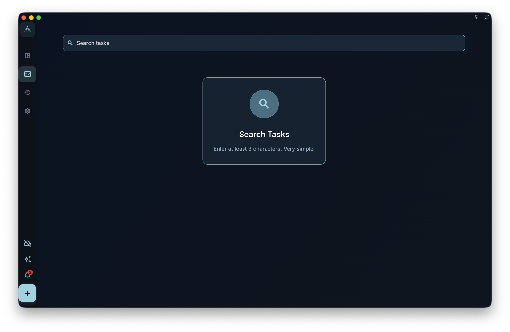

Search helps you find existing tasks quickly. Use it when you remember part of a title but do not remember which list the task is in.

Do not treat search as a full data audit, attachment text search, or permanent filter rule. It is a find-and-open entry point; it does not reorganize tasks for you.

## Where To Enter

Open search from the home or main interface search entry. After the search page opens, enter a keyword that is specific enough, then review the results.

<!-- manual-screenshot:id=interface-search-main -->

If the keyword is too short, the page asks you to keep typing. If there are no results, it means no matching item was found in the current searchable scope. It does not mean all historical data, attachments, or deleted content have been checked one by one.

## Using Results

Results are mainly tasks. When you open a result, GranoFlow takes you back to the task's current location, such as the inbox, task list, completed list, archive, or trash.

If the task belongs to a project, continue judging its relationship to stages, milestones, and dates in the task or project context.

## When To Use It

- You remember part of a task title, but not where it is.
- You want to reopen a completed or archived task quickly.
- Before organizing the inbox, a project, or review, you want to find an older task.

Search does not create tasks, bulk-edit results, or save itself as an automatic filtered view. For long-term browsing by tag, project, date, or completion state, use the relevant list or project page.
