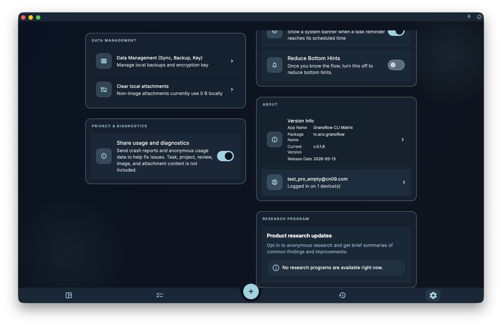

If you see Account, Sync, Data, Subscription, AI Assistant, or Tag Management entry points on the settings page, treat them as buttons leading to dedicated settings pages: Account manages login and devices, Sync ensures consistent records across multiple devices, Data handles import/export, backup and restore, Subscription manages Pro entitlements, and AI Assistant and Tag Management respectively handle external AI tool integration and task tags.

Related settings pages:

- [Settings Overview](/manual/en/interface/settings-overview/)
- [Language, Theme, and Fonts](/manual/en/interface/settings-language-appearance/)
- [Current Device Preferences](/manual/en/interface/device-preferences/)
- [Account, Sync, and Data Entry Points](/manual/en/interface/settings-account-data-entrypoints/)

These entry points are not confined to the current settings page. After clicking, you will usually enter more specific pages with their own rules and constraints.

If an operation involves restore, deletion, sync reset, encryption keys, subscription entitlements, or account logout, read the corresponding page first before proceeding. Screenshots only help you confirm the location of the entry point; even if the screenshot does not load, you can determine the purpose of each entry point from the text below.

## Account Entry Point

The Account entry point is used to register, log in, log out, view account status, and connect the current device to the same account system.

<!-- manual-screenshot:id=interface-device-preferences-main -->

After logging in, you can purchase or restore GranoFlow Pro entitlements, enable cloud sync capabilities that require an account, and access account-related personalization settings.

If you want to know what an account can do, read [Account Overview](/manual/en/account/overview/). If you want to understand the relationship between the current device and other devices, read [Device Management](/manual/en/account/device-management/).

## Sync Entry Point

The Sync entry point is used to keep core records such as tasks, projects, and reviews consistent across multiple devices.

Sync is not equivalent to "copying all local settings to another device." It primarily handles the data flow of business records. Language, theme, fonts, app lock, and other current device preferences fall into a different scope.

If you want to confirm what gets synced, or what to check first when sync issues occur, read [Multi-Device Sync](/manual/en/data-security-and-recovery/sync/).

## Data and Recovery Entry Point

The Data entry point is used to import, export, back up, restore, view attachment status, or clear local storage usage.

These operations are typically more sensitive than appearance settings and current device preferences. Backups preserve important data when changing devices, reinstalling, or encountering anomalies; restore brings backup or cloud data back to the current device.

The data management page presents daily operations with three tiled function cards: within the "Local Backup" card, "Create Local Backup Package" generates an encrypted `.flow.grano` file, suitable for full device migration or restore; the "Deck" card provides import of grano decks, an Anki import instruction pop-up, "Export Current Deck" that navigates to the deck list, current card cache usage and a clear cache entry; the "Encryption Key" card manages device keys. `.deck.grano` only handles selected decks, cards, and packable local image media; it does not create task entities and cannot replace a full local backup. Destructive cleanup entries are placed separately in the "Dangerous Operations" group at the bottom of the page. For the difference between decks and backups, read [Decks, Import, and Export](/manual/en/review-cards/decks-import-export/).

Before restoring, first confirm the backup source, account status, encryption keys, and version compatibility. For details, read [Backup and Restore](/manual/en/data-security-and-recovery/backup-and-restore/).

## Subscription Entry Point

The Subscription entry point is used to view GranoFlow Pro entitlements, purchase status, restore purchase instructions, and limitations that may arise from purchases on different platforms.

Pro entitlements may affect cloud sync, attachment capabilities, storage quotas, or the availability of advanced settings. Actual pricing and purchase availability depend on the platform display.

If you want to understand why there is a subscription, read [Subscription Overview](/manual/en/subscription/overview/). If you want to see the boundaries of entitlements, read [Subscription Entitlements](/manual/en/subscription/entitlements/).

## AI Assistant and Tag Management

The AI Assistant entry point is used to select or configure external AI tools to work with GranoFlow, for example, sending organized content to ChatGPT, Codex, Claude, Gemini, DeepSeek, or a custom assistant.

This entry point does not mean that AI automatically reads all local data, nor that AI silently modifies your records. For overall boundaries, read [AI Assistance](/manual/en/ai-assistance/overview/); for the clipboard workflow, read [AI Assistant and Clipboard](/manual/en/ai-assistance/clipboard-assistant/).

Tag Management is used to create, rename, organize, or deactivate task tags. Tags help you organize tasks horizontally by scenario, location, energy level, or topic.

Tags affect how tasks are organized, so do not treat them as mere appearance settings. Read [Tags](/manual/en/tasks/tags/) to see how tags help organize tasks.

## Next Steps

- If you encounter sync issues, read [Multi-Device Sync](/manual/en/data-security-and-recovery/sync/).
- Before backing up or restoring, read [Backup and Restore](/manual/en/data-security-and-recovery/backup-and-restore/).
- If you are unsure whether an operation affects your account, read [Account Overview](/manual/en/account/overview/).
