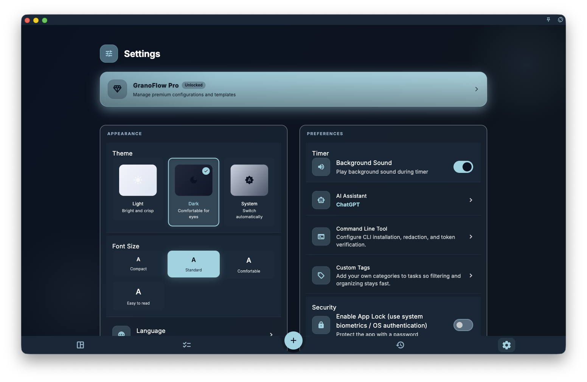

<!-- markdownlint-disable MD013 -->

If you're not sure where a setting applies, first see which group it's in: Appearance, Preferences, and Security usually only affect this device; Data Management, About, Research & Activities, and Pro Settings take you to specific pages for more detailed account, sync, subscription, AI, or data rules.

Related settings pages:

- [Settings overview](/manual/interface/settings-overview/)
- [Language, theme & fonts](/manual/interface/settings-language-appearance/)
- [Current-device preferences](/manual/interface/device-preferences/)
- [Rich text content](/manual/interface/markdown-content/)
- [Account, sync & data entry points](/manual/interface/settings-account-data-entrypoints/)
- [Command-line tool](/manual/desktop/command-line-tool/)

The Settings page is the unified entry point for GranoFlow. It brings together display experience, preferences, security, data management, privacy & diagnostics, About, Research & Activities, and Pro Settings in one place, but each entry affects a different scope.

## Appearance

Appearance typically includes theme, font size, and language.

<!-- manual-screenshot:id=interface-settings-overview-main -->

These settings mainly affect the interface you see on the current device. Switching your language, turning on dark mode, or increasing font size will not rewrite tasks, projects, tags, review records, or change the meaning of data in [multi-device sync](/manual/data-security-and-recovery/sync/).

If you just want to adjust your reading and display experience, read on at [Language, theme & fonts](/manual/interface/settings-language-appearance/).

## Preferences & Security

Preferences control how this device works, such as timer background sounds, AI assistant entry, command-line tool, tag management, messages & reminders, and reducing some bottom prompts. App lock is in a separate "Security" group.

Think of these options as: how this device alerts me, protects me, and shows feedback. They should not be understood as account-level business data or a commitment to sync across devices.

"Messages & reminders" centrally manages task reminders and Notification Center messages. Task reminders let you control whether to show system banners and whether to play sounds; Notification Center messages only go to the in-app notification list by default, and only appear as system alerts if you turn on system banners. Silent sync is a default compensation capability of cloud sync; you don't need to turn it on or off here.

Remote rich-text resource prompts are located in "Pro Settings". They control whether to pop a confirmation before loading remote images, audio, video, and third-party links. They do not rewrite rich-text content itself, nor sync to other devices. For writing and limitations, read [Rich text content](/manual/interface/markdown-content/).

## Data Management & Account Sync

The "Data Management" entry is for local backups, card deck import/export, media cache, and dangerous operations; the account entry is in the "About" area and is used for signing in, signing out, checking account status, or entering related account capabilities. The sync status and device relationship after login are handled by the account and sync pages.

If you need to deal with login, devices, or sync issues, first read [Account overview](/manual/account/overview/) and [Device management](/manual/account/device-management/). If you want to understand how data flows between multiple devices, read [Multi-device sync](/manual/data-security-and-recovery/sync/).

## AI, Tags & Review Configuration

Preferences provide AI assistant, tag management, and other entries; Pro Settings provide AI research preferences, AI desensitization, review, and card-related advanced configurations.

These entries are for entering specific configuration or explanation pages; they do not mean AI will automatically modify your records. For processes involving external AI, first understand the boundaries of [AI Assistance](/manual/ai-assistance/overview/) and [AI Assistant & Clipboard](/manual/ai-assistance/clipboard-assistant/).

## Command-Line Tool

On the Settings page, under "Preferences", there is a "Command-line tool" entry for installing or fixing the `granoflow` command and confirming whether the current platform can call the CLI in a terminal.

The CLI here is only for the user's local machine and the running desktop app. It does not include development, building, cloud admin, internal debugging, or publishing commands.

If you just manually use `granoflow help`, `granoflow version`, `granoflow status --json`, `granoflow display get --json`, or `granoflow open <route> --json`, you usually don't need additional setup. When you need scripts or AI assistants to read structured results, prefer `--json`.

To adjust App display preferences from the terminal, use `granoflow display language/theme/font-size/reset`. These commands only affect the display experience; they will not clear account or business data.

Business object commands include `task`, `project`, `milestone`, `tag`, `domain-value`, and `review`. These commands require the running desktop app to handle them; if the app is unreachable, they return `app_not_reachable` and do not bypass the app to read or write the local database directly.

The CLI's `backup create` and `backup restore` also require the running desktop app. Before restoring a backup, use `--preview` to see a summary; only import after explicitly `--confirm`.

Full navigation at [Command-line tool](/manual/desktop/command-line-tool/). If you need the full command matrix, read [CLI commands and parameter reference](/manual/desktop/cli-command-reference/); if you're confirming token or local access boundaries, read [CLI security settings and key boundaries](/manual/desktop/cli-security-and-settings/).

## Privacy & Diagnostics, About, Research & Activities, and Pro

"Privacy & Diagnostics" lets you control whether to send crash reports and anonymous usage statistics. It does not upload task, project, review body, image, or attachment content. In high-risk or sensitive environments, you can turn off the "Help Improve" switch here.

The "About" area typically contains version info, the account entry, and necessary auxiliary entries. Hidden diagnostic or test data entry points are not shown as default entries for regular users.

The "Research & Activities" area is for users who actively participate in feedback, research, or public community activities; it does not affect daily tasks and data structures.

"Pro Settings" provides access to subscription entry, full attachment sync, clear local attachments, remote rich-text resource prompts, card media cache, card study group size, domain count limit, AI research preferences, and AI desensitization—advanced entries. Specific benefits and platform rules follow [Subscription overview](/manual/subscription/overview/) and actual platform display.

## Next steps

- To adjust display effects, read [Language, theme & fonts](/manual/interface/settings-language-appearance/).
- To understand local toggles, read [Current-device preferences](/manual/interface/device-preferences/).
- To add tables, formulas, images, or remote media in descriptions or card fields, read [Rich text content](/manual/interface/markdown-content/).
- To handle account, sync, or data entries, read [Account, sync & data entry points](/manual/interface/settings-account-data-entrypoints/).
- To call GranoFlow from terminal, script, or AI assistant, read [Command-line tool](/manual/desktop/command-line-tool/).
