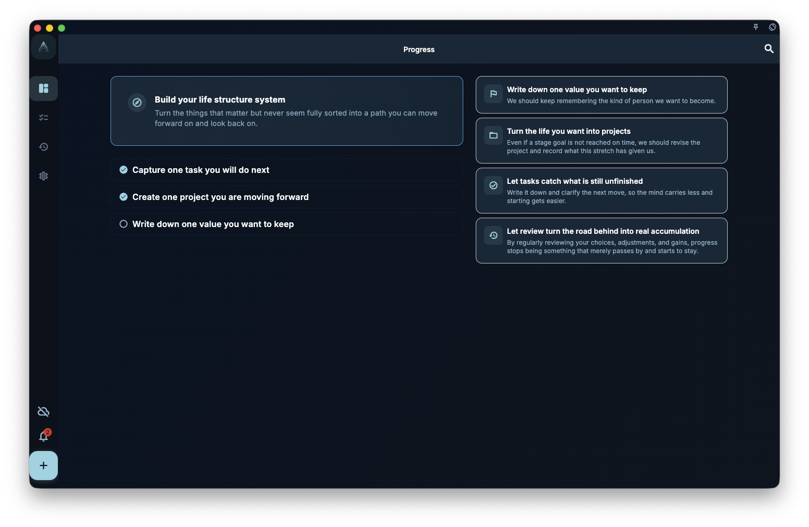

This chapter turns positive psychology and flow into practical GranoFlow steps: choose where to invest attention, tune task difficulty, keep feedback visible, and return after interruptions. It is for people who want a flow-friendly task manager for long-term goals.

Positive psychology and flow are not decorative ideas inside GranoFlow.

They point to practical questions:

- Why is this worth my time?
- Can this be reduced to something I can start now?
- Is the challenge too boring, too stressful, or just demanding enough?
- After I finish, can I see feedback?
- If I stop, can I return to the same direction?

GranoFlow does not guarantee flow, and it does not decide what a good life means for you.

It gives those questions an operating structure:

> Domain → Values → Project → Milestone → Task → Review

This path keeps positive psychology from becoming forced optimism, and keeps flow from becoming a command to focus harder.

## What Positive Psychology Does in GranoFlow

Positive psychology is not about pretending everything is fine.

It asks how people build meaning, engagement, relationships, achievement, and growth in real life.

In GranoFlow, those ideas land in four places:

| Positive psychology question | How GranoFlow supports it |
| --- | --- |
| Where does meaning come from? | Domains and values show long-term directions that matter |
| Where does engagement go? | Projects hold things you keep working on over time |
| How does achievement become visible? | Milestones, completion state, and progress surfaces show movement |
| How does growth stay with you? | Review turns completion, interruption, and adjustment into learning |

For example, you may care about health.

If that stays as a slogan, it will easily be crowded out by busy work.

In GranoFlow, it can become:

> Domain: Health  
> Value: I want to care for my body over time instead of constantly draining it  
> Project: Build a three-month basic exercise rhythm  
> Milestone: Adapt during the first week  
> Task: Stretch for 5 minutes  
> Review: The action was small, but the friction was low, so I can continue

This is not about making life more complicated.

It turns "what matters to me" into "what can I do today," then uses review to ask whether it is still worth continuing.

## What Flow Does in GranoFlow

Flow usually appears inside specific action.

You do not enter flow directly with a life direction. You are more likely to enter it while writing a paragraph, debugging code, practicing a movement, or organizing material.

Flow needs certain conditions:

| Flow condition | How GranoFlow supports it |
| --- | --- |
| Clear goal | Turn a vague thought into a concrete task |
| Suitable challenge | Use milestones to cut a large project into stages |
| Timely feedback | Finish tasks, see state changes, and review progress |
| Attention container | Use projects to define the current focus of effort |
| Ability to return after interruption | Keep context in the inbox, projects, and review |

This is why GranoFlow is more than a to-do list.

A normal to-do list usually asks:

> What is still unfinished?

GranoFlow helps you ask:

> Which direction does this belong to?  
> Which project does it move forward?  
> Is the current stage too large?  
> Is the next step clear enough?  
> What feedback remains after I finish?

These questions do not automatically create flow.

They reduce ambiguity before action, making it easier to begin and more likely that stable engagement can appear once the action unfolds.

## A Path from Theory to Features

You can understand GranoFlow as six layers.

1. **Domains provide meaning**  
   Where does my time ultimately go?

2. **Values provide choice criteria**  
   How do I want to act, beyond chasing external outcomes?

3. **Projects provide containers for engagement**  
   What am I seriously working on during this period?

4. **Milestones provide challenge gradients**  
   Which stage comes first, and is the difficulty appropriate?

5. **Tasks provide action entry points**  
   What can I start now?

6. **Review provides feedback**  
   Is this effort close to my values, and should I continue, adjust, or let go?

<!-- manual-screenshot:id=interface-home-progress-main -->

Positive psychology mainly helps you decide why something is worth engaging with.

Flow mainly helps you decide how to make that engagement easier to enter.

GranoFlow connects the two: it gives action meaning, then turns meaning into a task that can be started, completed, reviewed, and resumed.

## Do Not Turn the Theory into Pressure

Positive psychology does not require you to feel positive every day.

Flow does not require every work session to be immersive.

Real life includes fatigue, delay, interruption, and ordinary necessary tasks.

GranoFlow is not trying to turn every day into a highlight. It helps you do three things even when your state is imperfect:

- Notice whether your effort has drifted away from long-term directions
- Break a vague goal into an action small enough to start
- Get feedback after completion and return after interruption

Sometimes you will enter flow.

Sometimes you will simply finish an ordinary task.

Sometimes you will only do a little, but keep the path open.

All of these count.

Long-term change usually comes from many actions you can return to, continue, and accumulate, not from one perfect immersive session.

## A Complete Example

Domain:

> Creative work

Value:

> I want to not only consume content, but also keep expressing and creating.

Project:

> Finish the first set of GranoFlow comics

Milestones:

> Choose the theme  
> Write the script  
> Generate the images  
> Publish the first version

Today's task:

> Write the cover copy for the first comic set

Review:

> I finished the cover copy today, but the hook is not strong enough. Next, revise the first image before generating anything.

In this example, positive psychology is about meaning, values, and growth.

Flow is about clear tasks, suitable challenge, and timely feedback.

GranoFlow connects them into a path you can use every day.

## Further Reading

To understand Positive Psychology and Flow more deeply, start with Wikipedia's [Positive psychology](https://en.wikipedia.org/wiki/Positive_psychology) and [Flow (psychology)](https://en.wikipedia.org/wiki/Flow_(psychology)) entries, and read Mihaly Csikszentmihalyi's *Flow: The Psychology of Optimal Experience*.

GranoFlow is not a replacement for those ideas, and it does not guarantee flow. It turns the parts that fit daily task management and long-term engagement into domains, values, projects, milestones, tasks, and review.

## Next

After you understand this map, continue with:

- [Quick start: run the first practice in 5 minutes](/en/positive-psychology-flow/quick-start/).
