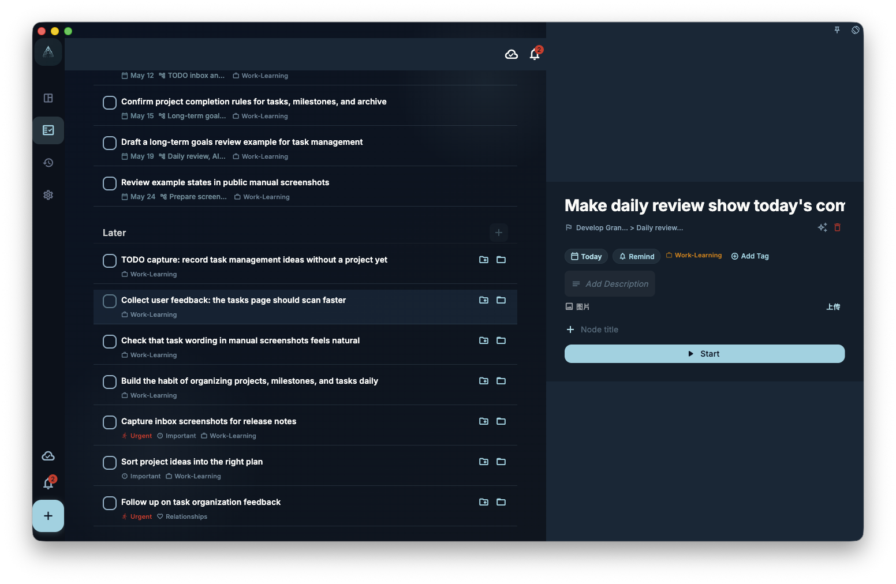

This chapter turns positive psychology and flow into practical GranoFlow steps: choose where to invest attention, tune task difficulty, keep feedback visible, and return after interruptions. It is for people who want a flow-friendly task manager for long-term goals.

Knowing that flow matters does not mean you can enter flow every day.

Real life includes delay, interruption, fatigue, and unexpected demands.

GranoFlow therefore does not focus on keeping a perfect state every day.

It focuses on this:

> How can important things become easier to start, and how can you return after interruption?

Stable engagement is not never stopping.

It is being able to return to a clear position after stopping.

## Small Actions Start the Process

Many long-term actions fail not because the goal is unimportant, but because the entry is too large.

For example:

> Exercise for an hour every day  
> Write a whole book  
> Master English  
> Organize my entire life structure

These goals may matter, but they are poor entry points for today.

Better entries are:

> Stretch for 5 minutes  
> Write 100 words  
> Listen to English for 10 minutes  
> Write down the most important thing today

A small action does not mean the goal is small.

It simply makes starting easy.

Once you start, you can do more. Even if you only finish the smallest action, real action happened.

## Tasks Reduce Action Friction

In GranoFlow, a task is the smallest action unit.

A stable task should answer:

> What exactly do I do now?

If the task is too large, you delay.

If it is too vague, you do not know where to begin.

If it can move forward in one focus session, flow conditions are easier to create.

<!-- manual-screenshot:id=tasks-breakdown-detail -->

For example:

> Finish the product manual

Can become:

> Draft the first version of the quick start section

> Recover my health

Can become:

> Walk for 10 minutes after dinner

Clear tasks create two benefits:

- You do not rethink the action before starting
- You receive feedback immediately after finishing

## Projects Keep Small Actions from Scattering

Micro-habits should not stay isolated.

If you do small things every day but do not know where they lead, they soon feel boring.

GranoFlow uses projects to hold long-term direction.

For example, "write 100 words" is small.

But if it belongs to:

> Finish the first set of articles

It is no longer a random action. It moves a clear direction forward.

Above that, it can connect to a value:

> I want to not only consume content, but also keep expressing and creating.

Small actions then connect to long-term meaning.

## Milestones Make Challenge More Suitable

Flow needs suitable challenge.

Tasks that are too simple become boring.

Goals that are too large create anxiety.

Milestones cut projects into stages, so the current challenge is closer to "requires effort, but is not impossible."

For example:

Project:

> Build a three-month basic exercise rhythm

Milestones:

> Adapt during the first week  
> Stabilize during the first month  
> Review after the third month

Today's task:

> Stretch for 5 minutes

You do not need to face three months at once.

You only need to know what the current stage asks for.

## Review Makes Returning Possible

After interruption, the easiest mistake is repayment.

Three days without exercise, so you try to repay three days at once.

One week without writing, so you try to finish everything on the weekend.

Several days without organizing tasks, so you try to clear every list.

This usually makes you more tired.

GranoFlow suggests asking:

> What is the smallest next step now?

Review helps you find that next step:

- Where did I stop last time?
- Which task had too much friction?
- Which project is still worth continuing?
- Which action can be made smaller?
- What should I do first tomorrow?

Returning does not need to be dramatic.

Returning only needs one small action.

## From Stable Engagement to Flow

Small actions and flow do not conflict.

Small actions open the entry.

Flow may appear after action unfolds.

For example:

You planned to write only 100 words.

After starting, the thinking becomes smoother and you write 800.

You planned to organize one task.

After that, the project structure becomes clear and you continue through a milestone.

You planned to exercise for 5 minutes.

After warming up, you walk another 20 minutes.

This is how GranoFlow supports flow in practice:

It does not ask you to have the right state first.

It helps you start first, so the state has a chance to follow.

## A Complete Example

Domain:

> Health

Value:

> I want to care for my body over time instead of constantly draining it.

Project:

> Build a three-month basic exercise rhythm

Milestone:

> Adapt during the first week

Today's task:

> Stretch for 5 minutes

Review:

> I only stretched for 5 minutes today, but I did not break the thread. The action has low friction, so I can continue tomorrow.

If your state improves after a few days, the task can become:

> Do 15 minutes of low-intensity training

Later, it may become:

> Complete one full workout

That is stable engagement.

It does not require you to be strong at the start. It only needs to be small enough to begin, clear enough to move, and easy enough to return to after interruption.

## Next

After stable engagement, continue with:

- [Core concepts: from domains to tasks](/en/positive-psychology-flow/core-concepts/).
