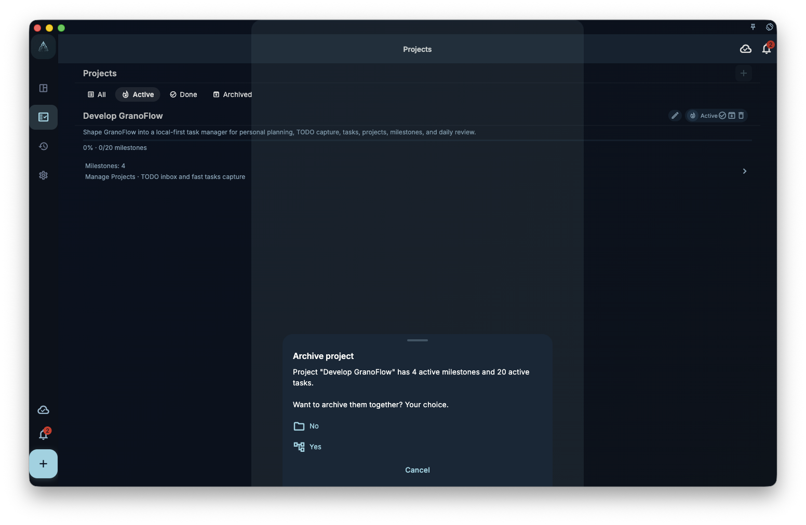

When a project is finished or no longer active, you have three options: complete, archive, or delete.

They are different. Choosing the wrong one could accidentally remove tasks or milestones, so read this before tapping delete.

## The three operations

| Operation | What it means | What happens to tasks inside |
|-----------|---------------|------------------------------|
| **Complete** | Goal achieved | Tasks remain, can be reviewed |
| **Archive** | Set aside, out of the active view | Tasks remain, can be restored |
| **Delete** | Remove permanently | Depends on what is inside (see below) |

## How to access these options

In the project detail page, open the menu in the top-right corner to find Complete, Archive, and Delete.

## Deletion protection

If the project still has unfinished tasks or milestones, GranoFlow will not let you delete it outright. It will first ask you to decide what to do with the contents:

- Move tasks to another project
- Complete or archive the tasks inside
- Confirm deletion (including all tasks)

This guard exists to prevent accidental data loss from a quick, unintentional tap.

:::tip[When in doubt, archive]
If you are not sure whether you will need this project later, archive is far safer than delete. Archived projects can be restored anytime. Delete cannot be undone.
:::

## Complete vs archive — which to choose

- Goal was **achieved**: choose "Complete" — it records a completion date for the project
- Goal is **on hold** or you just do not want it cluttering your view: choose "Archive" — it does not mean success, just out of sight
- Project is **no longer needed** and you want the content gone too: only then choose "Delete"
