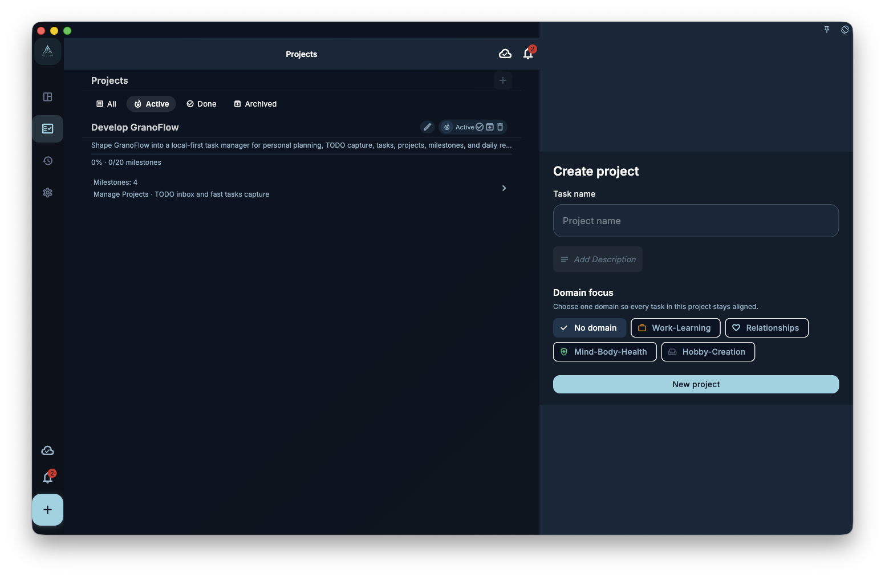

Creating a project is fast: open the projects page, tap **+**, give it a name, done.

## Where to start

In the project list, tap the **+** button in the top-right corner. A creation dialog appears.

You can fill in:

- **Name** (required): make it descriptive — "Q3 product launch" beats "Project 1" every time
- **Domain** (optional): assign the project to a life area like Work, Health, or Learning
- **Due date** (optional): the overall target completion date for the project

:::tip[A good name saves future headaches]
The project name is the first thing you see when scanning your project list. A verb-plus-goal format works well: "Finish thesis" instead of "Thesis".
:::

## Create empty vs tasks-first

Both approaches work — pick whichever fits how you think:

| Approach | Best when |
|----------|-----------|
| Create project first, add tasks later | Planning phase — you want to build the structure first |
| Capture tasks in inbox, then assign to project | Action phase — capture quickly, organize later |

Either way, tasks end up in the project.

## After creating the project

The usual next steps are:

1. Add milestones (optional) — if the goal has clear phases
2. Link existing tasks to the project
3. Create new tasks directly inside the project

If you are not sure what to add yet, just close the project page. It will be there when you come back.
