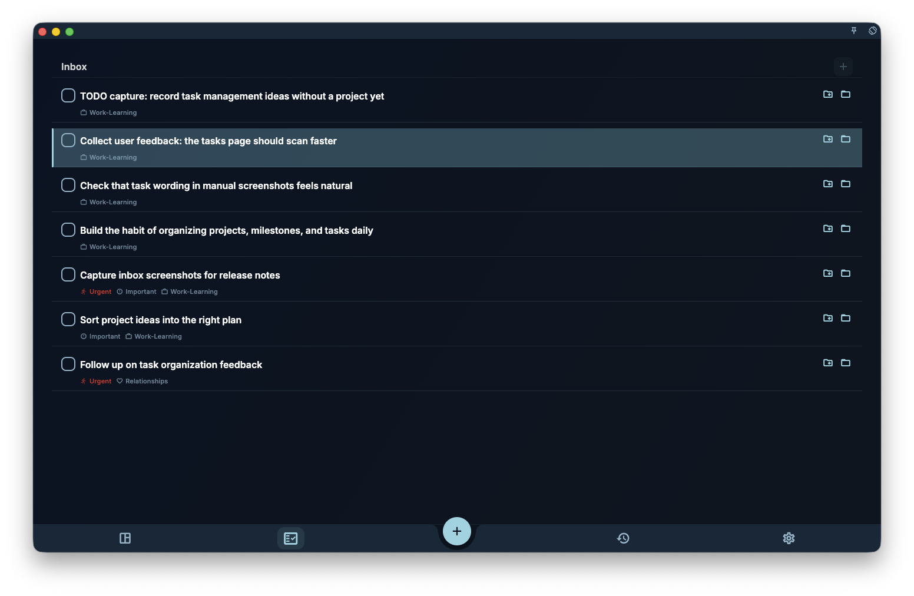

After you link a task to a project, it appears in the project. If the task has
a date, it still appears in Today or Calendar. The project tells you which
project the task belongs to; the milestone tells you which stage of that
project it belongs to.

The most common misunderstanding is about the Inbox: **linking a task to a
project by itself does not make a dateless task leave the Inbox
automatically**. The Inbox primarily looks at whether a task has a date; if
the task still has no date, it may continue to stay in the Inbox so you can
schedule it later.

## How to link

You can link a task to a project in several ways.

### Method 1: choose a project from the task detail

Open the task detail, find the project field, and choose the target project.
If needed, you can also choose a milestone inside that project.

This is the most common way, especially when you already have the task open
and want to classify it directly.

### Method 2: “Add to project” from the task list or Inbox

When you use “Add to project” from the task list or Inbox, you need to choose
a specific milestone. This links the task to both the project and that phase.

<!-- manual-screenshot:id=projects-link-tasks-drag -->

### Method 3: create a new task from the project page

Open the project detail page and add a task under a milestone. The task
automatically picks up the current project and milestone, so you do not need
to select them again.

## Where a linked task appears

After linking a task to a project, the same task may appear in more than one
place. It has not been copied; it is the same task shown in different views.

| View | Behavior |
| --- | --- |
| Project page | Appears in the project and, if chosen, under a milestone |
| Today view | Still appears if the task is due today |
| Calendar view | Shows by due date |
| Inbox | May remain if it has no date and is pending or in progress |

:::note[Inbox changes]
The Inbox is not “the list of tasks without a project”; it is “the list of
pending tasks that haven’t been scheduled yet”. If you link a task to a
milestone that has a due date, GranoFlow may bring that milestone date to the
task; the task then appears by date in the task list or calendar and leaves
the Inbox.
:::

## Project vs milestone

Linking to a project means the task belongs to that project.

Linking to a milestone means the task belongs to the project and also to a
specific stage inside it. For example, if a project has milestones like
“Prepare”, “Execute”, and “Review”, the task can be placed under one of those
milestones.

The “Add to project” action from the task list or Inbox usually requires you
to pick a specific milestone. This prevents tasks from being attached to a
large project without knowing which phase they are in.

## Remove a task from a project

Open the task detail and clear the project field.

After you clear it, if the task also has no due date and is still pending or
in progress, it reappears in the Inbox. If it still has a due date, it
continues to appear by date in Today or Calendar.

## Can a task belong to multiple projects?

No. Each task can belong to only one project (and one milestone).

If a task feels like it spans two projects, you usually have two options:

1. Pick the project it mainly belongs to
2. Split it into two tasks, one for each project
