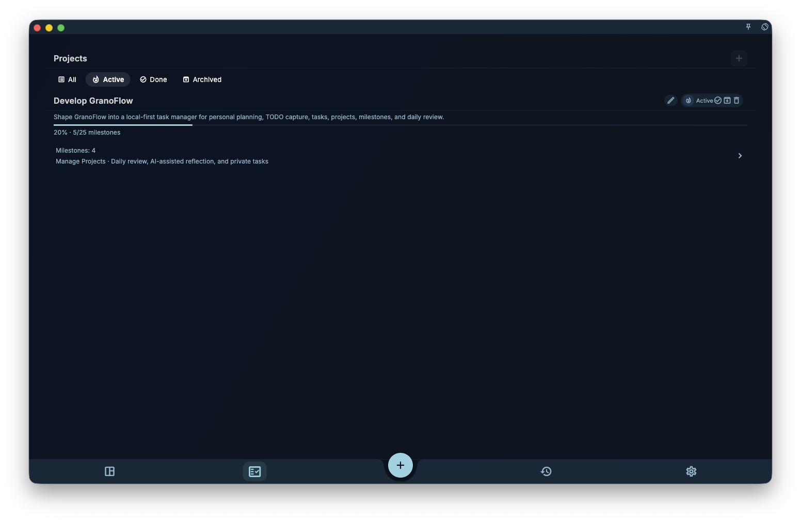
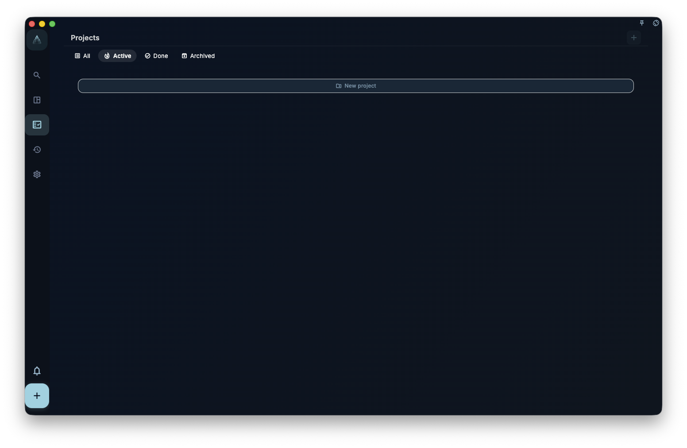
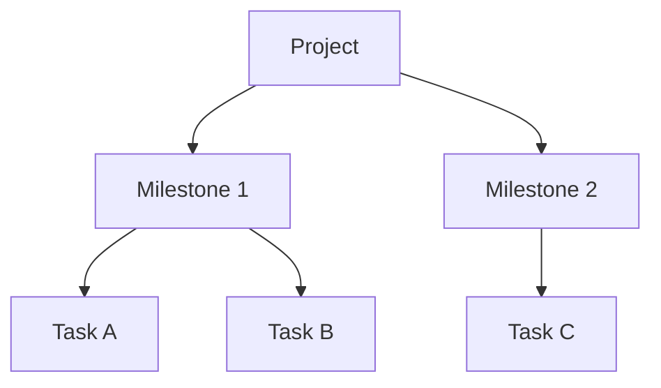

Use a project to manage a goal that lasts for a while: put related tasks in one place, split the work with milestones, and check the overall progress.

A task is one specific thing to do. A project is the larger goal behind a group of related tasks. For example, if you are moving house, buying boxes, packing the kitchen, and calling the moving company are tasks. “Moving house” is the project. When those tasks live in one project, you do not have to look around for them, and it is easier to see how far the whole thing has progressed.

## What you see in a project

In the project list, you can see your projects and the current progress for each one. If the screenshot does not load, think of this as the overview page for all projects: find the project you want, then open its detail page.

Inside a project, you can see:

- All milestones in the project, meaning its phase goals
- Tasks under each milestone
- How much of the whole project is complete

On a wide screen or desktop, clicking a task opens the task detail on the right. This lets you read a project’s phases and a task’s details side by side, without jumping between pages.

## What projects can and cannot do

Projects **can**:

- Keep related tasks in one view
- Split a large goal into phases with milestones
- Track overall project progress

Projects **cannot replace**:

- Today’s schedule: due dates still decide when something should be done
- Tag filtering: tags are still for cross-project categories
- Daily review: daily review shows what you completed each day, not the project view

:::tip[When to create a project]
If something will create three or more related tasks and last more than a week, it is worth creating a project. If it is only one or two tasks, just create the tasks directly. You do not need a separate project.
:::

## Quick recap: the three-layer structure

Use the three layers only when you need them: project, milestone, and task. Simple goals can use just “project + tasks”; milestones are optional.
