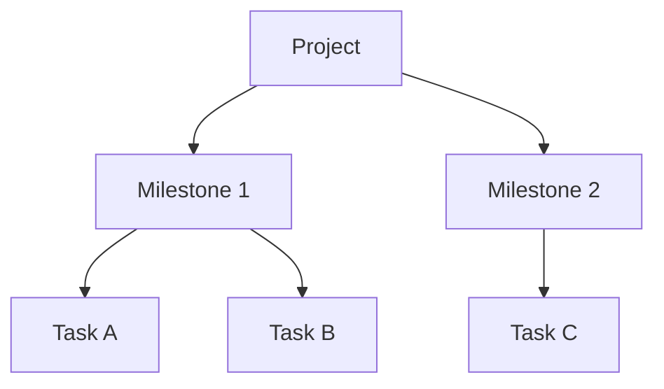

A task is one concrete thing to do. A project is a sustained goal.

Think of moving house: buy boxes, pack the kitchen, call the moving company — those are tasks. "Moving house" as a whole is the project. Put all those tasks into one project and you can see at a glance how the move is progressing.

## What you see in a project

Inside a project you can see:

- All milestones (phases)
- Tasks under each milestone
- Overall completion progress

On a wide screen or desktop, clicking a task opens its detail on the right — no page jumping needed.

## What projects can and cannot do

Projects **can**:

- Keep related tasks in one view
- Use milestones to mark phases
- Track overall progress

Projects **cannot replace**:

- Today's schedule (due dates still control when something shows up as "today")
- Tag filtering (tags work across projects)
- Daily review (review tracks what you completed each day, not project progress)

:::tip[When to create a project]
If something will generate three or more related tasks and take more than a week, it is worth creating a project. If it is just one or two tasks, do them directly — no project needed.
:::

## Quick recap: the three-layer structure

Use all three layers only when you need them. Simple goals can work with just a project and tasks — milestones are optional.
