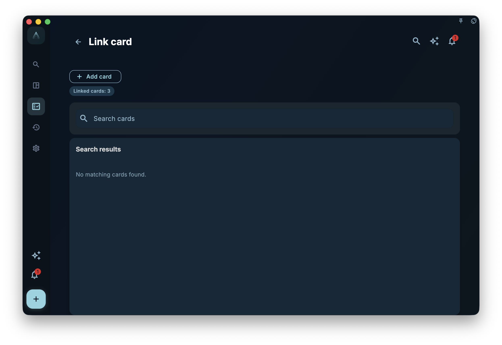
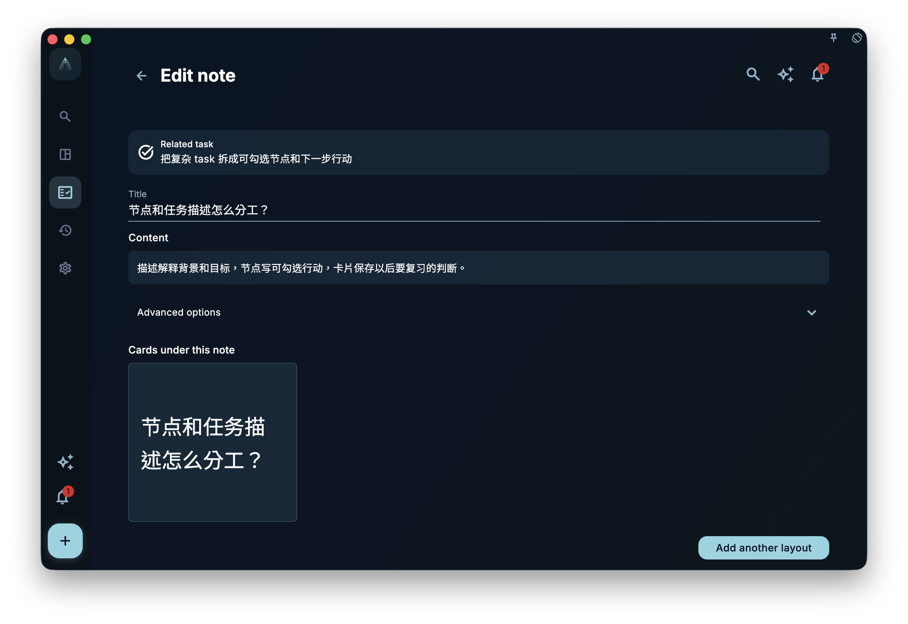
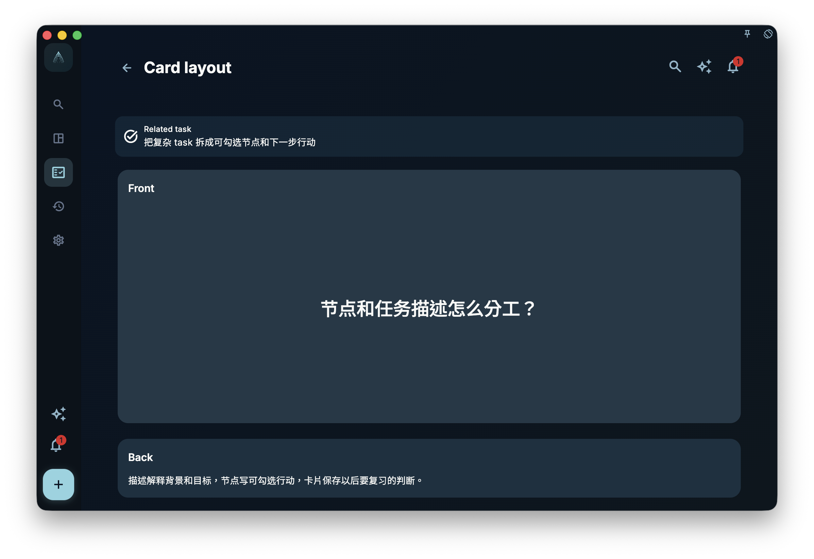
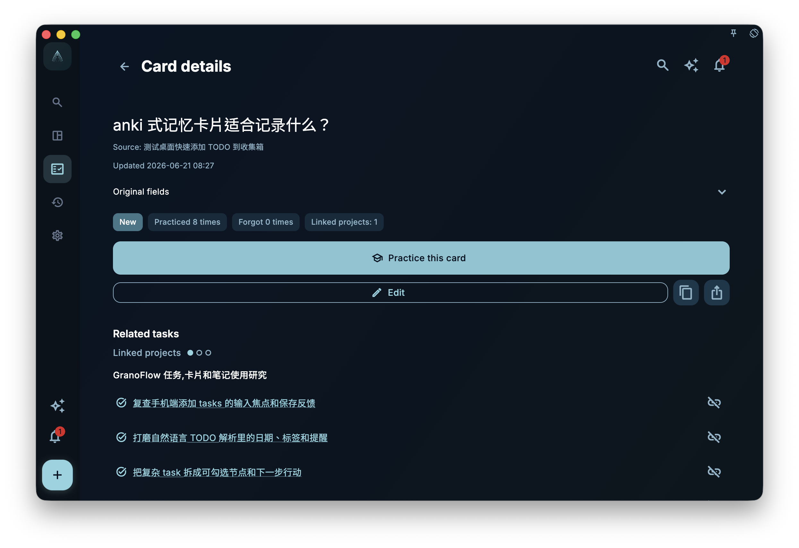

When creating a card, the most important thing is not to think "how many do I want to make," but rather "where did this insight come from, and where should it return to?"

In GranoFlow, cards usually enter from a task context. This has a benefit: you're not creating knowledge from scratch in a blank page; you're organizing insights alongside an event that already happened. The task provides the source, the card stores reusable judgment, and the link ensures that judgment can return to similar tasks later.

## Don't Aim for a Complete Card Library from the Start

Many people new to card systems try to build a complete knowledge base first: categories, templates, tags, imports, batch organization — everything arranged.

But the insights that really stick rarely come that way. They come when you finish something and suddenly realize:

> This insight will definitely be useful again.

Creating a card at that moment is far more valuable than importing hundreds at once. Because it knows where it came from, and it knows why it exists.

## Core Concept: First the Note, Then the Card Layout

GranoFlow separates "notes" and "card layouts."

The note page holds the complete context — title, content, translations, and custom fields. The card layout page determines how those note fields appear on the front and back. Think of it as: the note preserves context, the card handles practice format.

Multiple cards can be created from the same note. For example, a note on "Interview question design" could produce one card asking about principles and another asking for examples. They share the same note, but each card has its own front and back arrangement.

This separation is important. It avoids duplicating a note just to make a second related card, and lets you return later to the same note for further expansion.

## A Real Task Example

Suppose you've completed a task like "Read a paper on usability testing." During review, you realize a recurring insight:

> Test questions should make users perform real actions, not rate the interface.

You can start from the "Task Cards" area in the task details:

1. Click "Add Card" to go to the "Link Cards" page.
2. First search existing cards to see if the same insight already exists.
3. If no suitable result, select "Add Card."
4. On the note page, fill in the title, e.g., "Usability testing should observe real actions."
5. Once the title is filled, other fields unlock; continue filling in content.
6. Go to the card layout page and arrange note fields onto the front and back.
7. After completing the layout, return to the note page. This card will be linked to the current task.

The note page auto-saves field content. When saved successfully, a brief "Saved" indicator appears next to the title. You don't need to look for a separate "Save Note" button.

<!-- manual-screenshot:id=review-card-task-link-page -->

## What Happens When Adding Manually

Adding a card manually involves two main pages:

1. **Note page**: Fill in the title first. Once the title is non-empty, other fields unlock; content auto-saves.
2. **Card layout page**: Choose which fields appear on the front and which on the back.

If no cards exist yet under this note, the footer shows "Make Card." If cards already exist, the footer shows "Make Another Card" to create another card from the same note.

Cards under this note are displayed as a grid of front-face thumbnails, which try to fit the current side's content completely. Tap a thumbnail to switch to the back; tap again to return to the front. Advanced options allow adding title translations, content translations, and custom fields.

The source is automatically written from the current task name when the title is first saved — it won't clutter the note page. During review, it appears subtly at the bottom of the back to remind you where the card came from.

<!-- manual-screenshot:id=review-card-note-edit-page -->

## The Card Layout Page Determines What You See During Practice

The note page holds the material; the layout page decides how the front and back appear. Before entering the layout page, both title and content must be saved. If the note lacks a title or content, GranoFlow will bring you back to the note page to fill them in.

The layout page is divided into "Front" and "Back" sections. Tap a section to select title, content, translation, or custom fields. When editing an existing card, the page also provides a "Practice Card" entry to check how the layout works during real review.

If the same note is suitable for multiple cards, you don't need to duplicate the note. Just return to the note page and click "Make Another Card" to design another front-and-back arrangement for the same material.

<!-- manual-screenshot:id=review-card-layout-page -->

After finishing the layout, you can check whether the card is easy to recall on the practice page. The answer page shows the back content and feedback buttons, helping you turn "I think this card is good" into a real retrieval exercise.

<!-- manual-screenshot:id=review-card-study-answer -->

## Linking Existing Cards

You don't always need to create a new card.

If you already have a relevant card, search for it on the "Link Cards" page first. The page shows how many cards are already linked to the current task and excludes those already confirmed as linked to avoid duplication. When you tap a note result, a panel opens showing a two-column thumbnail grid of linkable cards; tapping the same note result again closes the panel. Active cards show the front by default with a highlighted border; archived cards show the back by default with subdued styling. Tapping a card toggles between front and back to indicate whether it will be linked as active or archived. The bottom shows how many cards are being linked this time, how many are active, and how many are archived. After tapping "Link," the panel closes, the note result disappears from the list, and the linked card count increases by the number of active cards.

Linking existing cards is suitable for these cases:

- The current task is using an insight you summarized before.
- You find a card highly relevant to this task.
- You want this card to show its usage across different tasks later.

This step may seem simple, but it affects the "internalized" judgment. The system only marks a mastered card as internalized if it has been brought back to tasks in multiple different projects.

## Card Details and Edit Entry

When you open a single card from card management, the task cards area, or the post-practice entry, you enter card details. This is for confirming the card's front and back, source, translations, related tasks, and available actions.

The details page is for checking, not for long editing sessions. To adjust the card face, enter the edit entry; GranoFlow takes you to the layout editing page, not a separate isolated "card editor." To change title, body, translations, or custom fields, go back to the note page from the layout page.

<!-- manual-screenshot:id=review-card-detail-page -->

## Using the Task AI Assistant to Generate Card Drafts

The task AI assistant is suitable for organizing reusable insights into card drafts after analyzing or reviewing a task. It does not silently create cards.

The AI first confirms with you in natural language about task understanding, source material, and candidate card directions. Only after you explicitly agree to output and confirm the import will GranoFlow create the note, card layout, and associate it with the current task.

Remember a boundary here: AI can help draft, but it cannot decide whether the insight is truly worth keeping. That's what the confirmation stage is for. If you see a well-worded insight that won't be useful later, ask the AI not to import it. If you see something with correct direction but imprecise phrasing, have the AI revise it before confirming.

## How the Task Cards Area Displays

The "Task Cards" area in task details groups multiple cards under the same note. Unarchived cards appear before archived ones; archived cards can still be opened from the task context but in a more subdued state.

You can tap a single card to enter layout editing. Swipe right on a card in task details to archive or unarchive; swipe left to unlink it from the current task. Unlinking does not delete the card or affect its relationships with other tasks. If multiple card variants exist under the same note, GranoFlow unlinks the entire note from the current task and warns you about the scope if needed.

In daily, weekly, and monthly reviews, task cards reuse a similar list. But since those aren't single-task contexts, swiping left moves the card to the trash instead of unlinking from the current task.

## When Not to Create a Card

If something is just an emotion of the day, a temporary arrangement, or a fact that won't be reused, don't force it into a card.

For example, "Meeting at 3 PM today" is not suitable for a card; "Before an important meeting, confirm whether the decision-maker is present" might be. The former is one-time information, the latter is a reusable judgment.

The next chapter continues: After cards are created, how practice, archiving, mastery, and internalization ensure they don't just stay in the system, but actually return to your actions.
