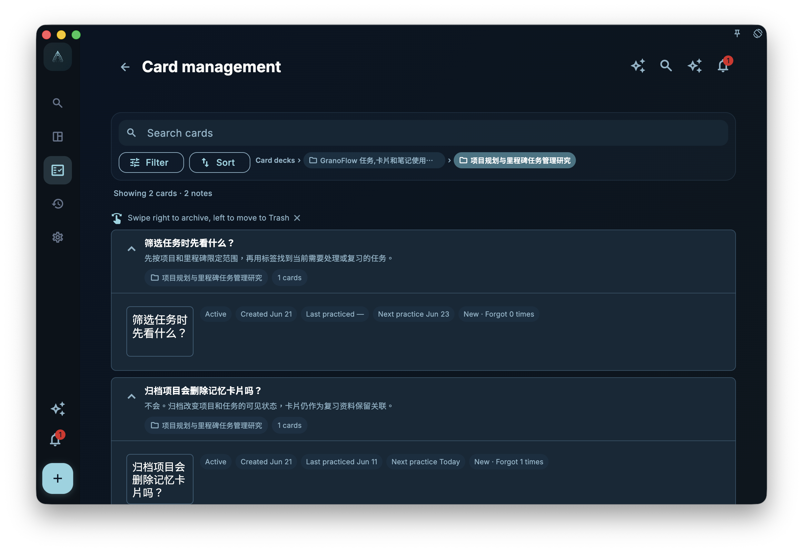

When cards multiply, you'll naturally want to organize them: which belong to the same batch of tasks, which come from the same import package, which can be migrated to another device, which should be temporarily archived.

That's why card boxes exist. A card box is not another project system, nor a full backup. It's more like a container for managing and migrating a specific scope of cards.

## Don't Mix Up Three File Types

There are a few easily confused things in GranoFlow:

- `.flow.grano`: Full local backup, used for whole-device migration or restoration.
- `.deck.grano`: GranoFlow's own card box package, handling only the selected card box and its cards.
- Anki/APKG: Anki's card box format, which is not the same as GranoFlow's note, layout, and task association model.

They all seem related to "import/export," but they solve different problems. Treating `.deck.grano` as a full backup will miss tasks, projects, and reviews. Treating Anki as a native GranoFlow card box will misunderstand the boundaries of fields, media, templates, and learning records.

## Core Concept: Card Boxes Handle Scope, Not Your Whole Life System

A card box focuses on a set of cards and their card box tree. It can help migrate a certain category of knowledge or experience, like "paper reading methods," "user interview experience," or "product design principles."

But task entities, projects, milestones, daily reviews, accounts, and device keys are not the responsibility of `.deck.grano`. It won't create task entities, nor can it replace a full local backup.

You can judge like this:

- To switch devices or restore a whole device, use `.flow.grano` local backup.
- To migrate or share a specific card box, use `.deck.grano`.
- To try bringing in Anki cards, read the Anki import entry and instructions, but don't expect lossless conversion.

## A Real Task Example

Suppose you've organized a set of "Research Writing" cards containing insights on reading papers, writing abstracts, preparing group meetings, and handling supervisor feedback. You want to migrate this set to another computer.

You don't need to export the entire GranoFlow backup, nor should you think of it as an Anki package. Go to the card box list, select the top-level card box, and export `.deck.grano`. This package will include the selected top-level card box, sub-card boxes, undeleted cards, and any packable local image media.

If you've turned on "Include learning records," learning records will be included in the export package; by default they are not. Similarly, during import, learning records are not imported by default; they are only merged if you explicitly turn on "Import learning records" in the import preview.

## Where to Manage Card Boxes

The main entry for card box–level import, export, and Anki import is in the card box list.

You can reach the card box list from card statistics, or from the card management page via the card box breadcrumb. The list top provides "Import Card Box" and a subdued "Import Anki Card Box" entry. Each top-level card box row has an export button. In the current version, the Anki entry only shows instructions and a feedback entry; it won't let you select a `.apkg` file or actually import Anki cards.

The card management page itself is mainly for searching, filtering, sorting, and organizing cards within the current scope; it doesn't handle card box–level import/export. This separation prevents you from mistakenly thinking you're operating on the entire card box when you're just organizing a single card.

<!-- manual-screenshot:id=review-card-deck-list-main -->

## Managing Cards Only Within a Card Box

When you enter "Manage Cards" from a specific card box, GranoFlow opens the card management page scoped to that card box. This page still provides search, filter, sort, archive, and trash capabilities, but the scope is limited to the current card box and its sub-card boxes.

This is suitable for partial organization, like checking only the "Research Writing" card box for mastered cards or cards that should be archived. It is not the same as the card box list, nor does it provide card box–level import/export. To export `.deck.grano`, go back to the card box list.

If you enter from the general card management page, you see the global scope; if you enter from a card box row, you see that card box's scope. When troubleshooting "why are there fewer cards here," first confirm whether you're currently within a specific card box scope.

<!-- manual-screenshot:id=review-card-deck-scoped-management -->

## Archiving and Deleting in the Card Box List

The card box list shows statistics for active, archived, not started, learning, mastered, and internalized.

In the card box list:

- Swipe right to archive non-internalized cards; internalized cards remain in active review.
- Swipe left only deletes cards not linked to any task.
- The card box itself is preserved as much as possible, especially when it still contains cards that cannot or should not be deleted.

This design is a bit conservative, but necessary. A card box often contains a whole set of insights; deleting by mistake is costlier than a single card. Internalized cards deserve special caution because they've been used in multiple projects.

## What `.deck.grano` Can Do

`.deck.grano` is suitable for migrating a card box between GranoFlow instances.

It handles:

- Selected top-level card box and sub-card boxes
- Undeleted cards
- Notes, fields, layouts, and packable local image media
- Optional learning records

It does not handle:

- Task entities
- Project and milestone entities
- Daily, weekly, monthly review content
- Complete account or device restoration
- Lossless preservation of arbitrary Anki templates, CSS, or scheduling history

Before importing `.deck.grano`, GranoFlow shows a preview for you to confirm. The import does not create task entities; it only retains task associations that still exist on this device and are not in the trash. Missing task associations are counted in the preview and skipped; cards with no valid task associations may go into the archived cards.

## How to Understand the Anki Entry

Anki/APKG and GranoFlow's card format are completely different.

Anki emphasizes card templates and field combinations; GranoFlow also handles task associations, notes, layouts, media boundaries, card box sources, and review context. So Anki import cannot be understood as "copy as is."

The current Anki entry shows instructions and limitations. After confirmation, GranoFlow opens the `@GranoFlow` X page as a feedback entry; it does not go into file selection, precheck, or import progress.

Under the hood, Anki/APKG compatibility code and defenses remain, but this does not mean the current user interface has opened Anki import. Even if it reopens in the future, you should not expect lossless migration of arbitrary Anki templates, CSS, scheduling history, or learning records.

A safer approach remains: let GranoFlow cards come from your own tasks and reviews. The Anki entry can be a supplement, but should not become the main path for building your experience system.

## Relationship with Full Backups

If you're preparing to switch devices, reinstall the system, or do a large-scale deletion, first create a full local backup `.flow.grano`. The full backup is the main line of defense to return to a point in time.

The "Card Boxes" card in the Data Management page handles `.deck.grano` import, Anki import instructions, card box export, viewing card cache, and clearing cache. But none of these equal a full backup.

A simple principle:

- Worried about losing the entire data set? Back up first.
- Only want to migrate a set of cards? Export the card box.
- Want to import external cards? First read the limitations; the current Anki entry only collects feedback, `.deck.grano` is the main path for migrating card boxes between GranoFlow instances.

## Closing

Card boxes let the card system be organized, migrated, and scoped, but they don't change the core: what truly matters is whether insights can return to tasks. Import/export are just transportation; a card's value ultimately depends on whether it helps you make better judgments in your next action.
