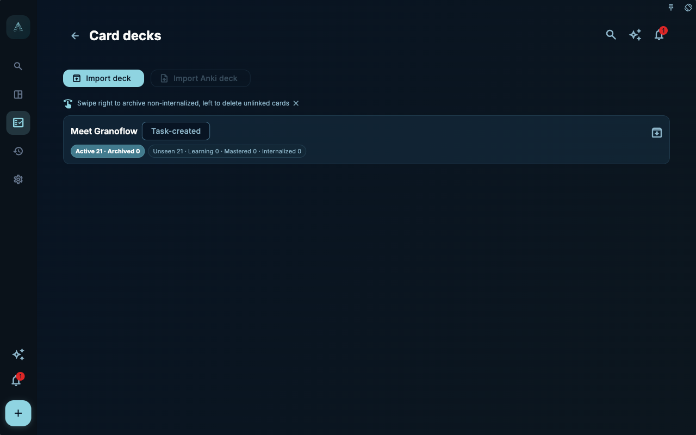

When you accumulate many cards, you naturally want to organize them: which belong to the same batch of tasks, which came from the same import package, which can be migrated to another device, and which should be temporarily archived.

That is why card decks exist. A deck is not another project system, nor a full backup. It is more like a container for managing and migrating a set of cards.

## Don’t Confuse the Three File Types

There are several easily confused items in GranoFlow:

- `.flow.grano`: Full local backup, used for whole‑device migration or recovery.
- `.deck.grano`: GranoFlow’s native deck package, handling only selected decks and their cards.
- Anki/APKG: Anki’s deck format, which is incompatible with GranoFlow’s notes, layout, and task-linking model.

They all look related to “import/export,” but solve different problems. Treating `.deck.grano` as a full backup will miss tasks, projects, and reviews. Treating Anki as a native GranoFlow deck will also misunderstand the boundaries of fields, media, templates, and study history.

## Core Concept: Decks Handle Scope, Not Your Entire Life System

A deck focuses on a set of cards and their deck tree. It helps you migrate a particular body of knowledge or experience, such as “paper reading methods,” “user interview insights,” or “product design principles.”

However, task entities, projects, milestones, daily reviews, accounts, and device keys are not the responsibility of `.deck.grano`. It will not create task entities, nor can it replace a full local backup.

You can decide like this:

- For device swap or full‑device recovery, use the `.flow.grano` local backup.
- To migrate or share a specific deck, use `.deck.grano`.
- If you want to bring in Anki cards, check the Anki import entry and its notes, but do not expect lossless round‑trip fidelity.

## A Real‑World Task Example

Suppose you have organized a set of “scientific writing” cards, containing experiences from reading papers, writing abstracts, preparing group meetings, and handling supervisor feedback. You want to migrate this set of cards to another computer.

In this case, you do not need to export the entire GranoFlow backup, nor should you treat it as an Anki package. Go to the deck list, select the top‑level deck, and export a `.deck.grano` file. That package will include the selected top‑level deck, its sub‑decks, undeleted cards, and packable local image media.

If you turned on “Include study history,” study history will be written into the export package; by default it is not included. Similarly, when importing, study history is not imported by default—only if you explicitly enable “Import study history” in the import preview will it be merged.

## Where to Manage Decks

The main entry points for deck‑level import, export, and Anki import are in the deck list.

You can reach the deck list from the card statistics screen, or from the card management page via the deck breadcrumb. At the top of the list, you will find “Import Deck” and “Import Anki Deck”; each top‑level deck row has an export button at its end.

The card management page itself is primarily for searching, filtering, sorting, and managing cards within the current scope; it does not handle deck‑level import/export. This separation prevents you from thinking you are working with an entire deck while you are only managing a single card.

<!-- manual-screenshot:id=review-card-deck-list-main -->

## Archiving and Deleting in the Deck List

The deck list shows statistics such as active, archived, unseen, learning, mastered, and internalized.

In the deck list:

- Swipe right to archive non‑internalized cards; internalized cards remain in active review.
- Swipe left only deletes cards that are not linked to any task.
- The deck itself is preserved as much as possible, especially when it still contains cards that cannot or should not be deleted.

This design is somewhat conservative, but necessary. A deck often contains a whole body of experience; the cost of accidentally deleting it is much higher than that of a single card. Internalized cards deserve extra caution because they have been used in multiple projects.

## What `.deck.grano` Can Do

`.deck.grano` is suitable for migrating a deck between GranoFlow instances.

It will handle:

- Selected top‑level deck and sub‑decks
- Undeleted cards
- Notes, fields, layout, and packable local image media
- Optional study history

It will not handle:

- Task entities
- Project and milestone entities
- Daily, weekly, or monthly review body text
- Full account or device recovery
- Lossless round‑trip of arbitrary Anki templates, CSS, or scheduling history

Before importing a `.deck.grano` file, GranoFlow shows a preview for your confirmation. The import does not create task entities; it only retains task associations that still exist on this device and are not in the trash. Missing task associations are counted and skipped in the preview; cards without a valid task association may end up in the archived section.

## How the Anki Entry Works

Anki/APKG and GranoFlow have completely different card formats.

Anki emphasizes card templates and field combinations; GranoFlow additionally handles task associations, notes, layout, media boundaries, deck provenance, and review context. Therefore, Anki import cannot be understood as “bring everything in as-is.”

The current Anki entry displays notes and limitations. If it encounters unsupported templates, remote media, missing attachments, video media, or content that cannot reliably derive a title, the import may be rejected or skip some data and cards. Even after a successful import, you should not expect arbitrary Anki templates, CSS, scheduling history, and study history to migrate without loss.

A safer approach is still to let GranoFlow cards come from your own tasks and reviews. The Anki entry can be a supplement, but should not become the main path for building your experience system.

## Relationship with Full Backups

If you are preparing to switch devices, reinstall the system, or perform a large‑scale deletion, you should first create a full local backup (`.flow.grano`). The full backup is the primary line of defense to return to a previous point in time.

On the Data Management page, the “Decks” card handles `.deck.grano` import, Anki import instructions, exporting the current deck, viewing card cache, and clearing cache. None of these are equivalent to a full backup.

A simple rule of thumb:

- If you worry about losing your entire dataset, back up first.
- If you only want to migrate a set of cards, then export the deck.
- If you want to import external cards, read the limitations first, then try on a small scale.

## Summary

Decks allow you to organize, migrate, and control the scope of your card system, but they do not change the core truth: what really matters is whether the experience can return to your tasks. Import and export are just ways to move data; whether a card has value ultimately depends on whether it helps you make better judgments in your next action.
