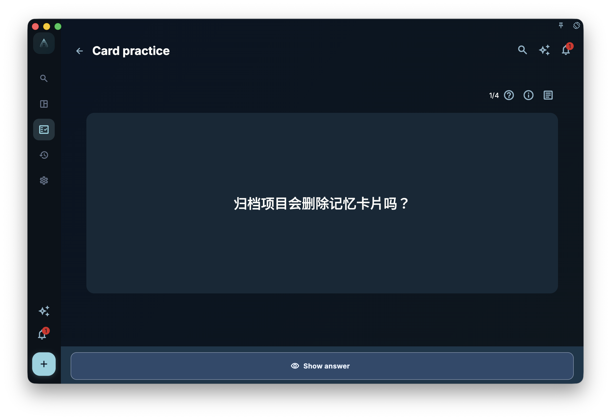
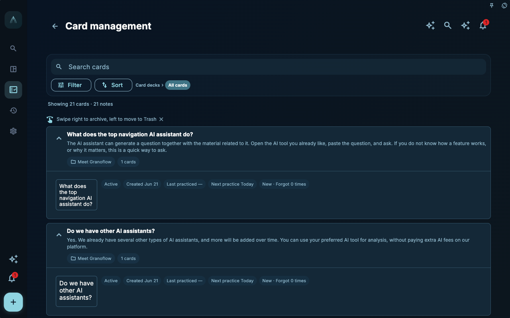

Card practice can easily feel stressful. See a question, flip to the answer, then click "Forgot" or "Easy" — as if the system is grading you.

In GranoFlow, it's better to think of it as a brief reminder: Do I still remember this insight? Do I know where it applies? Next time I encounter a similar task, can I make a faster judgment?

Practice isn't about proving you have a good memory; it's about giving insights a chance to move from the card back into action.

## Misconception: Easy Review Means You've Learned

Just because you can answer a card today doesn't mean you can use it in a real task tomorrow.

For example, you can recite:

> Interview questions should elicit concrete experiences.

That's good, but not enough. What's truly useful is when you're writing an interview guide next time, you naturally change "What do you think" to "Last time it happened, what did you do?" That's when the card moves from memory to use.

GranoFlow uses "Mastered" and "Internalized" to distinguish these two layers. Mastered means it's stable in review; internalized means it has been brought back to tasks in multiple different projects and starts participating in real actions.

## Core Concept: Active Review vs. Contextual Review

"Card Learning" on the Progress page is active review. It reminds you which active cards need practice based on today's due and review schedule.

Card practice in tasks, daily reviews, weekly reviews, and monthly reviews is contextual review. It doesn't just ask "Is today due?" but rather "Are there any relevant insights in this task or review worth revisiting?"

Both types of practice matter:

- Active review helps maintain memory and prevents insights from sinking completely.
- Contextual review helps put insights back in context and see if they can guide the current task.

If active review is like periodically checking bookmarks, contextual review is like discovering an old bookmark that's exactly useful when writing a new chapter.

## A Real Task Example

You have a card:

- Front: When designing interview questions, how to avoid getting only abstract evaluations?
- Back: Ask about a recent real experience, including the constraints at the time, actions taken, and subsequent changes.

The first time you practice, you might click "Hard." After a few more rounds, you answer steadily and it becomes mastered.

But the real change happens later. You link this card to tasks in three different projects: "Thesis Interview," "Product User Research," and "Team Retrospective Interview." You use it when preparing questions. At that point, the system marks it as internalized: it's not just remembered, it's been used across different projects.

Internalization is not an automatic AI assessment, nor does it mean the card never needs review again. It's just a very useful hint: this insight has stepped out of the card box and returned to your actions.

## Four Learning States

Card learning states are divided into four:

- **Not Started**: No review records yet, or no learning state.
- **Learning**: Has been reviewed but hasn't reached mastered.
- **Mastered**: Stable in review, but doesn't yet meet the conditions for internalized.
- **Internalized**: Mastered and the same card has been linked to tasks in 3 different projects.

Multiple tasks in the same project count as only one project. This limitation is important because internalization looks at cross-scenario transfer, not repeated occurrence in the same project.

## How to Rate During Practice

The practice page shows a question. After you tap to reveal the answer, use four feedback options:

- **Forgot**: Barely remembered.
- **Hard**: Have some impression but not stable, or needed the answer to piece it together.
- **Good**: Could answer, understood basically.
- **Easy**: Very natural, almost effortless.

These four ratings are used by the system to schedule subsequent reviews. Don't tap a higher rating just to make statistics look good, and don't blame yourself if you're having a bad day. The more honest the feedback, the more helpful the reminders will be.

Sometimes a card may appear again later in the same session even after you have rated it. This usually means the system decided it is still worth practicing again today. The card moves to the end of the queue, but it does not increase the session total or the completed count. The completed count only moves forward when the next practice time is scheduled for tomorrow or later. In the early learning stage, even the first "Good" rating may mean seeing the card again a few minutes later; answering "Good" consistently, or choosing "Easy," is more likely to push the interval beyond today.

If today's due count is 0 but there are still practice candidates, the progress page might display "Today's card practice is complete" and "Practice another set." This is for when you still have energy to continue with a small group; it doesn't mean you have to complete extra today.

<!-- manual-screenshot:id=review-card-study-question-focus -->

## Active Review Queue Page

When you enter active review from card statistics or the progress page, it first forms a queue of currently practiceable cards. This entry is not a detail page for a single card; it's a practice session: after you see a card, show the answer, and give feedback, the system continues to the next one.

If the queue temporarily has no cards to process, the page shows a completion state or guides you back to card statistics. It doesn't mean the card box is empty, only that there are no pending items within the active review scope. Contextual review in task details, daily, weekly, and monthly reviews may still show relevant cards.

<!-- manual-screenshot:id=review-card-study-queue -->

## Viewing Notes

Some cards belong to a more complete note. The practice page provides a note entry; opening it shows a side panel with:

- Note title and content
- Corresponding translation
- Source
- Associated projects and tasks
- All cards under the same note

Associated projects are indicated by three dots covering 0, 1, 2, or 3+ projects; tasks without a project are listed under "Not in a Project." Tapping an associated task first closes the note panel, then opens the task details.

The purpose of this panel is not to read long texts during practice, but to help you recover context when needed: where the card came from, which tasks it's related to, and what other cards exist under the same note.

## Archiving and Trash

Archiving is for cards that you don't want in active review anymore but still have preservation value.

Archived cards do not appear in the progress page's active review count, today's due, or active review queue; but they still retain content, task links, and review context. You may still see them in related tasks or reviews, and can unarchive them in the archived view if needed.

Moving to the trash is different. It means the card is temporarily deleted and won't appear in ordinary card details, learning queues, or the link card area. As long as the trash isn't emptied, you can still restore it; after permanent deletion or clearing the trash, you can't rely on the trash to recover it.

Archived and trashed cards are both viewable in "Card Management." Enter card management, tap "Filter" in the toolbar, and choose "Archived" or "Trash" under Status. If you entered card management from a specific card box, the filter applies only within that card box. The outer "Archived" and "Trash" pages only handle tasks, not cards.

By default, internalized cards are protected in the card management list. When you swipe to archive or delete, the system warns you that the card has been used in multiple projects. This warning isn't to stop you from organizing, but to prevent accidentally removing an insight that has proven valuable.

## Entering Practice from the Progress Page

The "Card Learning" area on the progress page shows the number of active review cards and today's due count. Tapping the total card count enters card statistics, where you can view learning states, load for the next 7 days, and recent practice activity.

Card statistics is the main entry to the card series pages. From there you can enter card practice or open card management. Card practice and card management open as subpages and return to the card statistics page.

Card management organizes cards by note, not as isolated items. From a note, you can see its multiple cards, archival status, and learning status. Internalized cards have extra warnings during organization to prevent you from accidentally moving an insight that has proven useful across multiple projects.

<!-- manual-screenshot:id=review-card-management-main -->

## A Quick Check

After practicing a card, quickly ask yourself:

- Am I just remembering the answer, or do I know what type of task it applies to?
- Should it continue in active review?
- Is it outdated and should be archived or moved to trash?
- Is there a recent real task I could link it to?

You don't need to write these down every time. They just help pull practice away from "tapping buttons" and back to "what to do next."

The next chapter covers card boxes, import, export, and backup boundaries: when cards multiply, how to migrate and organize without mistaking the card box for a full backup or an Anki clone.
