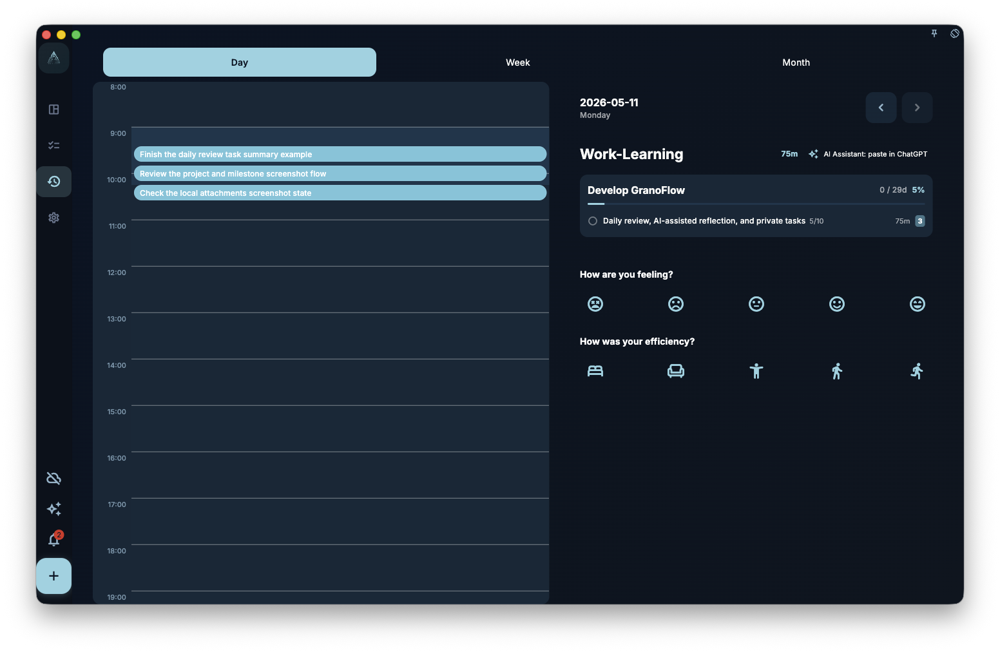

The daily review is the most-used part of GranoFlow — a quick glance at what you got done today, a few sentences written, then done.

## How tasks are counted

The daily review counts by **actual completion time**, not due date.

This means:
- Task due yesterday, completed today → appears in today's review
- Task completed at 11:58 PM last night → appears in yesterday's review
- Task completed at 1:00 AM this morning → **appears in yesterday's review** (tasks completed before 6 AM belong to the previous day)

The logic: if you are still working at 1 AM, that is "last night extended," not a new day starting.

## What to write

No fixed format. Write whatever feels right:

- What you completed and what you did not
- What felt easy or hard
- What you want to prioritize tomorrow
- What your energy level was like

Three to five sentences is plenty. You do not have to answer every prompt.

## Days with nothing completed

If you did not finish any tasks on a given day, the daily review shows a quiet empty state — no shame graph, no "you didn't do anything today" message. The emptiness is just an honest record of that day.

:::note[The audience is future you]
Write the way that makes sense to you, not the way that looks good to someone else.
:::
