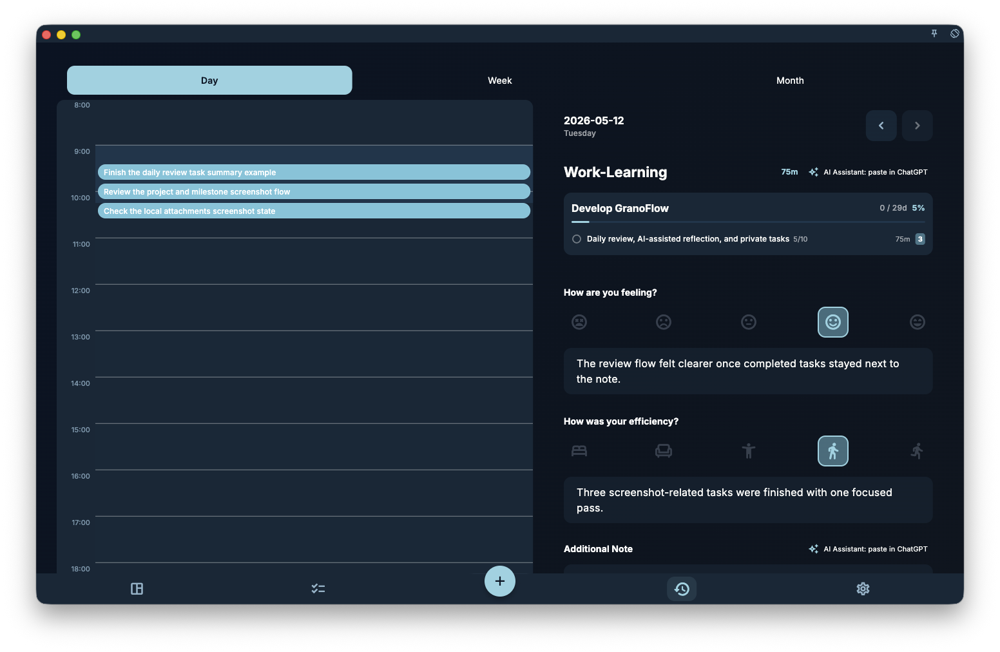

The daily review helps you check what you actually finished during the day and write a few notes about it. It counts tasks by **completion time**, not due date; tasks completed before 6 AM count as the previous day.

## How tasks are counted

The daily review only looks at when a task was marked complete.

This means:

- Task due yesterday, completed today → appears in today's review
- Task completed yesterday at 11:58 PM → appears in yesterday's review
- Task completed today at 1:00 AM → **appears in yesterday's review**, because anything completed before 6 AM counts as the previous day

This is designed for people who work past midnight or go to sleep late. That early-morning time is treated as an extension of yesterday, not the start of a new workday.

## What to write

There is no fixed format. You can simply write a few things worth remembering, such as:

- What you completed, and what you did not complete
- What felt smooth, and what got stuck
- What you want to handle first tomorrow
- What your state felt like today

Three to five sentences is usually enough. You do not need to write a formal report, and you do not need to answer every prompt.

## Days with no completed tasks

If no tasks were completed on a given day, the daily review shows an empty state. It does not use empty charts or messages like "you did nothing today" to create pressure.

The empty page simply means: no completed tasks were recorded for that day.

:::note[The review is for you]
The audience is your future self, not your boss or other users. Write it in whatever way will make sense to you later.
:::
