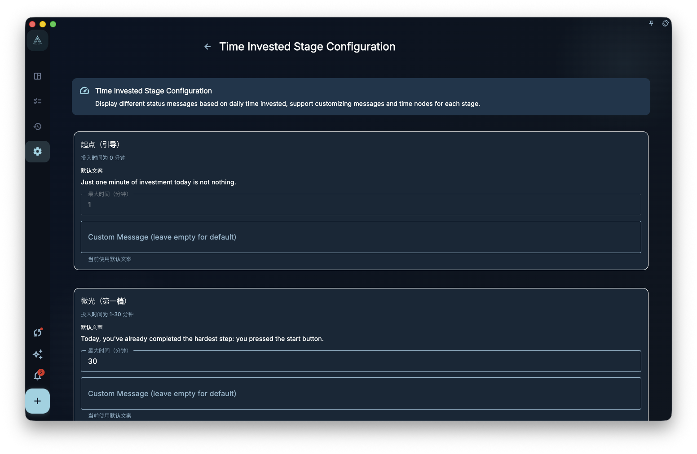
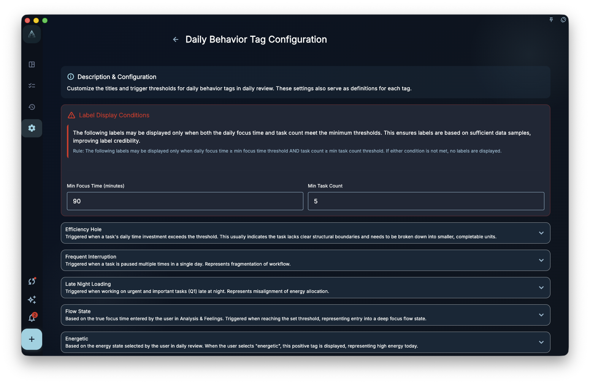
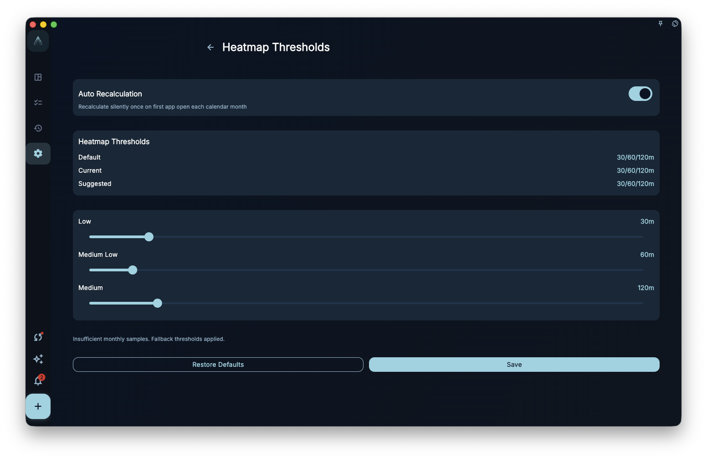

Diagnostics and heatmap settings help explain how review and progress are displayed. They are not medical, psychological, performance, or financial assessments. They generate hints from records, time invested, and thresholds; final interpretation still depends on your real context.

## Where To Enter

Open time invested stages, daily behavior tags, or heatmap thresholds from member-only settings. Some pages may be read-only or show an upgrade prompt when the current account does not have access.

## Time Invested Stages

Time invested stages show different status copy based on the day's invested time. You can adjust stage breakpoints and messages so the review page matches your own rhythm better.

<!-- manual-screenshot:id=review-diagnostic-state-settings -->

Stage copy only affects display and interpretation. It does not change tasks and does not judge whether you worked hard enough.

## Daily Behavior Tags

Daily behavior tags may appear based on task count, time invested, quadrant distribution, pause count, selected energy state, or deep focus duration. You can adjust some tag names and trigger thresholds.

<!-- manual-screenshot:id=review-diagnostic-anomaly-settings -->

These tags are for noticing patterns, not for diagnosis. A threshold that is too low may make tags appear too often; a threshold that is too high may hide useful hints.

## Heatmap Thresholds

Heatmap thresholds decide how different invested-time ranges map to colors in calendar or statistics heatmaps. Changing thresholds may change the color distribution, but it does not change historical task data.

<!-- manual-screenshot:id=review-heatmap-threshold-settings -->

If the page offers automatic recalculation, it only suggests better color bands from existing monthly data. Before accepting the suggestion, check whether those colors match the rhythm you want to observe.

## Boundaries

- Diagnostics, tags, and heatmaps only interpret records already in GranoFlow.
- If records are incomplete, hints may also be incomplete.
- They do not replace professional medical, psychological, performance, or financial judgment.
