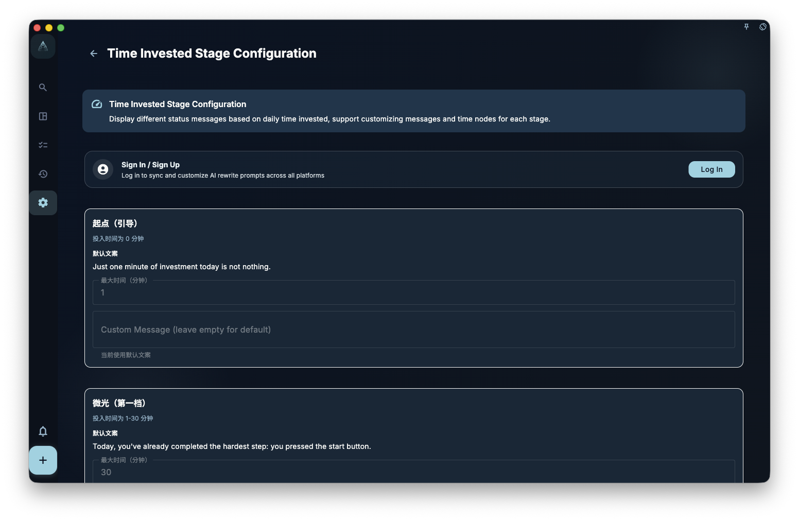
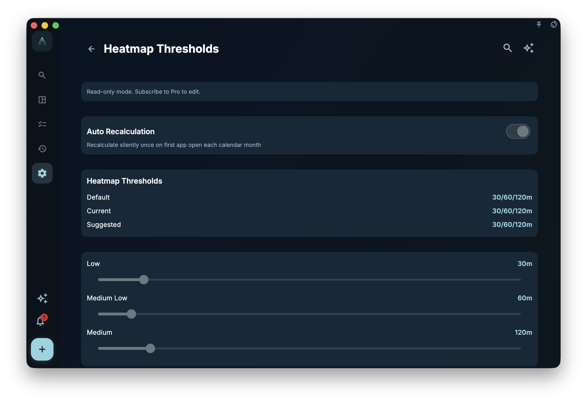

If you want to understand whether your time investment has a pattern, start with diagnostics and the heatmap: they turn your records into status text, color levels, and anomaly prompts so you can review them, but they do not draw conclusions for you.

## Time investment phases

GranoFlow shows different phase labels based on the focus time you recorded for the day, such as “just getting started,” “building momentum,” or “deep focus.” These labels help you quickly understand roughly where that day sits.

You can adjust each phase’s time point and wording in settings. For example, if 2 hours is where you personally start to feel steady, set that phase to 2 hours. This changes the review display rules only. It does not change your historical records or judge whether you worked “hard enough.”

## Heatmap thresholds

The heatmap uses color intensity to show how much time you invested each day. A darker color usually means more recorded time that day; a lighter color means less time or no record.

You can adjust the heatmap color thresholds. For example, if 2 hours per day is “normally active” for you, set that point as the middle color. Thresholds only change how colors are grouped. They do not modify the time data you already recorded.

## Anomaly detection

GranoFlow can surface anomaly signals in your review data, such as a certain task type not appearing for several days, or your time investment shifting far from its usual range.

An anomaly prompt is not a conclusion, and it does not mean “something is wrong with you.” It is only a reminder to look back: did your work rhythm change? Did one type of work pause for a while? Or is there another reason that only you can interpret?

:::note[These are references, not conclusions]
Diagnostics and the heatmap generate prompts based only on your records. The final interpretation and judgment are always yours. They are not medical, psychological, performance, or financial assessments.
:::
