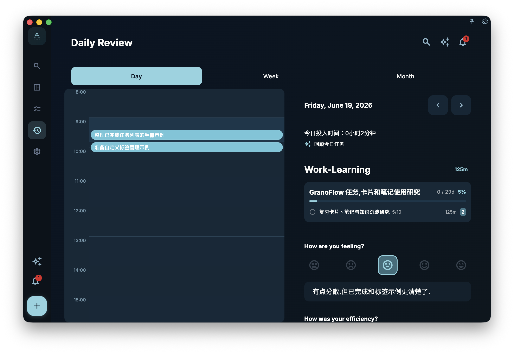

During a review, you can write notes alongside the task list — a sentence, a paragraph, whatever you want.

These notes are tied to the date, so when you look back later, you can see not just what you completed that day, but also what you were thinking.

## What to write in notes

- How the day felt (productive, sluggish, unexpected, exhausting…)
- Why something got done or did not
- What you want to prioritize next
- A fresh thought on a project
- Any clue you would want to find when looking back

It is not a daily report and not a log. Write as much or as little as feels right — honest and brief usually beats complete and polished.

## Notes and tasks

Notes are tied to the date, not to specific tasks. If you write something on the day you completed a task, both will be visible when you review that date later.

Deleting or editing a task does **not** delete the note from that day. Notes and tasks are stored separately.

## Browsing history

In the review page, switch to any past date to see that day's history. There is no limit on how far back you can go — if there is a note from that day, it is there.
