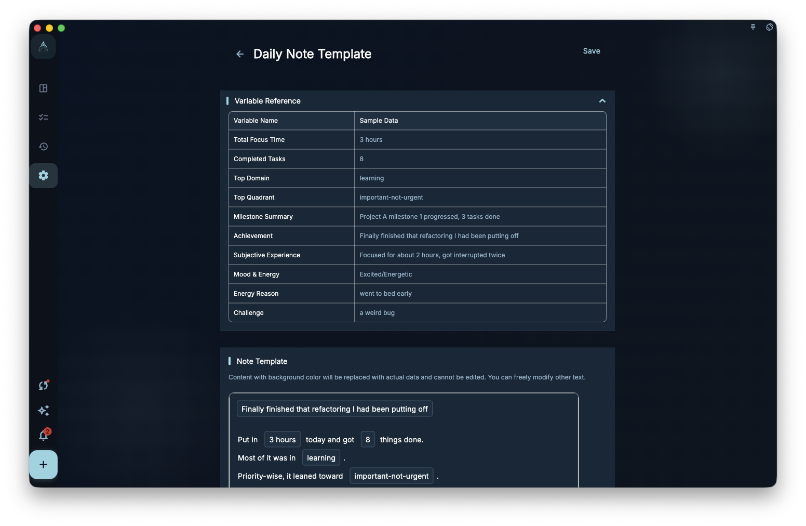
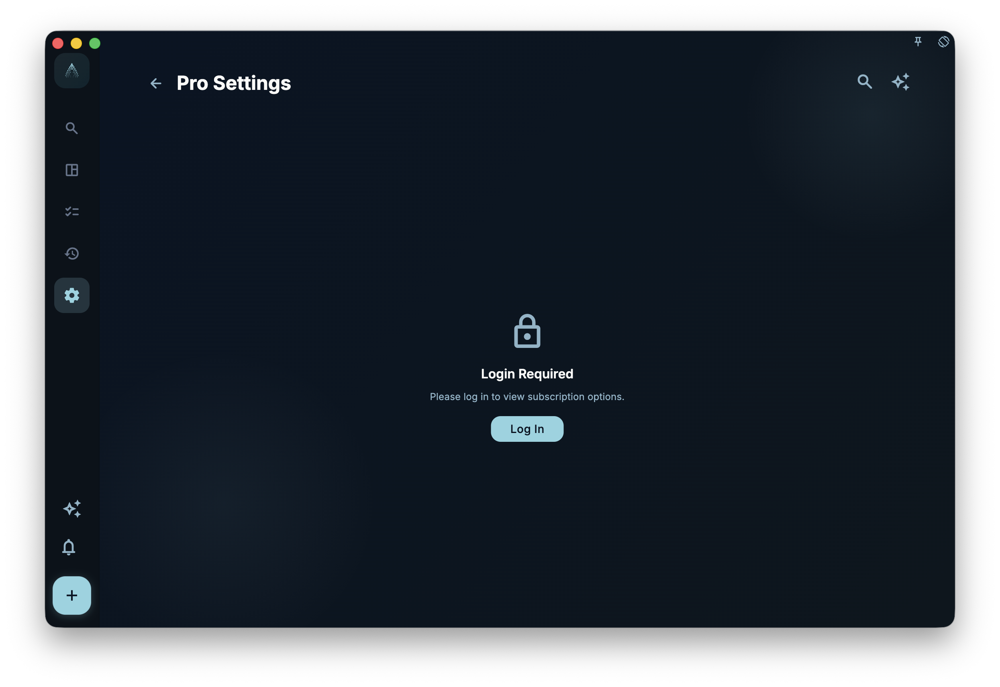

Use note templates when you want every daily or weekly review to follow the same format. The template prepares the draft structure first, such as the date, completed items, feelings, and next steps; your job is to review it and add your own thoughts.

<!-- manual-screenshot:id=review-daily-note-template-settings -->

## What it does

When you open today's review or this week's summary, GranoFlow creates a draft from the matching template.

The draft is not a blank page. It starts with the headings, sections, and variables from the template. Think of it like a form: the structure is already there, but the actual content still needs your input or adjustment.

## Two templates

- **Daily note template**: used for each day's review draft.
- **Weekly summary template**: used for each week's summary draft.

<!-- manual-screenshot:id=review-weekly-note-template-settings -->

These two templates are independent. You can make the daily template more detailed and the weekly template more summary-focused. You can also edit them separately or reset them separately.

## What variables are

Variables are placeholders inside a template. When GranoFlow creates the draft, it replaces them with real data.

Common variables include:

- Today's date
- Today's completed task list
- This week's review summary
- Time-investment stats

For example, if the template includes completed tasks, that section will try to bring in the tasks completed that day when you open the review. This gives you a starting point instead of an empty page. You can then decide what to keep and add your feelings and next steps.

## Templates do not write for you

Templates only provide the draft structure. They do not automatically analyze your records or generate summaries for you.

If you want AI to help organize content, use the AI assistance feature. Note templates and AI assistance are separate features.

:::tip[Members-only feature]
Note templates are available to members. Non-members can view them but cannot customize them.
:::
