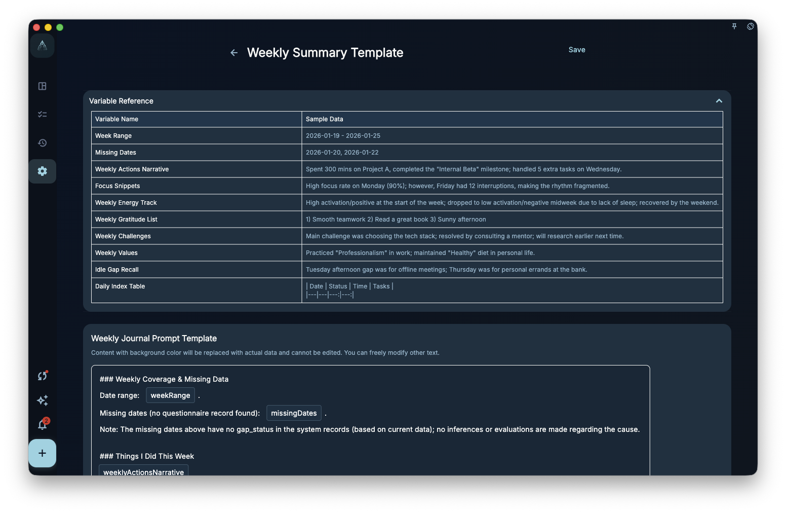

Templates keep records in a consistent structure. They do not fill in facts or write the whole journal for you. Use them when you already have a regular note habit and want daily or weekly drafts to start from the same format.

## Where To Enter

Open Daily Note Template or Weekly Summary Template from member-only settings or review-related settings.

The daily note template affects daily note drafts. The weekly summary template affects weekly summary drafts. They are separate templates and can be saved or reset independently.

## How To Edit

Templates may include variable examples. Variable content is replaced with actual data when a draft is generated, such as dates, tasks, review records, or summary data.

<!-- manual-screenshot:id=review-daily-note-template-settings -->

<!-- manual-screenshot:id=review-weekly-note-template-settings -->

You can edit ordinary text, heading order, and instructions. Do not treat variables as facts that already exist. If a day or week has no matching data, the generated result may be empty, shorter than expected, or require manual completion.

## Results And Boundaries

After you save a template, later daily or weekly drafts use the new structure. Existing generated records are not rewritten automatically.

- Templates do not decide which facts matter or fill missing records for you.
- If you remove key variables, drafts may lose task, date, or review context.
- Resetting to default restores the template text; it does not delete existing notes.

## Difference From Prompts

Templates decide draft structure. Prompts are more about how AI or a generator should phrase the output. To change the final draft section order, edit the template first. To change external AI rewrite instructions, read “Values and prompts.”
