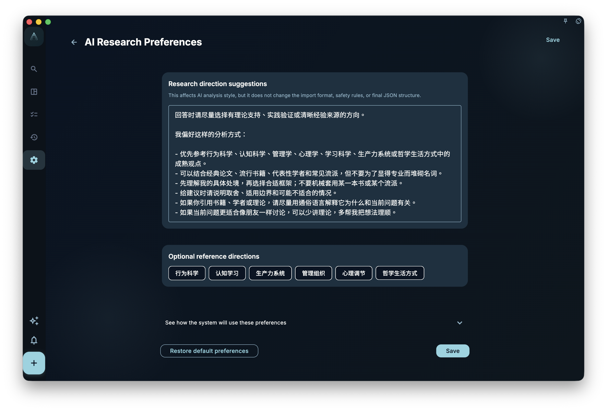
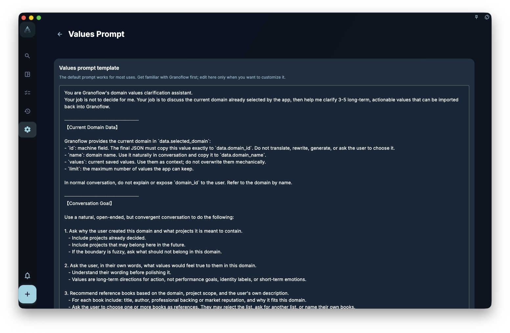
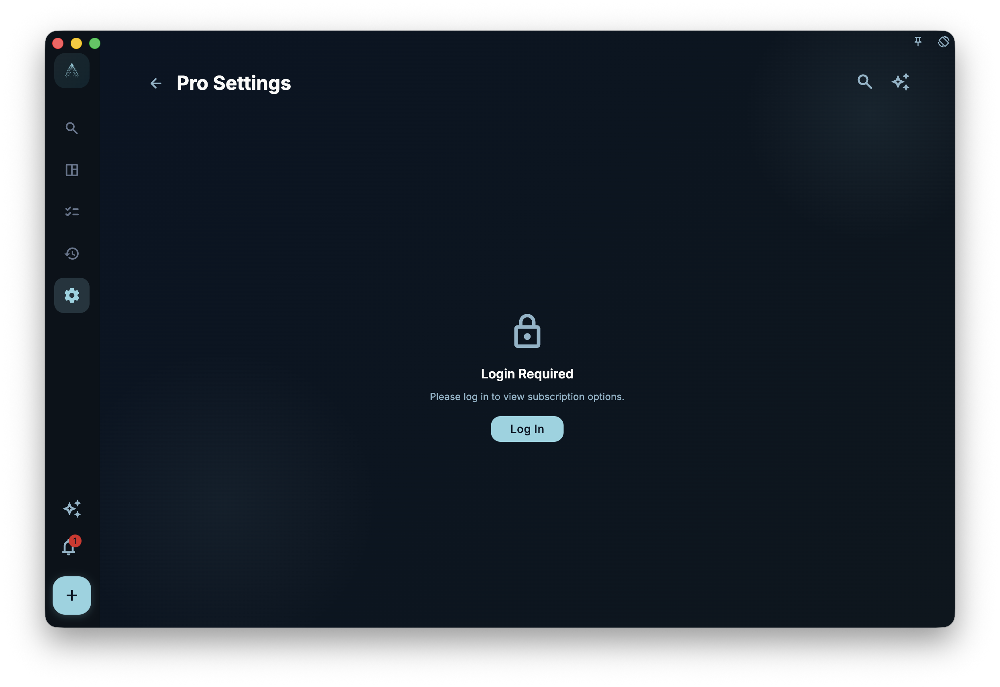

If you want journal cleanup, weekly reviews, and values exploration to sound more like you, edit the related prompts and values settings here. They shape future questions, organization, and draft wording for the relevant features, but they do not automatically rewrite existing tasks, records, or past summaries.

<!-- manual-screenshot:id=review-values-prompts-settings -->

## What prompt settings do

A prompt is the work instruction the AI assistant reads. When you use AI features to organize a journal, generate a weekly summary, or extract action insights, the system reads the prompt for that scenario to understand the tone, focus, and structure you prefer.

Each scenario has its own prompt:

<!-- markdownlint-disable MD055 MD056 -->

| Scenario | Screenshot | What it shapes |
| --- | --- | --- |
| Daily review rewrite | <!-- manual-screenshot:id=review-daily-journal-prompt-settings -->
 | Requirements for organizing the day's notes, such as what to keep and how to phrase it. |
| Weekly review | <!-- manual-screenshot:id=review-weekly-review-prompt-settings -->
 | How a week of records is organized and expressed. |
| Domain values | <!-- manual-screenshot:id=review-domain-values-prompt-settings -->
 | The questions, book-reference boundary, and final import format used when exploring values; it does not decide your direction for you. |
| Work and learning report | <!-- manual-screenshot:id=review-work-learning-report-prompt-settings -->
 | How the report draft organizes content and highlights key points. |

<!-- markdownlint-enable MD055 MD056 -->

After you edit a prompt, the next use of that feature reads the new text. Existing tasks, records, and historical summaries are not automatically rewritten.

## Questionnaire and values settings

<!-- manual-screenshot:id=review-questionnaire-prompt-settings -->

Analysis and questionnaire settings affect questions before and after a review, including when a review questionnaire is finalized. Their job is to help turn the day's records into a relatively stable result, not to judge whether the day was good or bad.

Domain values settings bring your long-term direction into review context. Values can be edited at any time and may become clearer as real records accumulate. They are not a classification table that must be filled in once and stay correct forever.

## Limits to keep in mind

- **Prompts do not guarantee AI quality**: Changing a prompt guides direction, but it does not guarantee accurate output.
- **No effect on tasks or projects**: These settings only shape future prompts, drafts, and question organization. They do not change existing records.
- **Some settings are members-only**: Non-members can view the default configuration but cannot customize it.

:::tip[Not sure where to start?]
Start with the journal prompt. Tell the AI your preferred writing habits or note-taking style; this is usually where the change is easiest to notice.
:::
