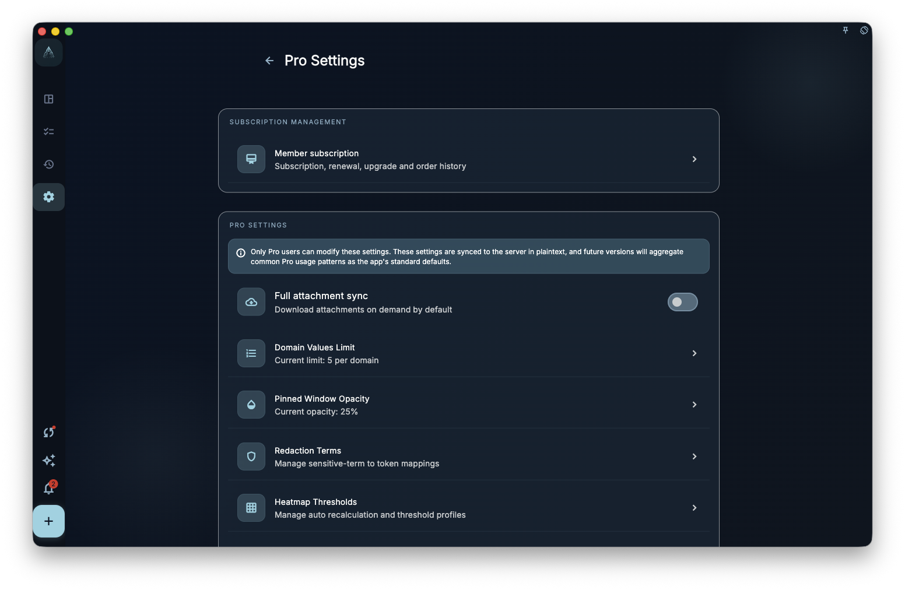
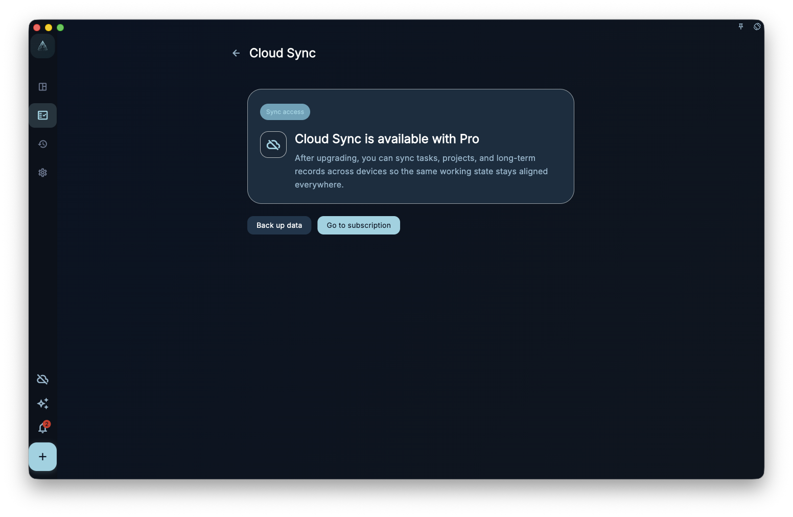

See how entitlements take effect, and understand the relationship between local display, server state, and purchase records.

## Where To Start

Check the current entitlement from Subscription or Account. Subscription status should come from the server account state; local display is only the current UI feedback.

## How To Use It

- After purchase, stay signed in to the same account and wait for subscription state to refresh.
- Use the restore entry for the platform where the purchase was made, and confirm the signed-in account is correct.
- If entitlement does not appear, check platform, account, network, and purchase record before changing the subscription state.

## Results And Boundaries

Subscription affects available entitlements, but it does not change ownership of your task data. Purchase records, platform orders, and the GranoFlow account need to line up.

- Purchases on one platform may not automatically transfer to another platform.
- Payment card details are handled by the platform; GranoFlow does not store them as part of manual app operations.

## Member-Only Settings

Member-only settings collect more advanced personalization features, such as AI redaction terms, the Helper prompt, review prompts, note templates, diagnostic settings, and heatmap thresholds. Some entries may be read-only, show an upgrade prompt, or block saving changes when the current account does not have access.

<!-- manual-screenshot:id=subscription-vip-settings -->

These settings explain which entitlements you can use. They do not directly resolve sync conflicts, data recovery, or account recovery. For data safety, cloud keys, or syncing a new device into existing cloud data, use the relevant data safety pages.

## Sync Membership Notice

When you use a sync entry but the current account does not have an available entitlement, GranoFlow may show a sync membership notice. This page explains why sync requires membership and where to view or enable entitlements.

<!-- manual-screenshot:id=subscription-sync-vip-upsell -->

Seeing the sync membership notice does not mean local data is lost, and it does not mean cloud recovery has already run. It is an entitlement prompt at the sync entry; the actual sync state still belongs to the sync page, account state, and data safety pages.

## Next Step

If restore still fails, keep the platform order information and recheck the subscription account and platform purchase page.
