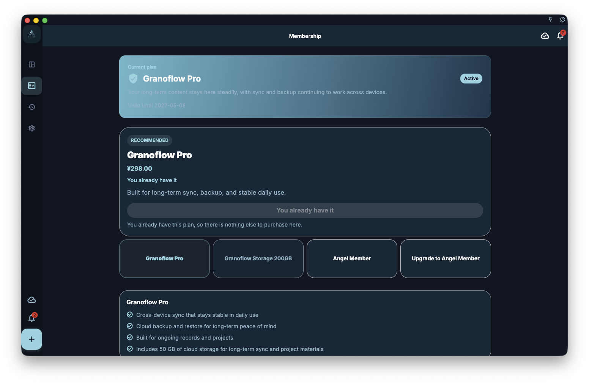

You do not need a subscription to use GranoFlow's core features: tasks, projects, values, lightweight journaling, reviews, local data, and backups are available for free. Membership is mainly for two needs: syncing across multiple devices, or using more personalization options.

So when you first start using GranoFlow, you can use the free version to organize your work and life. After you know it fits your rhythm, you can decide whether membership is worth it.

## Free vs. subscriber — what's different

| Feature | Free | Subscriber |
| ------- | ---- | ---------- |
| Tasks, projects, values | ✅ | ✅ |
| Journal, reviews, backups | ✅ | ✅ |
| AI task parsing and thinking support | ✅ | ✅ |
| Multi-device cloud sync | ❌ | ✅ |
| Personalization | ❌ | ✅ |

In short: **the free version is enough for a serious trial, and it also works for long-term single-device use; membership is for people who need device-to-device continuity, or who want the interface, theme, and details to fit their habits better.**

## Where to check your subscription status

Open GranoFlow Settings, then go to Account/Subscription to see your current subscription status. When you are not subscribed and store purchases are available, the page starts with the plan selector and the selected plan details. Angel Member direct purchase and Angel upgrade are mutually exclusive; only one is available at a time. The available Angel entry shows the remaining time in minutes, while the unavailable entry only shows its current status. When the store is loading or purchases are unavailable, the page only shows status, included benefits, restore purchase, and manage subscription options, without prices or purchase buttons.

If the current account already has Angel membership, the Pro plan is shown as included with Angel membership and no Pro purchase button is offered. This helps prevent duplicate purchases when you already have the higher-tier entitlement.

**Important**: Subscription status comes from the server, not from the app deciding on its own. If you already paid but the benefits do not appear yet, wait a moment for the status to refresh; if nothing changes, check your network and the account you are signed into.

## Most common questions

**I paid, so why do I not have the benefits?**
First check one thing: is the account you are signed into now the same account you used to purchase?

**I switched phones. Where did my subscription go?**
Sign in with the same account, and the benefits usually come back with that account.

**Can purchases be shared across store platforms?**
Not always. Current store purchases are handled separately; the macOS DMG build is not currently a store purchase platform. See [Platform purchases and restore](/en/subscription/platforms-and-restore/).

## Subscription vs. data — which matters more

Subscription controls which features you can use. It does not decide who owns your data.

Even if your subscription expires, your local tasks, projects, values, lightweight journal entries, and backups remain in place, and you can keep using all free features. Membership only makes that content easier to sync across devices and gives you more room to tailor the interface and experience.
