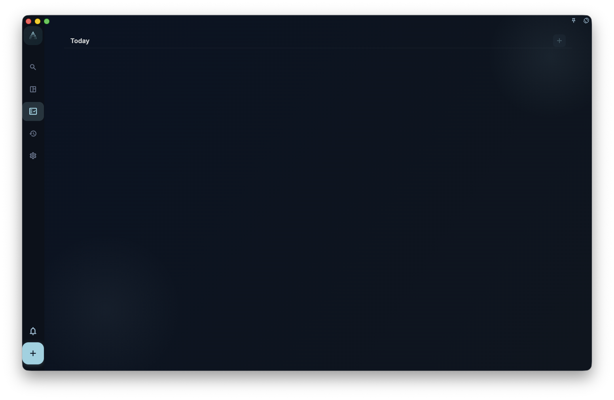

If a task feels too big and you do not know where to start, open the task detail and split it into small actions in the steps or nodes area. Complete one node at a time; when all nodes are done, the parent task can be completed.

## How to break down a task

Open the task detail, find the steps or nodes area, and add the first sub-step.

Write each step or node as one action you can actually do. For example, “write the whole report” is too large, so you might split it into:

- “Gather reference materials”
- “Write an outline”
- “Write the first body paragraph”
- “Revise”
- “Send to a colleague for confirmation”

You do not need to plan every step upfront. Write the next one or two steps you can do now, then add more later if needed.

## Reorder and nest nodes

In task detail, use the more button on a node row to choose Move Up, Move Down, Indent, Outdent, or Delete. On desktop, you can also use the drag handle on the left side of a node to change its order or nesting. When the node list has keyboard focus, use `Alt+↑ / Alt+↓` to move a node up or down, `Alt+← / Alt+→` to outdent or indent it, and `Delete` or `Backspace` to delete the current node.

On phone or tablet, long-press a node row to open the same node actions. When you delete a node, GranoFlow hides that node and its child nodes, then shows an Undo action at the bottom.

## How nodes and the parent task relate

- When you complete nodes, the parent task progress updates, such as “3/5 done”
- When all nodes are complete, the parent task can be marked complete
- If you **add a new unfinished node**, the parent task goes back to to-do; this is normal, because the system is reminding you that something is still unfinished

:::tip[Avoid deep nesting]
Nodes can have sub-nodes, but avoid too many levels. Two levels is usually enough. If the structure becomes more complex, it is usually better to split it into separate tasks or project milestones.
:::

## Breakdown vs milestones

| Use nodes when | Use milestones when |
| --- | --- |
| The task can be finished in hours or days | The goal takes weeks or months |
| Steps depend on each other and happen in a fixed order | Phases are relatively independent |
| You do not need to manage progress across tasks | You need to track progress at the project level |

Short version: nodes answer “what is the next action?” Milestones answer “which stage is the project in?”
