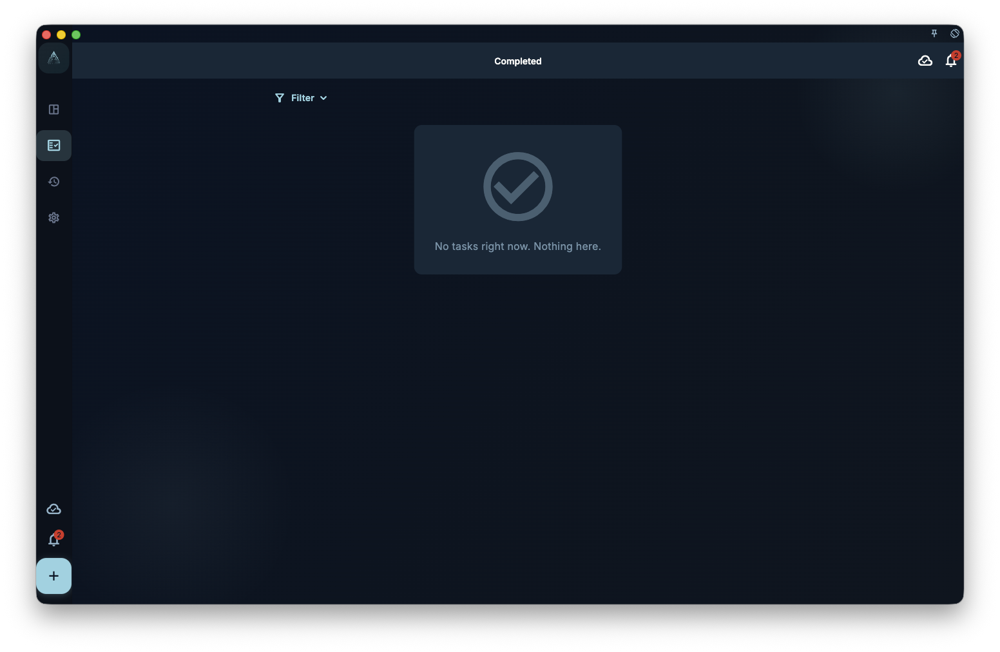
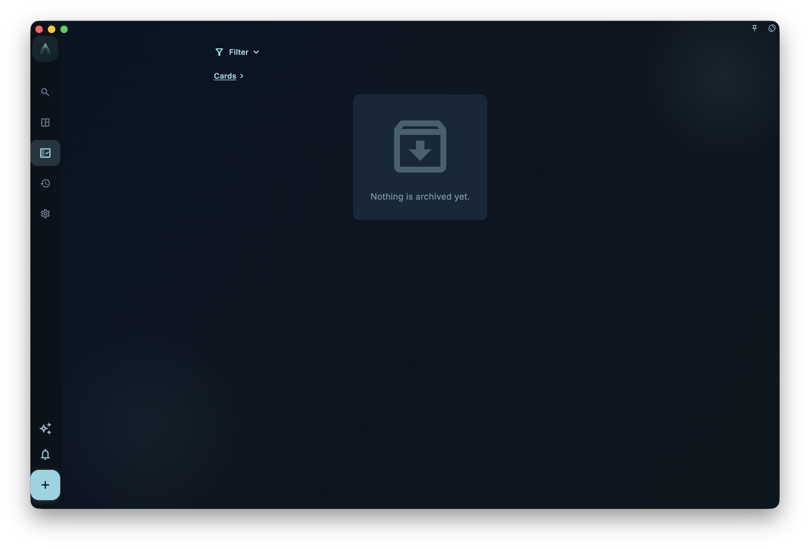
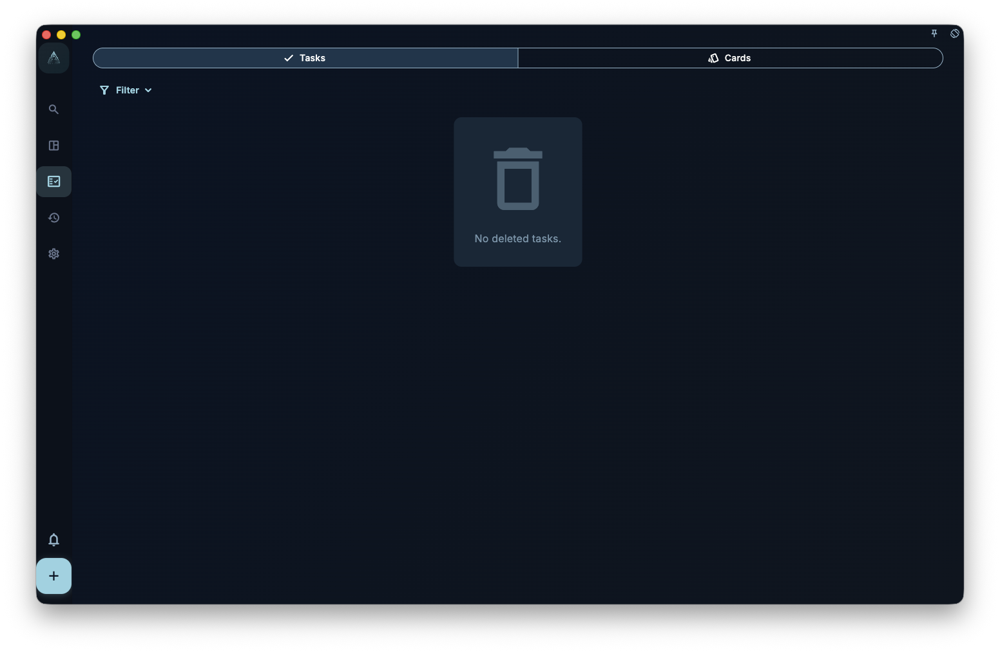
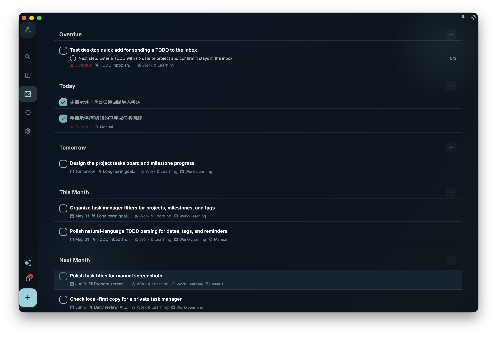

If a task disappears from your list, do not assume it is lost. Most of the time, it is hidden by a filter, scheduled for a date, inside a project, completed, archived, or in the trash.

In GranoFlow, these three states matter most when a task seems missing:

- **Completed**: the task is done, and it appears in the completed view and daily review stats
- **Archived**: you do not need to see it now, but you want to keep the record
- **Trash**: the task was deleted, but the trash has not been emptied

## Completion

When you finish something, mark it complete. After that, the task will:

- Leave the current task list
- Record a completion time
- Appear in the “Completed” view
- Be used in daily review stats

<!-- manual-screenshot:id=tasks-completed-archived-trash -->

:::tip[Tip]
If you still want to see the record in daily review, do not delete completed tasks casually. Completed tasks are not junk; they are your completion history.
:::

After completion, the task detail view shows **Task Review** and lets you edit it. Use it to record the actual time spent, what was confirmed, problems, or lessons learned. Archived tasks can also have editable Task Reviews.
## Archive

Archive is for tasks you do not want to see every day, but may still need as a record later.

For example: old tasks from a project, expired items that still have reference value, or anything you want out of the current list without deleting it.

<!-- manual-screenshot:id=tasks-archived-list -->

Archive and complete are not the same thing:

- **Complete**: the task is actually done, and it counts in completion stats
- **Archive**: the task is only moved out of the current view; it does not mean done, and it does not count as completed

## Trash

After you delete a task, it goes to the trash. As long as the trash has not been emptied, you can still check it there.

The trash has two segments: **Tasks** and **Cards**. The task segment handles deleted tasks, while the card segment handles deleted review cards. They are not mixed together; restore, permanently delete, and empty actions apply only to the current segment.

When you restore a task that used to belong to a deleted project or milestone, GranoFlow asks whether to restore that original project and milestone too, or restore only the task to Inbox. If you restore only the task, it becomes a plain Inbox task with no project, no milestone, and no date, so you can organize it again later.

<!-- manual-screenshot:id=tasks-trash-list -->

:::caution[Think before emptying]
Manually emptying the trash is irreversible. If a task belonged to a project or still has review value, you will not be able to recover it from the trash after emptying it.
:::

## Task is missing — where to look

Check in this order. It is usually the fastest way:

1. Check whether a filter is hiding it, such as showing only “today” tasks.
2. Think about whether it has a date. If it does, look in that day’s task list.
3. Think about whether it belongs to a project. If it does, look in the project page.
4. If it is already done, check the “Completed” view.
5. If you wanted it out of the current list, it may be archived. Check the “Archived” view.
6. If you deleted it, check the trash.

Most missing tasks are in one of these places.

## Task Review after reopening

If you write a Task Review after completing a task, then reopen that task, the review is not cleared. While the task is incomplete, task details hide the Task Review. It appears again when the task is completed or archived.

<!-- manual-screenshot:id=tasks-detail-review-readonly -->

