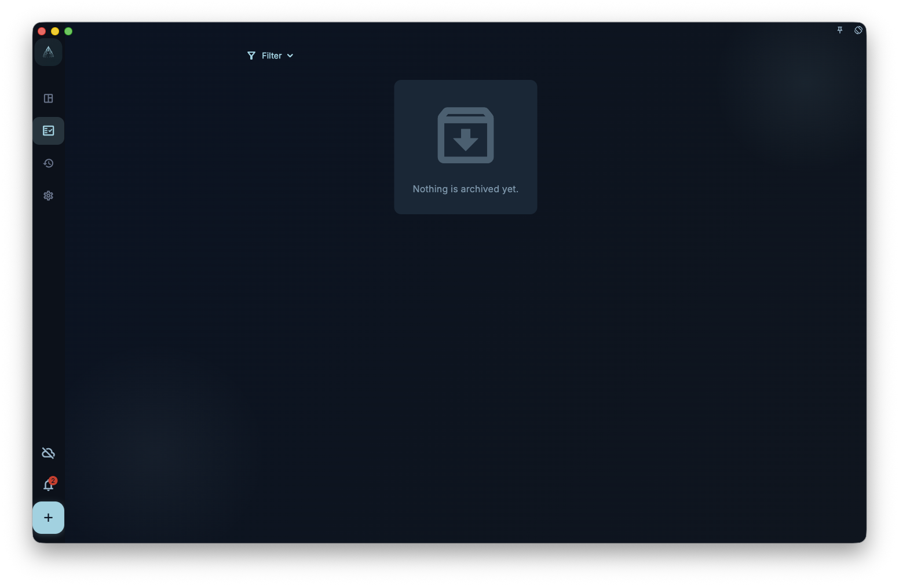
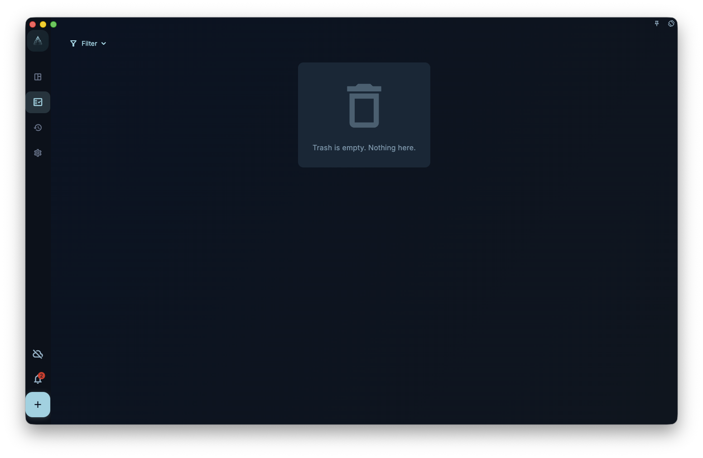

Understand completion, archiving, deletion, and restore behavior so normal hiding or protection states are not mistaken for data loss.

## Where To Start

Complete tasks from a task list or detail page. Use archive or deletion when you are organizing historical content.

## How To Use It

- Marking a task complete removes it from active lists and moves it into completion-related statistics, review, or history.
- Archive hides inactive tasks from everyday views while keeping them for history.
- Confirm the impact before deleting. Deletion is closer to irreversible cleanup than completion or archive.

<!-- manual-screenshot:id=tasks-archived-list -->

<!-- manual-screenshot:id=tasks-trash-list -->

## Results And Boundaries

A task missing from the current list is not necessarily lost. It may be completed, archived, hidden by filters, or moved into a project, date, or tag view.

- Completed tasks and archived tasks serve different purposes. Do not delete just to clear a list.
- If a task contributes to review, statistics, or project history, deleting it reduces that context.

## Next Step

If you cannot find a task, first check filters, project, date, completion state, and archive state.
