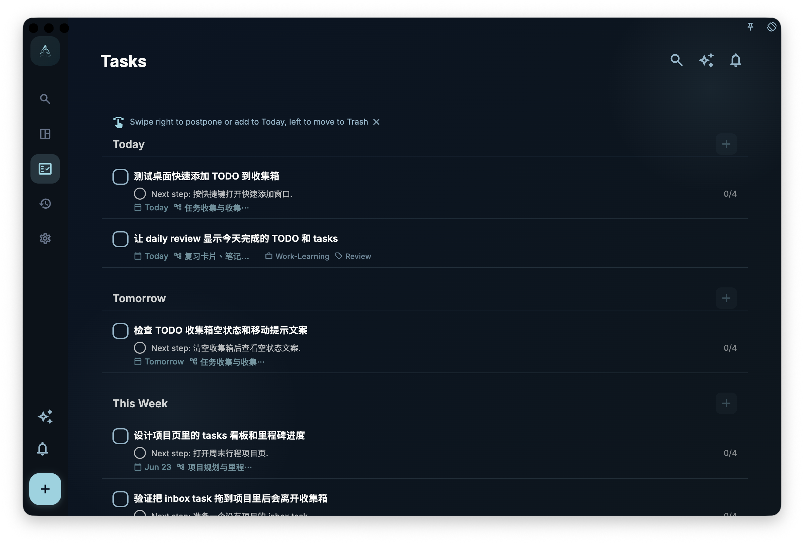

If a task disappears from the list, don't panic that it's lost. The most common reasons: it's hidden by a filter, scheduled for a day, placed in a project, already completed, archived, or in the trash.

The three most relevant states in GranoFlow for "task disappeared" are:

- **Completed**: The task is done; it enters the Completed view and daily review statistics.
- **Archived**: Temporarily hidden but still preserved.
- **Trash**: The task was deleted but the trash hasn't been emptied.

## Completing a Task

When you finish something, tap "Complete" in the task detail, or use the completion entry on the list. After completion, the task:

- Disappears from the current to-do list.
- Records a completion time.
- Appears in the "Completed" view.
- Is used for daily review statistics.
- Hides the "Start" and "Complete" buttons in its detail to prevent re-starting.

If the task is currently being focused, tapping "Complete" first ends the current focus session, then completes the task, and clears it from "Current Tasks." This keeps task state, focus records, and the current task at the top of the list consistent.

<!-- manual-screenshot:id=tasks-completed-archived-trash -->

:::tip[Tip]
If you still want to see completion records in the daily review, don't delete completed tasks casually. Completed tasks are not garbage; they are your completion history.
:::

## Calibrate Time After Completion

When a task is first completed, the system records a completion time. This is enough to get the task into the "Completed" view and daily review, but it may not equal the actual start and end time of your work.

If you want more accurate hindsight, after completing a task, open its detail and tap "Time Record." The time record window allows you to modify both start time and completion time. You can change it to a period closer to reality, such as "3:10 PM to 4:05 PM for organizing materials," instead of just the moment you tapped Complete.

<!-- manual-screenshot:id=tasks-completion-time-record-editor -->

This step is recommended but not mandatory. It is especially useful for tasks where:

- You didn't tap "Start" but actually worked for a while.
- You forgot to tap "Complete" in time, so the recorded time is later than the actual end.
- You want the daily review to show a more accurate distribution of time invested.
- You want to know, when looking back at this day, roughly where your time went.

Time records affect the task time blocks and "Today's Time Invested" in the daily review. The daily review calculates time invested as the union of the day's task time blocks; overlapping portions are not double-counted. To avoid obviously unreasonable records, the start time must be at least 1 minute before the completion time, and the completion time cannot be in the future.

After completion, the task detail shows "Task Review" and allows editing. This is suitable for recording confirmed observations, problems, and insights.

Completed task details also show "Flow Time." This is not automatically calculated as "time invested" from start to completion, but a manual record of truly focused time; tasks completed on the same day share the same daily flow time. After a task is archived, you can continue editing the task review, but the editable flow time entry is no longer shown.

Focus sessions and flow time are not the same field. Focus sessions record a period of start and end on a specific task; flow time is a manually confirmed subjective focused time used during review to understand how deeply you sank into work that day. Both can help with review but have different meanings.

## Archiving

Archiving is suitable for tasks that you don't want to see every day right now, but may want to know they existed later.

Examples: old tasks in a project, expired but valuable items, content you don't want on the current list but don't want to delete either.

<!-- manual-screenshot:id=tasks-archived-list -->

The archived view only handles task archiving. Card archiving and task archiving have different meanings: cards exit active review but may still remain in task and review contexts. To view archived cards, go to "Card Management," tap "Filter," and select "Archived" under Status. To understand why cards can exit active review while staying in task context, read [Practice, Master, and Internalize](/manual/en/review-cards/study-and-internalize/).

Archiving and completion are not the same:

- **Completed**: Means the task is truly done; enters completion statistics.
- **Archived**: Only removes the task from the current view; does not mean it's done and does not enter completion statistics.

## Trash

When you delete a task, it goes into the trash. As long as the trash hasn't been emptied, you can view it there.

The outer trash only handles deleted tasks. Deleted cards do not appear here; to view the card trash, go to "Card Management," tap "Filter," and select "Trash" under Status. If you enter card management from a specific card box, the trash will also be scoped to that card box.

When restoring a task, if it originally belonged to a deleted project or milestone, GranoFlow asks you to choose: restore the original project and milestone together, or restore only the task to the inbox. Choosing to restore only the task turns it into an ordinary inbox task with no project, no milestone, and no date; you can reorganize it later.

<!-- manual-screenshot:id=tasks-trash-list -->

:::caution[Think before emptying]
Manually emptying the trash is irreversible. If the task once belonged to a project or had review value, you can't rely on the trash to recover it after emptying.
:::

## Can't Find a Task?

Follow this order, it's usually the fastest:

1. Check if a filter is hiding it, e.g., showing only "Today" tasks.
2. Think if it has a date. If so, look in that day's task list.
3. Think if it belongs to a project. If so, look in the project page.
4. If it's already done, look in the "Completed" view.
5. If you didn't want it on your current list, you might have archived it. Look in the "Archived" view.
6. If you deleted it, look in the trash.

Most missing tasks are in one of these places.

## Task Review After Re-enabling

If you wrote a task review after completing a task, and later uncompleted or re-enabled the task, the existing review is not cleared. When not completed, the task detail won't display the task review; after the task is completed or archived again, the review reappears and can be edited.

<!-- manual-screenshot:id=tasks-detail-review-readonly -->

