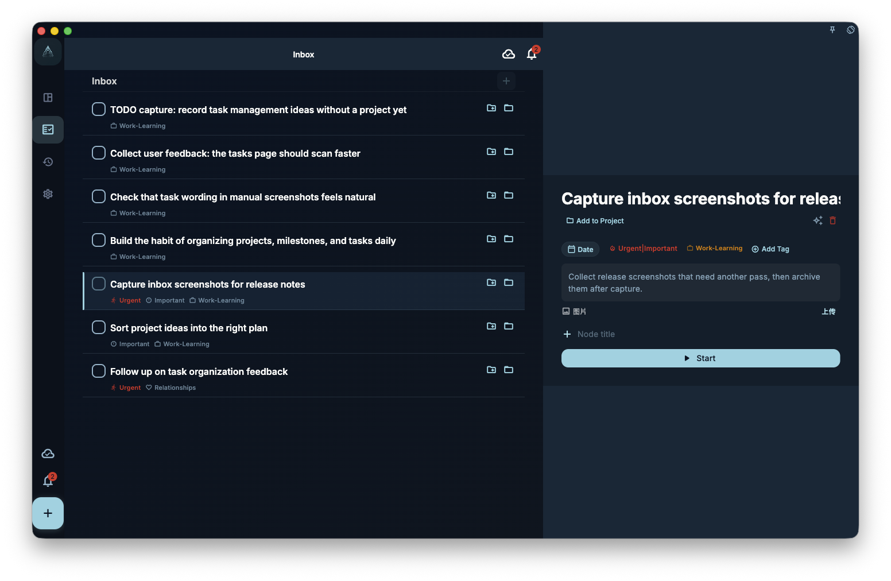

To create a task quickly, enter a title and save it. You can leave everything else blank at first, then come back later to add a date, assign a project, add tags, or break the task into steps.

## Where to create a task

| Entry point | Best for |
| --- | --- |
| Bottom **+** button | Capturing something immediately |
| Input field in Inbox | Adding a task while organizing the inbox |
| Inside a project or milestone | Creating a task that should belong to that project or phase |
| Node inside an existing task | Breaking a large task into smaller steps |

## The task editing screen

{/* manual-screenshot:id=tasks-create-edit-dialog */}

When you create or edit a task, you will see these fields. Only the title is required.

| Field | Required? | What it does |
| --- | --- | --- |
| Title | ✅ Yes | The task name. The more specific it is, the easier it is to act on later |
| Description | Optional | Stores background notes, links, or extra details |
| Due date | Optional | Makes the task appear in that day's task list |
| Reminder | Optional | Sends a notification at the selected time; it cannot be set in the past |
| Project | Optional | Moves the task out of the inbox and into that project |
| Milestone | Optional | Assigns the task to a phase within a project |
| Tags | Optional | Helps you filter tasks; one task can have multiple tags |
| Nodes | Optional | Breaks the task into smaller steps |
| Task Review | Optional | Stores retrospective notes after completion; editable when completed or archived |

:::tip[Natural language input]
In the title field, you can type `#tag`, `@date`, or `~reminder` and GranoFlow will parse them automatically. For example, `Finish report @tomorrow #work` will detect tomorrow's date and a “work” tag. See [Writing tasks in natural language](title-parser) for the full syntax.
:::

## Where does the task go after saving?

Where the task appears after saving depends on which fields you filled in:

- **No date, no project** → Inbox
- **Date set** → That day's task list
- **Project assigned** → Inside that project
- **Created inside a project page** → Automatically assigned to that project

Changing the date, project, or milestone does not create another task. It only changes where the same task appears or belongs.

## Editing an existing task

Tap any task to open its detail view. Change the fields you need; the task auto-saves when you leave the detail view.

After a task is completed or archived, its detail view shows **Task Review**. Use it to record what was confirmed, what actually happened, or what you want to remember next time. If you complete a task, add a review, and then reopen it, the review is kept but hidden while the task is incomplete. It appears again when the task is completed or archived.
:::caution[Note]
Reminders cannot be set to a time in the past. If the reminder time you choose has already passed, the system will prompt you to pick a new one.
:::

Completing, archiving, and deleting are separate actions. Filling in or changing task fields does not automatically mark the task complete.
