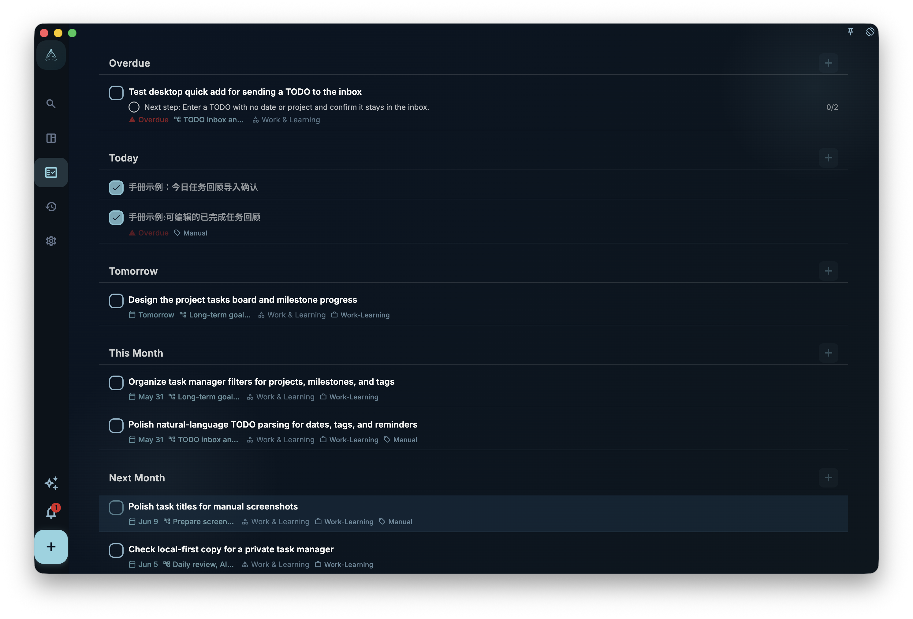

To quickly create a task, just enter a title and save. All other fields can be left blank; when you need to set a date, assign it to a project, add tags, or break it into steps, open the task and fill them in.

## Where to Create Tasks

| Entry Point | Best For |
| --- | --- |
| Bottom **+** button | When you want to jot something down immediately |
| Input box on the Inbox page | Adding tasks while organizing your Inbox |
| Inside a project or milestone page | Creating a task that directly belongs to this project or phase |
| Subtask node inside an existing task’s details | Breaking a larger task into smaller steps |

## Task Editing Interface

<!-- manual-screenshot:id=tasks-create-edit-dialog -->

When creating or editing a task, you will see these fields. Only the title is required.

| Field | Required | Purpose |
| --- | --- | --- |
| Title | ✅ Required | The name of the task. The more specific, the easier to execute later |
| Description | Optional | Add background info, links, notes, etc.; supports [rich text content](/manual/interface/markdown-content/) |
| Due Date | Optional | Once set, the task appears in the task list for that date |
| Reminder | Optional | Sends a notification at the specified time; the reminder time cannot be in the past |
| Project | Optional | Once set, the task moves from the Inbox to the corresponding project |
| Milestone | Optional | Associates the task with a specific phase within a project |
| Tags | Optional | Used for filtering tasks; a task can have multiple tags |
| Subtasks (Nodes) | Optional | Break the task into smaller steps |
| Task Review | Optional | Record post-completion reflections; editable after completion or archiving |
| Task Card | Optional | Link or create a card within a project task, saving experience from this task as reviewable judgments |

If a custom tag you select comes with a template, and this task does not yet have a description or subtasks, GranoFlow will add the template content to the task description and root subtask after saving. If the task already has a description or subtasks, the template is skipped to avoid overwriting what you have filled in. The same tag template will only be auto-applied to the same task once; if template application fails, the tag selection remains, and you can manually add the description or subtasks later.

:::tip[Use Natural Language Input]
In the title input box, you can directly write `#tagname`, `@date`, `~remindertime`, and GranoFlow will parse them automatically. For example, entering `整理报告 @明天 #工作` will automatically recognize tomorrow's date and the "工作" tag. For detailed rules, see [Writing Tasks with Natural Language](title-parser).
:::

## Where the Task Goes After Saving

Where the task appears after saving depends on which fields you filled in:

- **No date** → Goes to the Inbox
- **Has a date** → Appears in that day's task list
- **Has a project or milestone** → Assigned to that project; if still no date, it also continues to appear in the Inbox
- **Created inside a project page** → Directly assigned to that project; whether it appears in the task list still depends on the date

Changing the date, project, or milestone does not create another task; it only changes the location or assignment of the same task.

## Editing an Existing Task

Click any task to open its details. After editing fields, the changes auto-save when you exit the detail view.

The task detail view is not just for changing the title. It is also where you move a task from "jotted down" to "in progress":

- The top area allows changing the title, selecting or changing project and milestone.
- The attributes area lets you adjust due date, reminder, tags, and also add images.
- The description area is suitable for background info, links, drafts, or notes you want to keep.
- The subtasks area is for breaking the task into steps.
- The "Focus" and "Complete" buttons at the bottom determine the task's next state.

If a task has not started, both "Focus" and "Complete" are shown at the bottom of the detail view. Clicking "Focus" tells GranoFlow to set this task as the current task and starts a focus session; clicking "Complete" marks it as done directly. If the task is already in focus, only "Complete" is shown at the bottom, because the most important action at that point is to end the focus session and complete the task.

This is a common misunderstanding: focusing is not just adding a regular label to a task, but telling GranoFlow "I am working on this task right now." So if another task is already in focus at the same time, the current detail view will prompt you to complete or stop that task before starting a new focus session.

<!-- manual-screenshot:id=tasks-detail-review-editable -->

After a task is completed or archived, the detail view shows a "Task Review" section. Here you can add notes on how long it actually took, what was confirmed later, and what to watch out for next time. If you complete the task and write a review, then later revert the task to incomplete, the existing review is not cleared; when the task is completed or archived again, the review reappears and can be edited.

If the task belongs to a project, a "Task Card" section also appears in the detail view. From here you can add a new card, link an existing card, or practice with cards related to this task. Linked cards are grouped by note; multiple cards from the same note are placed together, with unarchived cards before archived cards. Unlinking only removes the relationship between this task and the cards under that note, without deleting the cards themselves.

Task descriptions, task reviews, and other long-text fields support rich text editing. For adding tables, formulas, local images, remote audio, or YouTube videos, see [Rich Text Content](/manual/interface/markdown-content/).

:::caution[Note]
Reminders cannot be set for a time that has already passed. If you select a reminder time that is already in the past, the system will prompt you to choose again.
:::

Completion, archiving, and deletion are three different operations. Filling in or modifying fields will not automatically change a task to the completed state.
