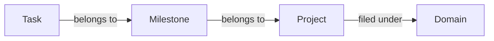

In GranoFlow, a task is one specific thing you need to do. You can tap the **+** button in the middle of the bottom bar, write it down, and save it; later, you can decide whether it belongs in a project, milestone, or domain.

You can use GranoFlow as a simple task list. For example, “call mum” or “finish the chapter three draft” can both be tasks.

GranoFlow also lets you connect tasks to projects, milestones, and domains. This helps when your work gets bigger: you can see not only what needs to be done, but also why it matters. But this is optional. For simple things, a standalone task is enough.

## How to add a task

The fastest way is: tap the **+** button in the middle of the bottom bar, enter the task, and save it.

You do not need to decide the project, date, or tags right now. Capture the task first, then organize it later.

<!-- manual-screenshot:id=tasks-overview-main -->

If a task has no date and no project, it goes into the **Inbox** first. Think of the Inbox as a temporary note area: put things there first, then sort them out when you have time.

The top-left menu contains these task views:

| View | What it shows |
| --- | --- |
| Inbox | Tasks with no date or project yet |
| Task list | Tasks currently being moved forward |
| Completed | Tasks you have finished |
| Archived | Tasks you want to keep but do not need to review daily |
| Trash | Deleted tasks that have not been cleared yet |

## How tasks, projects, milestones, and domains relate

You can start with tasks only. When things become more complex, add structure above them:

- **Task**: one specific thing to do, and the basic unit
- **Milestone**: a stage inside a project, such as “finish user testing”
- **Project**: a goal you work on over a period of time, such as “App launch”
- **Domain**: a long-term area of life you care about, such as “Work” or “Health”

Not every task needs a project. If something can be finished directly, just do it. Use projects, milestones, and domains for work that needs longer-term organization.

## Task statuses

| Status | When to use it |
| --- | --- |
| To-do | You have not started yet |
| In progress | You are working on it now; it is best to keep only one at a time |
| Completed | It is done, and GranoFlow records the completion time |
| Archived | You no longer need to track it, but want to keep the record |
| Trash | It has been deleted but not cleared yet |

:::tip[Focus tip]
When you mark a task as “in progress,” GranoFlow tries to keep only one task in progress. This helps you keep your attention on the thing you are working on now.
:::

## First time here?

Tap **+**, write down the one thing you most want to finish today, and save it.

That is enough. When you actually need more organization, you can start using projects, milestones, domains, archives, and the other task features.
