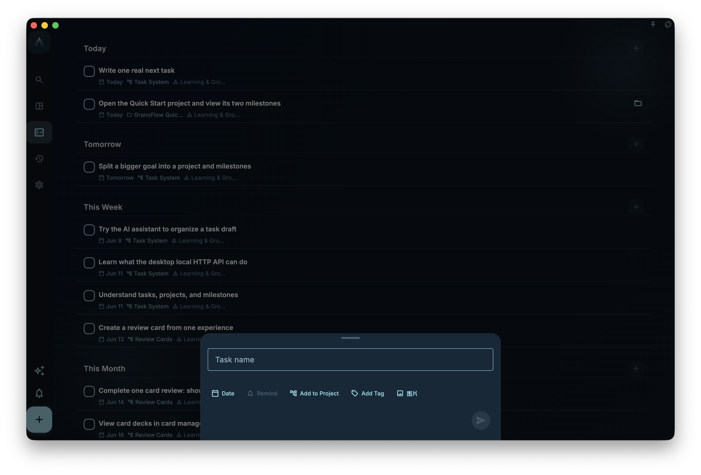
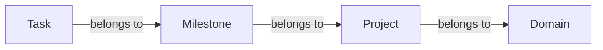

In GranoFlow, a task is one specific thing you need to do. Just tap the **+** button at the bottom center, write it down, and save it. You can decide later whether it belongs in a project, milestone, or domain.

You can use GranoFlow like a simple task list. For example, “Call Mom” or “Finish the first draft of Chapter 3” can both be created as tasks.

GranoFlow also supports linking tasks to projects, milestones, and domains. The advantage is that when things get numerous, you not only know “what to do” but also see “why this matters.” That said, it’s not required. For simple things, just record them as tasks.

## How to Add a Task

The fastest way is to tap the **+** button in the center of the bottom bar, enter the task content, and save.

You don’t need to decide which project it belongs to, what date to set, or whether it has tags. Write it down first; organize it later.

<!-- manual-screenshot:id=tasks-overview-main -->

If a task has no date, it will first go into the **Inbox**. Projects and milestones only indicate task ownership; they do not move a task without a date out of the Inbox on their own. Think of the Inbox as a temporary sticky-note area: put it there, process it when you have time.

In the top‑left menu you can find these task views:

| Entry | Content Displayed |
| --- | --- |
| Inbox | Tasks without a date that are still To-do or In Progress |
| Task List | Tasks you are actively working on |
| Completed | Tasks that have been finished |
| Archived | Tasks you no longer need to track but want to keep a record of |
| Trash | Deleted tasks that have not been emptied yet |

After entering the “Task List”, tasks are grouped by time periods: overdue, today, tomorrow, this week, this month, next month, and later. In each group, you can quickly add a task from the top‑right corner; if you add a task under “Today”, it will default to today’s date; if under “Tomorrow”, it defaults to tomorrow. You can still change the title, date, reminder, project, milestone, tags, or image at the time of saving.

If you have already set a task as your current task, it appears at the top of the task list as “Current Task”. It is not a new task but a pinned display of the original one, making it easy to return to what you are actively pushing forward. Tapping it opens the details on the right side on wide screens, or navigates to the task detail page on narrow screens.

## Relationship Between Tasks, Projects, Milestones, and Domains

You can start with just tasks. When things become more complex, layer on the structure:

- **Task**: One specific thing to do, the smallest unit
- **Milestone**: A phase node within a project, e.g., “Complete user testing”
- **Project**: A goal that is actively pushed forward over a period, e.g., “App launch”
- **Domain**: An area of life you care about long‑term, e.g., “Work”, “Health”

Not every task needs to be connected to a project. For small things you can complete directly, just do them. For things that need long‑term progress, use projects, milestones, and domains to organize.

## Task Statuses

| Status | Use When |
| --- | --- |
| To‑do | Not yet started |
| In Progress | Actively working on (it’s recommended to have only one at a time) |
| Completed | Finished; completion time is recorded |
| Archived | No longer needs attention, but record kept |
| Trash | Deleted but not yet emptied |

:::tip[Focus Tip]
When you mark a task as “In Progress”, GranoFlow tries to keep only one in‑progress task at a time. This helps you focus your attention on the one thing you are currently doing.
:::

Tap “Focus” in the task detail, and the task becomes the current task, starting a focus session. Later, when you return to the task list, you will see it at the top. If another task is already in a focus session, GranoFlow prompts you to complete or stop that task first, avoiding two tasks being treated as “currently doing” at the same time.

If a task has been broken down into sub‑tasks (nodes), a lightweight “Next” appears below the incomplete tasks in the task list. Checking it completes only the current node without marking the whole task done; the list then refreshes to the next incomplete node.

## Getting Started for the First Time

Tap **+**, write down the one thing you most want to accomplish today, and save.

That’s all you need. When you truly need to organize, you can then use projects, milestones, domains, archiving, and other features.
