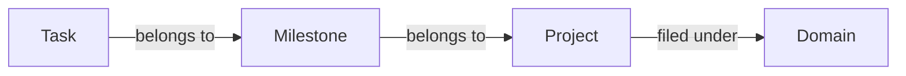

A task is the specific thing you are going to do — from "call mum" to "finish chapter three draft." Anything that needs to happen can be a task.

The biggest difference from a plain to-do app is that tasks in GranoFlow can connect to projects, milestones, and domains — so you always know why a task matters, not just that it exists.

But none of that is required. You can use tasks as a plain checklist and GranoFlow works fine that way too.

## How to add a task

Fastest way: tap the **+** button in the middle of the bottom bar, type what you need to do, and save.

You do not need to figure out the project, due date, or tags right now. Capture first, organize later.

If a task has no due date and no project, it lands in the **Inbox**. Think of the Inbox as your pocket notes — safe for now, sort them out when you have time.

The top-left menu shows every task view:

| View | What it shows |
| --- | --- |
| Inbox | Tasks with no date or project yet |
| Task list | Active, in-progress tasks |
| Completed | Tasks you have finished |
| Archived | Tasks you want to keep but not see daily |
| Trash | Deleted tasks — still recoverable |

## How tasks, projects, milestones, and domains relate

Start with tasks. Add structure above them only when it helps:

- **Task**: the specific thing you are doing — the basic unit
- **Milestone**: a phase checkpoint inside a project (like "user testing done")
- **Project**: a sustained goal over time (like "App launch")
- **Domain**: a broad life area you care about (like "Work" or "Health")

Not every task needs a project. Simple things can live as standalone tasks. Add structure where it actually helps.

## Task statuses

| Status | When to use it |
| --- | --- |
| To-do | Not started yet |
| In progress | Currently working on it (keep to one at a time) |
| Completed | Done — records a completion time |
| Archived | Keeping the record but not tracking it daily |
| Trash | Deleted but not yet cleared |

:::tip[Focus tip]
Marking a task as "in progress" signals that this is the thing you are working on now. GranoFlow tries to keep only one task in progress at a time — this is intentional. It is harder to be in a state of flow when ten things are simultaneously "in progress."
:::

## First time here?

Tap **+**, write down the one thing you most want to get done today, and save it.

That is enough. Explore other features as you need them.
