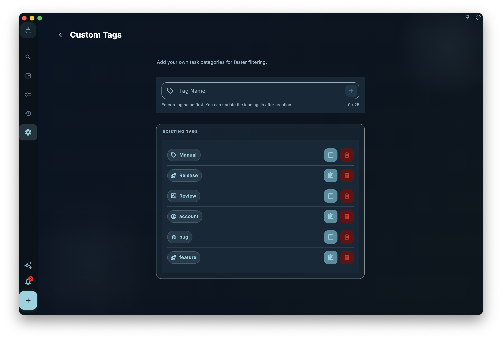

Projects are vertical structure (which goal does this task belong to?). Tags are horizontal labels (what type of task is this?).

For example, you might have a "Fitness app" project, but some tasks inside it are "waiting for a design file" and others are "blocked by third-party API" — those cross-cutting labels are exactly what tags are for.

## How to add tags to a task

Open a task detail or the new task screen, find the tags area, and tap to select or create tags.

- Existing tags show up as candidates immediately
- Do not see the right one? Type a new name and create it
- A task can have multiple tags

## What to use tags for

Tags work best for **cross-project, reusable** categories:

| Use case | Tag examples |
| --- | --- |
| Energy level / context | `low energy` `deep work` `quick task` |
| Waiting status | `waiting on someone` `needs reply` `pending` |
| Task type | `call` `creative` `admin` |
| Temporary flags | `this week` `revisit later` |

Avoid duplicating project names as tags — if a task is already in a project, you do not need to tag it with the project name too.

## What happens when you delete a tag

Deleting a tag **does not** delete the tasks that use it. It only removes that label from those tasks.

:::caution[Confirm before deleting]
Deleting a tag is permanent. Make sure you no longer need the category before you remove it.
:::

## Keeping tags tidy

Too many tags make filtering pointless. Periodically:

- Merge tags with overlapping meaning
- Delete tags nobody is using
- Keep names short and clearly distinguishable
