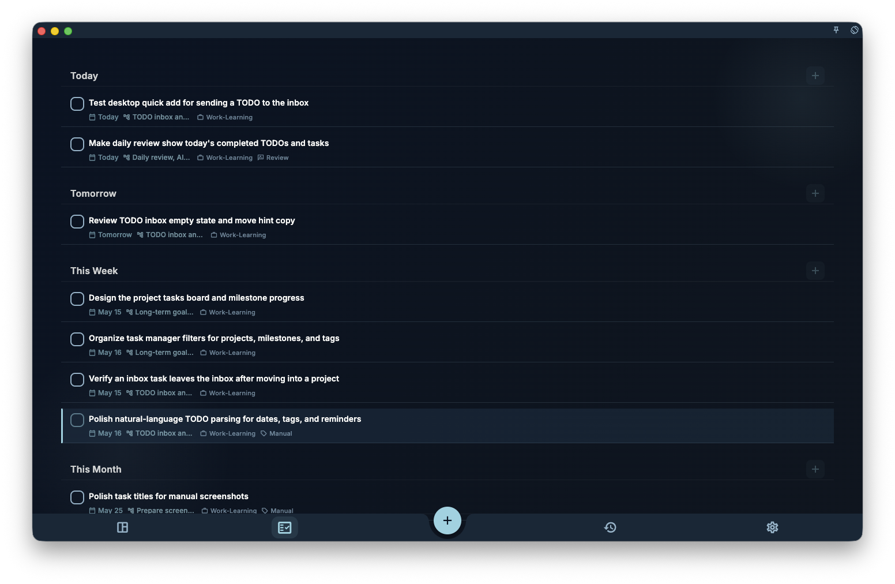

Do not want to tap through every field every time? Just write it in the title:

- `#work` — adds a tag called "work"
- `@tomorrow` — suggests a due date of tomorrow
- `~3pm` — suggests a reminder at 3 PM

GranoFlow highlights what it detects and shows candidates for you to confirm.

## How to use it

While typing a title, any `#` `@` `~` or date phrase will be highlighted with a suggestion.

To confirm a suggestion:

- Tap the highlighted candidate
- Press **Enter** or **Tab** to confirm the current one

:::caution[Important: nothing is saved until you confirm]
Detected content does **not** automatically become a field. You must explicitly confirm each suggestion. Anything you do not confirm stays in the title text as-is.
:::

## Quick syntax reference

| You type | What happens |
| --- | --- |
| `#work` | Suggests adding a "work" tag |
| `@tomorrow` `@next Friday` `@March 5` | Suggests a due date |
| `~3pm` `~9am tomorrow` | Suggests a reminder |
| `Write report @tomorrow #work` | Suggests both at once |

## What does not work

- Symbols embedded mid-word may not be recognized (e.g. `fix#bug` might not trigger the tag parser)
- Complex sentences with multiple dates can produce incomplete suggestions
- Parsing is a suggestion — if it is wrong, just set the field manually

Natural language input is a shortcut, not a requirement. Fields always work the straightforward way too.
