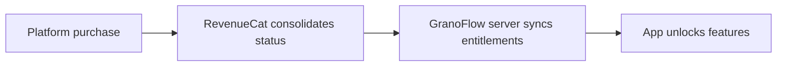

## The four terms, clarified

| Term | What it is |
|------|-----------|
| **Account** | Your identity in GranoFlow — used for sync, recovery, and identification |
| **Subscription** | Your purchase relationship with Apple or Google |
| **Membership** | GranoFlow's label for your user tier (e.g. Pro) |
| **Entitlements** | The features your current account can actually use |

The path looks like this:

"I tapped the buy button" does not automatically equal "my account has entitlements" — each step in the chain can fall out of alignment.

## Why log in at all

GranoFlow's local features work without an account: capture tasks, organize projects, write reviews.

Log in to access: cloud sync, multi-device use, membership recognition, purchase restore, and account deletion.

> Local use answers "how do I organize now." Login answers "who does this data and these entitlements belong to."

## Restore purchases

After switching devices or reinstalling, if your membership is not showing, try "Restore purchases" — this asks the platform to re-check your purchase history and re-align it with your current account.

Restore will not work if: the purchase was linked to a different GranoFlow account, or the subscription has been refunded or expired.

## Why desktop might not show a buy button

Desktop versions (Windows/macOS/Linux) may not display a purchase entry to comply with platform distribution rules.

This is not a missing feature. If you already have a membership, logging in on desktop will unlock the corresponding features. To purchase, use the iOS or Android version.

## Debugging checklist

1. Which GranoFlow account am I logged in to?
2. Which platform was the purchase made on (Apple / Google)?
3. Is the subscription still active?
4. Has the app refreshed its entitlements?
5. Have I mixed up different accounts?

These five questions cover nearly every membership and entitlement issue.
