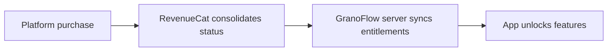

If your membership is not showing, check three things first: which GranoFlow account you are signed in to, whether the purchase was made through Apple or Google, and whether the subscription is still active. Account, subscription, membership, and entitlements are not the same thing. If one step does not line up, the result shown in the app may be wrong.

## The four terms, clarified

| Term | What it is |
| --- | --- |
| **Account** | Your identity in GranoFlow, used to tell which data and entitlements belong to you |
| **Subscription** | Your purchase relationship with Apple or Google |
| **Membership** | GranoFlow's label for your user tier, such as Pro |
| **Entitlements** | The features your current account can actually use |

You can think of the flow like this:

So, "I tapped the buy button" does not automatically mean "my current account has entitlements." The platform purchase, purchase status, server sync, and app display all need to line up.

## Why log in at all

You can use GranoFlow's local features without logging in, such as capturing tasks, organizing projects, and writing reviews.

After you log in, GranoFlow can confirm who the data and entitlements belong to. These features usually require login and server confirmation: cloud sync, multi-device use, membership recognition, purchase restore, and account deletion.

> Local use answers "how do I record this now." Login answers "who do this data and these entitlements belong to."

If Offline Mode is on, or the sign-in or purchase service is temporarily unavailable, local features will not stop working. Sign-in, sync, entitlement checks, and purchase restore can be retried later.

## Restore purchases

After switching devices or reinstalling the app, if your membership does not appear, try "Restore purchases." It asks Apple or Google to re-check your purchase history and then align it with the entitlements for the GranoFlow account currently signed in.

Restore purchases cannot fix every situation:

- If the purchase is linked to another GranoFlow account, the current account will not automatically receive the entitlements
- If the subscription has been refunded or has expired, restoring purchases will not reactivate the entitlements
- If the purchase service is temporarily unavailable, the app will ask you to try again later, and your local data will not be affected

## Why desktop might not show a buy button

Desktop versions, meaning Windows, macOS, and Linux, may not show a purchase entry because of platform distribution rules.

This does not mean membership features are missing on desktop. If you already have a membership, sign in to the same GranoFlow account on desktop and the corresponding features will unlock normally. To buy a membership, use the iOS or Android version.

## Debugging checklist

1. Which GranoFlow account am I signed in to?
2. Which platform was the purchase made on, Apple or Google?
3. Is the current subscription still active?
4. Has the app refreshed its entitlements?
5. Have I mixed up different accounts?

These questions cover most membership and entitlement issues.
