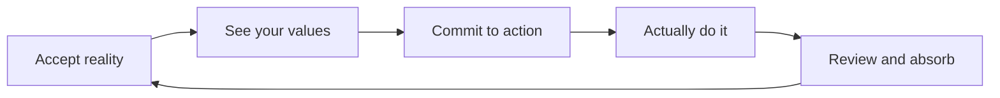

Most productivity tools assume you need to get your head straight before you start.

Stop procrastinating first. Figure out your priorities first. Stabilize your life first. Then begin.

But that "perfect state" rarely arrives.

GranoFlow draws on **ACT (Acceptance and Commitment Therapy)**, made accessible to many readers by Russ Harris in *The Happiness Trap*: you do not have to eliminate anxiety and chaos before living a life that matters. You can act toward what you value while the imperfection is still there.

## The loop

You do not need to complete this loop every day. Sometimes you just write one thing down. Sometimes you just do one review. That counts.

## Accept: write it down, even if you have not figured it out

The first step in GranoFlow is not getting into the perfect state — it is capturing whatever is occupying your attention.

Drop it in the inbox. You do not need to explain why it is there yet.

Acceptance is not giving up. It is: I acknowledge things are the way they are right now, and I start from here.

## Values: who do you want to be

Tasks answer "what do I need to do." Values answer "who do I want to become."

The most useful values are not grand declarations. They are ordinary and honest:

- I want to be a reliable person
- I want to keep going even when things are hard
- I want to create something, not just consume

## Commit to action: turn direction into today's next step

A value sitting in a notes app does nothing. It needs to become a project, milestones, and tasks.

"Be reliable" → Project: "Complete current product version" → Milestones → Tasks you can start today.

Committing to action does not mean "I can never stop." It means: even if I am not at my best, I am willing to take one concrete step toward what I care about.

## Interruptions are not failure

Life interrupts. Illness, job changes, low energy — plans pause.

What matters is not "never stopping" — it is "being able to come back." No guilt, no catch-up. Just: what still matters? What is the smallest next step today?

## GranoFlow's position

GranoFlow is not a therapy tool and cannot replace professional help. It borrows the parts of ACT suited to daily life: accept reality, see values, commit to action, let review turn experience into growth.

The goal is not to make you a perpetually high-performing person. It is to help you keep moving toward what you actually care about, in real life.
