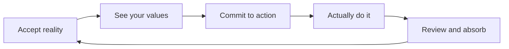

This page answers a practical question: when you feel anxious, scattered, or not ready, how can you still use GranoFlow to move on what matters? The answer is: accept the current state first, write things down, then turn what you care about into one small step you can take today.

Many task tools can make it feel as if you need to fix your state before you start.

For example, stop feeling anxious before working. Figure everything out before planning. Stabilize your life before changing anything.

Real life usually does not work that way. The perfectly ready day may never arrive.

GranoFlow draws on **ACT (Acceptance and Commitment Therapy)**, made accessible to many readers by Russ Harris in *The Happiness Trap*: you do not have to eliminate anxiety and chaos before living a life that matters. You can act toward what you value while real-life imperfection is still there.

## One loop: accept → values → action → review

The loop means: acknowledge reality first, notice what you care about, choose a concrete action, then use review to keep the experience.

You do not need to complete the whole loop every day. Sometimes you only write one thing down. Sometimes you only do one review. That still counts.

## Accept: write it down before you figure it out

In GranoFlow, the first step is not getting yourself into a perfect state. It is writing down whatever is occupying your attention.

Put it in the inbox. At this point, you do not need to explain why it belongs there, categorize it, rank it, or make a full plan.

If the screenshot does not load, the idea is still simple: find the inbox and capture the thing that is taking up space in your head.

Acceptance is not giving up. It means: I acknowledge that this is the situation right now, and I start from here.

## Values: who do you want to be

Tasks answer “what do I need to do.” Values answer “who do I want to be.”

The same workout can mean different things. One person may care about appearance, another about health, another about having more strength for the long run. The action is the same, but the value behind it can be completely different.

You do not need a beautiful life motto. The most useful values are often ordinary:

- I want to be a reliable person
- I want to keep going when things are hard
- I want to create something, not just consume life

## Commit to action: turn direction into one step for today

Writing down values is not enough. A value needs to land in projects, milestones, and tasks.

For example, if you value “being reliable,” you might turn it into a project: “Complete the current product version.” That project can become milestones: “finish core features → test → release.” Each milestone can then become specific tasks you can move today.

Committing to action does not mean “I can never stop again.” It means: even if I am not at my best, I am willing to take one concrete step toward what I care about.

## Interruptions are not failure

Life interrupts. Illness, job changes, and low energy can all pause a plan.

What matters is not “I never stopped.” What matters is “I can come back after stopping.”

When you come back, you do not need to compensate for the past or blame yourself. Just ask two questions again: what project still matters now? What is the smallest step I can take today?

## GranoFlow's position

GranoFlow is not a therapy tool and cannot replace professional help. It only borrows the parts of ACT that fit daily life: accepting reality, seeing values, committing to action, and using review to keep what happened.

The goal is not to make you a permanently high-performing person. It is to help you keep moving toward what you actually care about, in real life.
