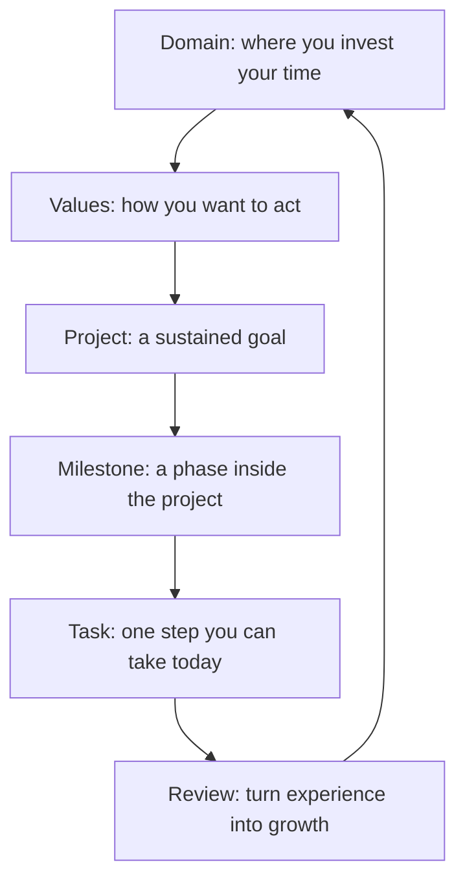

GranoFlow is not just a Todo list.

Think of it more like a structured life journal: first see what long-term directions you care about, then break them into projects and tasks, then use reviews to reconnect daily actions to bigger goals.

## The big picture

This is not a form you have to fill out completely. It is a language for organizing life.

## Domains

Domains are the long-term life areas you invest your time in — Work, Health, Relationships, Creative Projects.

A domain is not a short-term goal or a folder for tasks. It is more like a region on your personal map.

| Not a domain | Better as |
|---|---|
| Finish an app version | Project |
| Run three times a week | Task or habit |
| Work & Learning | ✅ Domain |
| Health | ✅ Domain |

## Values

Values are not goals — goals can be completed, values cannot.

> "Lose 5 kg in three months" → that is a goal.
>
> "I want to take care of my body long-term, not constantly burn myself out" → that is a value.

Values guide your choices: which actions bring you closer to the person you want to be?

## Projects

A project is a container for something you will work on over days, weeks, or months.

Quick test: can you finish it today? If yes, it is probably just a task. If it will keep demanding your attention and needs to be broken down and resumed, it is a project.

## Milestones

Milestones are phase markers inside a project, making big goals easier to navigate.

"Complete product version" becomes: Core features done → Testing passed → Release materials ready → Submit for review.

Small projects can skip milestones. Large ones benefit from them.

## Tasks

A task is the basic unit of action — something you can actually start doing.

Good tasks: "Write homepage copy v1", "Check login flow", "Sort 10 user feedback items"

Too vague: "Be more disciplined", "Build a great product", "Learn English"

If a task makes you hesitate to start, it is usually not you — the task is still too big. Break it down until it becomes one moveable action.

## Review

Without review, a finished task is just a crossed-off item. With review, it becomes experience and momentum.

A good review only needs three questions: What did I actually finish today? Which actions moved me toward what I care about? What is the next step?

:::tip[You do not have to set this all up at once]
Start with tasks. If something keeps going, make it a project. When the project grows, add milestones. Reviews will gradually reveal which domain and values it belongs to.
:::
