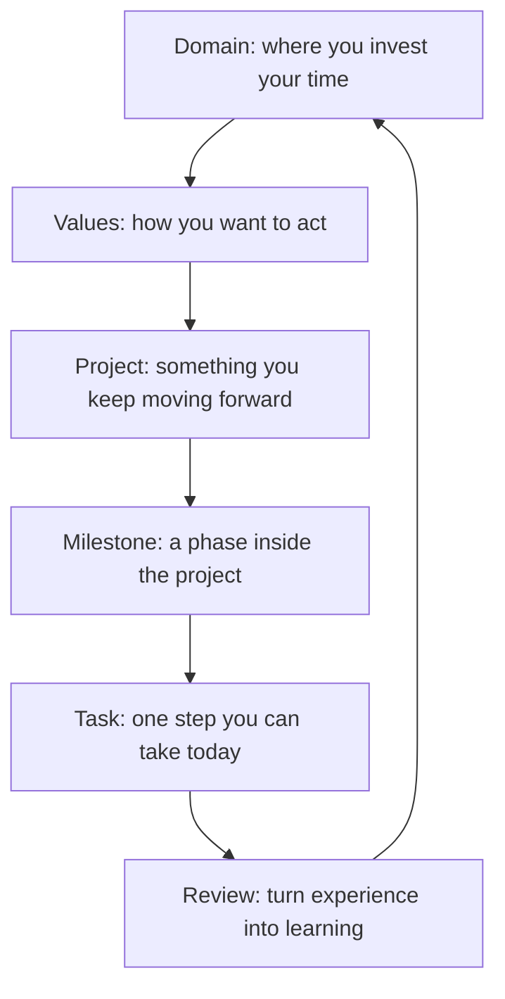

If you are wondering “where should I put this idea?”, use this simple rule: long-term life areas go into domains, decision principles go into values, things that need sustained work become projects, phases inside a project become milestones, one step you can take today becomes a task, and reviews help you keep what you learned.

GranoFlow is not just a Todo list. Think of it as a structured life manual: first see what you care about long-term, then break it into projects and tasks, then use reviews to reconnect daily actions with bigger directions.

You do not need to build the whole structure at the start. You can begin with tasks, then gradually discover projects, domains, and values.

## The big picture: from big to small

This is not a form you must completely fill in. It is a language for making your life directions easier to see and explain.

## Domains

Domains are long-term life areas you care about, such as Work & Learning, Relationships, Health, or Creative Projects.

A domain is not a task folder, and it is not a short-term goal. It is more like a region on your personal map. Projects can belong to a domain, and reviews can help you see where your energy has recently gone.

Easy examples to mix up:

| Not a domain | Better as |
|---------|---------|
| Finish an app version | Project |
| Run three times a week | Task or habit |
| Work & Learning | ✅ Domain |
| Health | ✅ Domain |

## Values

Values are not goals. Goals can be completed; values cannot be checked off once and for all.

> “Lose 5 kg in three months” → this is a goal.
>
> “I want to take care of my body long-term instead of constantly burning myself out” → this is a value.

Values help guide your choices: which actions bring you closer to the kind of person you want to be?

They do not need to sound like polished life statements. The more ordinary and true they are, the easier they are to keep using.

## Projects

A project is bigger than a task and more concrete than a life goal. It usually takes several days to several months.

To decide whether something should become a project, ask yourself:

> Can I finish this today?

If you can finish it today, a task is enough. If it will keep taking attention and needs to be broken down, moved forward, and followed up on, it probably belongs in a project.

## Milestones

Milestones are phase markers inside a project. They split a large project into smaller sections that are easier to move through.

For example, “finish a product version” might become:

- Complete core features
- Fix major issues
- Prepare release materials
- Submit for review

With milestones, you are not trying to chase the whole project at once. You are moving the current phase forward. Small projects can skip milestones.

## Tasks

Tasks are the basic unit of action in GranoFlow. A good task should make it clear how to start.

Good tasks: write homepage copy, check the login flow, organize 10 pieces of test feedback

Not-so-good tasks: become more disciplined, build a great product, learn English

If a task makes you hesitate for a long time, it is usually not because you are lazy. The task is probably still too vague or too big. Break it down until it becomes one action you can actually take.

## Review

Review turns experience into learning.

After a task is finished, without review it is just a crossed-off item. With review, it is more likely to become experience and judgment.

A review can be as simple as asking:

- What did I finish today?
- Which actions moved me closer to what I care about?
- What is the next step?

:::tip[You do not have to set everything up at the start]
The simplest path is: write tasks first → if something keeps going, make it a project → when the project grows, add milestones → during reviews, gradually organize domains and values. The structure can grow over time.
:::
