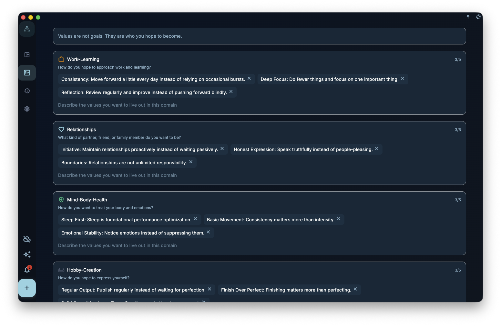

很多人并不是不努力，而是努力了很久以后，开始隐约觉得：

> 我每天都在做事，但我说不清自己到底在靠近什么。

任务越来越多，项目一个接一个，日程也排得很满。可如果这些行动背后没有长期方向，生活就很容易变成一种持续运转的忙碌。

这也是为什么，在 GranoFlow 里，“领域”和“价值观”不是装饰性的设置项。它们不是让你写一份漂亮的人生宣言，而是帮助你在任务和项目之外重新看见：

- 我长期在意什么？
- 我希望自己怎样行动？
- 我最近做的这些事，真的靠近了那个方向吗？

如果你想把长期目标变成今天能做的事，先不用急着整理一整套人生规划。你可以先用领域记录长期方向，再用价值观说明自己希望如何行动，之后再把它们慢慢连接到项目、里程碑、任务和回顾。

## 领域不是分类文件夹

领域是你长期在意的生活方向。
它不是普通文件夹，也不是为了把任务分门别类而存在。

常见领域包括：

- 工作学习
- 人际关系
- 身心健康
- 业余创作

如果说任务回答的是“现在做什么”，项目回答的是“这段时间推进什么”，那么领域回答的是：

> 我的人生主要投向哪些方向？

例如，准备考试不是领域，更适合作为项目。
每天跑步不是领域，更适合作为任务或习惯安排。
写一本小说也不是领域，更适合作为项目。

这些事情背后，才更接近领域：

- 准备考试，可能属于工作学习
- 每天跑步，可能属于身心健康
- 写一本小说，可能属于业余创作

领域的作用，是让你在回顾时能看见：最近的时间和注意力，主要流向了哪里。
如果你发现自己几个月都在处理工作，却几乎没有照顾身体、关系或创作，那不是系统在责备你，而是它在帮助你看见现实。

## 价值观不是目标

这大概是整章最重要的一点。

目标可以完成，价值观不能被一次性完成。

例如：

> 三个月减重 5 公斤

这是目标。

> 我希望长期照顾身体，而不是一直透支自己。

这是价值观。

再例如：

> 发布一个产品版本

这是目标。

> 我希望自己成为一个可靠、持续交付的人。

这是价值观。

目标适合放进项目和里程碑。
价值观更像一种长期方向：它不会在某一天被打勾完成，但会反复影响你之后的选择。

这也更接近 ACT（接纳与承诺疗法）里 values 的用法。
价值观不是“等我状态好了再考虑的事”，而是在你不确定、困难、混乱、甚至想逃避的时候，仍然能指向行动的方向。更多背景可以读 [ACT 与《幸福的陷阱》](/en/value-to-action/act-loop/)。

价值观真正有用的时刻，不是在一切顺利时，而是在你犹豫时，它能帮助你回答：

> 哪一种行动，更接近我想成为的人？

## 为什么人会忙，却失去方向

现实里最常见的情况不是“什么都不做”，而是“做了很多，却慢慢失去感觉”。

你可能：

- 一直在处理任务，但没有在推进真正重要的事
- 一直在满足外界要求，却越来越不清楚自己在乎什么
- 一直在追求效率，却越来越难感到自己活得像自己

如果没有领域和价值观，任务系统就很容易变成单纯的执行系统。
你会变得越来越会处理事情，却未必越来越知道自己为什么做这些事。

GranoFlow 引入领域和价值观，不是为了让系统更复杂，而是为了让“行动”重新有出处。

## 如何写一条真正可用的价值观

很多人第一次写价值观时，会先写一些抽象词：

> 自律
> 健康
> 成长
> 创造力

这些词本身没有错，但太短、太空，真正要用的时候，往往很难指导行动。

更好的方式，是用一句完整的话，写出你希望如何行动。
可以从这些句式开始：

> 我希望自己……
> 我希望在这个领域里……
> 当事情变难时，我希望自己仍然……
> 我不希望自己只是……，而是……

例如：

> 我希望自己遇到困难时仍然能继续推进。
> 我希望长期照顾身体，而不是一直透支自己。
> 我希望在人际关系中更诚实，也更愿意倾听。
> 我希望自己不是只消费内容，也能持续表达和创造。
> 我希望在工作中成为一个可靠、清楚、能交付的人。

一条好的价值观不一定要漂亮。
它只需要在你犹豫时，能帮你判断：下一步更接近哪个方向。

## 每个领域先写 1–3 条就够了

不要一开始就写人生宣言。
每个领域先写 1–3 条，就已经足够开始。

太多价值观会变成口号墙，反而不会被使用。你真正需要的，不是数量，而是少数几条能反复提醒你的方向。

例如，身心健康下面可以先写：

> 我希望长期照顾身体，而不是一直透支自己。
> 我希望自己在状态不好时，也能做一点温和的恢复。

业余创作下面可以先写：

> 我希望自己不是只消费内容，也能持续表达和创造。
> 我希望先完成小作品，再追求完美。

这已经足够开始。
价值观不是写得越多越好，而是越能影响真实行动越好。

## 在领域页里维护这些方向

领域页用来维护长期方向和价值观，不是必须一次填完的分类系统。你可以从首页引导、侧栏管理入口或相关设置进入领域管理，然后逐个领域添加、修改或删除几条价值观。

<!-- manual-screenshot:id=value-domains-management -->

如果截图没有加载，也不影响理解。你可以把这个页面想成一个“方向整理页”：每个领域下面都有自己的价值观列表；页面会用一些提示问题，帮助你把抽象念头写成一句完整的话，而不是只留下一个漂亮但难用的词。

如果页面提供 AI 辅助入口，它做的只是把当前内容整理成适合给外部 AI 的请求。AI 可以帮助你探索表达，但不会替你决定人生方向。最终保存哪些内容，仍以你在领域页中的判断为准。

## 价值观要落到行动上

价值观如果不能落到行动，就会慢慢失效。
它会变成一句挂在页面上的好话，但不会真的影响生活。

例如，你写下：

> 我希望长期照顾身体，而不是一直透支自己。

它可以连接到项目：

> 建立三个月的基础锻炼节奏

项目可以拆成里程碑：

> 第一周适应
> 第一个月稳定
> 三个月形成基本节奏

今天的任务可以是：

> 做 20 分钟低强度训练

这样，价值观就不是一条抽象句子，而是进入了今天能做的一步。

再例如，你写下：

> 我希望自己成为一个可靠、持续交付的人。

它可以连接到项目：

> 完成当前产品版本

今天的任务可能是：

> 修复登录页的一个阻塞问题

这就是 GranoFlow 想帮助你连起来的一条线：

> 价值观 → 项目 → 里程碑 → 任务 → 回顾

## 价值观不是定稿，而是会慢慢被修正

很多人以为，价值观应该是一组一开始就写得很准、很成熟的话。
其实不是。

刚开始写下的价值观，可能很粗糙，也可能后来发现并不准确。这很正常。
价值观不是考试答案，而是你在真实生活中慢慢辨认出来的方向。

你可以在日回顾或阶段回顾中观察：

- 最近我做的事，是否真的接近这些价值观？
- 哪些价值观只是听上去正确，但我其实并不真正重视？
- 哪些行动反复出现，说明我真正看重的是别的东西？
- 现在的项目，是否还值得继续投入？

有时候，回顾会让你发现某条价值观需要改写。

例如：

> 我希望每天都保持高效率。

这句话听上去积极，但可能太压迫。你也许会把它改成：

> 我希望在状态不完美时，也能稳定推进最重要的一步。

这更接近 GranoFlow 的使用方式：不是追求永远高效，而是在真实生活里保持方向感。

## 如果暂时写不出来，也没关系

如果你现在还写不出价值观，不要因为这个卡住。

你可以先继续使用任务、项目和回顾。等你积累了一些真实记录，再回头看：

- 哪些事情让我觉得值得？
- 哪些事情完成后，我会觉得更像自己？
- 哪些事情虽然困难，但我仍然不想放弃？
- 哪些事情看似忙碌，其实只是消耗？

价值观常常不是“想出来”的，而是在反复行动和回顾中“看出来”的。

所以，刚开始时可以很简单：

> 我希望自己能稳定推进重要的事。
> 我希望自己能照顾身体。
> 我希望自己能认真对待重要关系。
> 我希望自己能持续创作。

先写下来，之后再改。
这已经比什么都不写、什么都不看，要更接近真正的方向。

## 下一步

当你有了初步的领域和价值观，就可以继续把长期方向拆成更具体的承接结构：

- [项目与里程碑：把长期方向拆成阶段目标](/en/value-to-action/projects-and-milestones/)：把持续投入放进一个能推进的容器。
- [任务与收集箱：把下一步写下来](/en/value-to-action/tasks-and-inbox/)：把阶段落到今天能做的一步。
- [回顾：让经历真正沉淀](/en/value-to-action/review-reflection/)：在真实行动后，慢慢修正和确认你的方向。
