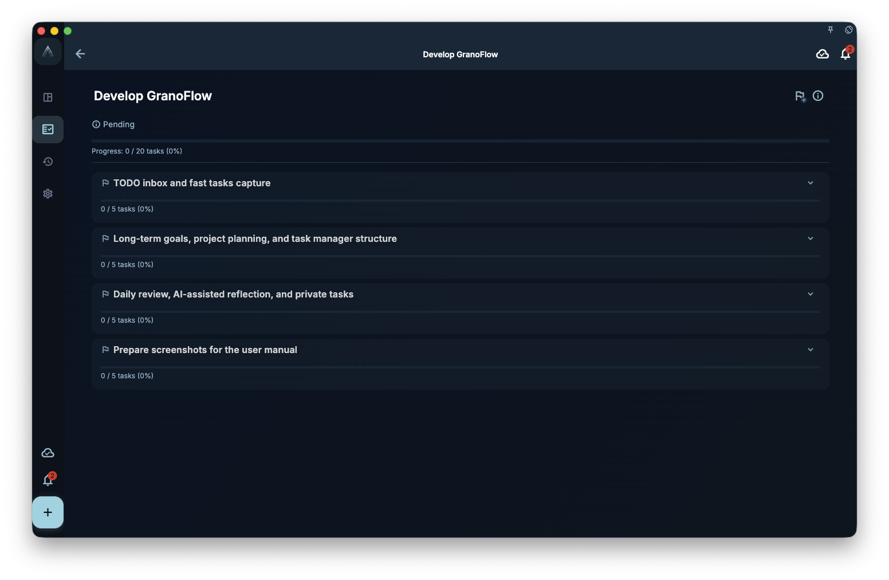

This chapter turns ACT and The Happiness Trap into a GranoFlow practice: domains, values, projects, milestones, tasks, and review. Use it to turn long-term goals into one task you can start today, without making task management another source of anxiety.

After you have domains and values, the next step is not to write a long list of tasks right away.

First ask yourself:

> What do I want to keep moving forward during this period?

The answer is usually a project.

## What a Project Is

A project is a goal you keep moving forward over a period of time.

It is bigger than a task and more concrete than a life wish.

For example:

- finish the current product version
- prepare for an exam
- build a three-month exercise rhythm
- finish the first set of comics
- build a personal website
- organize a moving plan

These all work well as projects.

A project is not an abstract wish.

For example:

- become more disciplined
- learn English well
- improve my life
- make the product better
- become a better person

These are too large and vague to be projects directly. They are closer to values, long-term directions, or questions that need to be broken down further.

A good project should answer:

> How far does this need to go before this stage is complete?

<!-- manual-screenshot:id=projects-milestones-detail -->

## When to Create a Project

Not everything needs a project.

If something can be finished today, write it as a task.

For example:

- reply to an email
- buy one item
- change one button label
- book a health check

These do not need projects.

But if something has several of these qualities, it is a good candidate for a project:

- it takes several days or weeks
- it needs multiple steps
- it may pause and resume later
- it needs materials, tasks, and stages to be organized
- it is worth reviewing after completion

For example, "write an article" may only be a task.  
But "finish a series of articles" fits better as a project.

"Run for 20 minutes" is a task.  
"Build a three-month running rhythm" is a project.

"Fix a small bug" is a task.  
"Complete a version release" is a project.

A project gives sustained effort a container.

## What a Milestone Is

A milestone is a stage inside a project.

It answers:

> Which part should be completed first?

For example, a project called:

> Finish the current product version

can be split into milestones:

- finish the core features
- fix the main issues
- prepare release materials
- submit for review
- handle review feedback

A project called:

> Build a three-month exercise rhythm

can be split into:

- adapt during the first week
- stabilize during the first month
- increase intensity during the second month
- form a stable rhythm during the third month

Milestones are not there to make projects more complicated.

They split a large goal into smaller stages, so you do not need to face the whole project every day. You only need to know the current stage.

## Small Projects May Not Need Milestones

Do not add milestones just to make a project look complete.

If a project is small and only has three to five tasks, managing it directly as a project is enough.

For example:

> Organize travel materials

It may only have a few tasks:

- confirm the flight
- organize passport information
- save the hotel order
- check the packing list

This kind of project may not need milestones.

But if a project is long, has many tasks, or lasts more than a few weeks, adding milestones usually helps. Otherwise the project can become an increasingly heavy pile of tasks.

The rule is simple:

> If you look at the project and do not know where to continue, split it into milestones.

## Keep Projects Specific

Projects that are too large are hard to start.

For example:

> Change my life

That is not a project.

> Learn English well

That is also too large.

You can turn it into more specific projects:

- finish one English textbook
- practice speaking for 30 days
- prepare for an English interview
- complete one English course

Another example:

> Make GranoFlow better

That is also too large.

You can split it into:

- finish the first version of the beginner manual
- improve the image upload experience
- prepare public beta invitations
- complete App Store review materials

The more specific a project is, the easier it is to move forward.

If a project can never be completed, it is probably not a good project. It may need to become several projects, or move up into a domain and values.

## Projects Need to Reach Tasks

A project should not stay as a title.

Every project eventually needs to reach one step you can take today.

For example:

Project:

> Finish the first version of the beginner manual

Milestone:

> Finish the first 6 chapters

Today's task:

> Draft the "Projects and Milestones" chapter

Now you are not facing a vague large goal every day. You know what to move forward today.

If a project has no tasks under it, there are usually two possibilities:

First, it is still only a wish and has not entered execution.  
Second, it is too vague and needs to be split into milestones or tasks.

Projects in GranoFlow are not for collecting wishes. They should help you act.

## Projects Can Be Completed

Completing a project means this stage of the goal is over.

It does not mean the work is perfect, and it does not mean you will never do related work again.

For example:

> Finish the first set of comics

After this project is complete, you can still create a new project later:

> Finish the second set of comics

That is clearer than putting all creative work into one "comics project" that never ends.

After completing a project, you can review:

- Which tasks actually moved the project forward?
- Which stages were harder than expected?
- Which lessons should be carried into the next project?
- Did this project move toward my values?

Completing a project is not only closing a container. It also turns a period of effort into experience.

## Projects Can Be Archived or Dropped

Not every project has to be completed.

Some projects expire.  
Some projects lose meaning.  
Some projects start before you realize they are not important.  
Some projects were needed at the time, but are no longer needed.

At that point, you can archive them or drop them.

Dropping a project is not failure.

The real question is not "Did I complete every project?" It is "Do I understand why this project is no longer worth continuing?"

For example:

> I originally wanted to take this course, but now I see that it is not closely related to my current direction. Archive it for now so it no longer takes attention.

That is useful review.

GranoFlow does not require you to finish every project you start. It puts more weight on whether you can see your direction through action and adjust in time.

## A Complete Example

Domain:

> Work and learning

Value:

> I want to be reliable, clear, and able to deliver.

Project:

> Finish the first version of the GranoFlow beginner manual

Milestones:

> Finish the first 3 chapters  
> Finish the core feature explanations  
> Finish the data safety explanation  
> Complete pre-release proofreading

Tasks:

> Write "Quick Start"  
> Revise "Turn Values into Action"  
> Add "Core Concepts"  
> Check terminology consistency

Review:

> Today I completed the projects and milestones chapter. The structure is clearer than before, but tasks and the inbox still need their own chapter. Next, write the task system page.

This is how a value reaches projects, milestones, tasks, and review.

You are not only completing to-dos. You are using a period of action to move closer to the direction you care about.

## Next

After you have projects and milestones, you can start handling daily concrete actions.

Next, read:

> Tasks and inbox: write down the next step.
